# Supabase Auth SDK Specification

**Version**: 2.0.0
**Status**: Draft
**Last Updated**: 2026-02-09
**Reference Implementation**: `@supabase/auth-js`

> This specification defines the canonical behavior for all Supabase Auth SDK implementations.
> It is **stack-agnostic** and uses RFC 2119 keywords: **MUST**, **MUST NOT**, **SHOULD**,
> **SHOULD NOT**, and **MAY** to indicate requirement levels.
> All code examples use pseudocode notation unless otherwise noted.

---

## Table of Contents

1. [Overview](#1-overview)
2. [Architecture](#2-architecture)
3. [Configuration](#3-configuration)
4. [Data Models](#4-data-models)
5. [Error Model](#5-error-model)
6. [Public Client API](#6-public-client-api)
7. [Admin API](#7-admin-api)
8. [Multi-Factor Authentication API](#8-multi-factor-authentication-api)
9. [OAuth 2.1 Server API](#9-oauth-21-server-api)
10. [Session Management](#10-session-management)
11. [Token Auto-Refresh](#11-token-auto-refresh)
12. [Auth State Change Events](#12-auth-state-change-events)
13. [PKCE Flow](#13-pkce-flow)
14. [Locking Mechanism](#14-locking-mechanism)
15. [HTTP Layer](#15-http-layer)
16. [Storage Abstraction](#16-storage-abstraction)
17. [Integration with Parent SDK](#17-integration-with-parent-sdk)
18. [Required Test Scenarios](#18-required-test-scenarios)
19. [API Endpoint Reference](#19-api-endpoint-reference)
20. [Constants and Defaults](#20-constants-and-defaults)

---

## 1. Overview

The Supabase Auth SDK is a client library that communicates with Supabase Auth (GoTrue), an open-source authentication server. The SDK handles:

- User registration and authentication (email/password, phone/password, OAuth, OTP, SSO, Web3, anonymous)
- Session management with automatic token refresh
- Multi-Factor Authentication (TOTP, Phone SMS, WebAuthn)
- Admin user management (requires service role key)
- OAuth 2.1 authorization server integration (consent flows, grant management)
- Cross-tab/cross-process session synchronization
- PKCE (Proof Key for Code Exchange) flow for secure OAuth

### Design Principles

1. **Never throw by default**: All public methods MUST return `{ data, error }` result objects. Errors are returned, not thrown, unless the consumer explicitly opts into throw mode.
2. **Session persistence**: Sessions MUST be automatically persisted to and loaded from storage.
3. **Automatic refresh**: Access tokens MUST be refreshed before expiry without consumer intervention.
4. **Concurrency safety**: Lock mechanisms MUST prevent race conditions during token refresh across tabs/processes.
5. **Platform agnostic**: The SDK MUST work across runtimes (browsers, server-side, mobile, edge). Platform-specific behavior (visibility detection, navigator locks, local storage) MUST be abstracted behind configurable adapters.

### Terminology

| Term | Definition |
|------|-----------|
| **GoTrue** | The open-source authentication server used by Supabase |
| **Session** | A pair of access token (JWT) and refresh token representing an authenticated user |
| **AAL** | Authenticator Assurance Level (aal1 = single factor, aal2 = multi-factor) |
| **AMR** | Authentication Methods Reference - list of methods used to authenticate |
| **PKCE** | Proof Key for Code Exchange - secure OAuth flow for public clients |
| **MFA** | Multi-Factor Authentication |
| **OTP** | One-Time Password |
| **SSO** | Single Sign-On |
| **TOTP** | Time-based One-Time Password (RFC 6238) |
| **SIWE** | Sign In With Ethereum (EIP-4361) |
| **SIWS** | Sign In With Solana |

---

## 2. Architecture

### Component Diagram

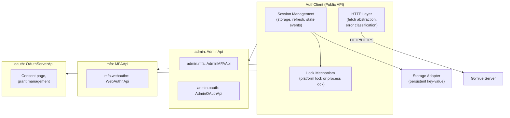

### Key Architectural Decisions

- **Result Pattern**: Every public method MUST return `Result<T>` = `{ data: T | Null, error: AuthError | Null }`. Exactly one of `data` or `error` MUST be non-null.
- **Namespace Pattern**: MFA, Admin, and OAuth operations MUST be organized as sub-objects on the client rather than flat methods.
- **Lock-Acquire-Then-Act**: Any method that reads or writes session state MUST acquire a lock first to prevent concurrent mutation.
- **Deferred Pattern**: Concurrent token refresh requests MUST be deduplicated; only one HTTP call is made and all callers receive the same result.

---

## 3. Configuration

### Client Options

| Option | Type | Default | Description |
|--------|------|---------|-------------|
| `url` | String | `http://localhost:9999` | GoTrue server URL |
| `headers` | Map<String, String> | See [defaults](#20-constants-and-defaults) | Custom HTTP headers sent with every request |
| `storageKey` | String | `supabase.auth.token` | Key prefix for persisting session in storage |
| `detectSessionInUrl` | Boolean or Callback | `true` | Whether to check the URL for OAuth/magic link parameters on initialization |
| `autoRefreshToken` | Boolean | `true` | Automatically refresh the access token before it expires |
| `persistSession` | Boolean | `true` | Persist session to storage |
| `storage` | StorageAdapter | Platform default | Storage adapter for session persistence |
| `flowType` | `"implicit"` or `"pkce"` | `"implicit"` | OAuth flow type |
| `debug` | Boolean or Callback | `false` | Enable debug logging or provide custom logger |
| `lock` | LockFunction | Platform default | Custom lock implementation for concurrency control |
| `fetch` | FetchFunction | Platform fetch | Custom HTTP fetch function |
| `hasCustomAuthorizationHeader` | Boolean | `false` | Whether the parent SDK sets its own Authorization header |
| `lockAcquireTimeout` | Integer (ms) | `10000` | Timeout for acquiring a lock before failing |

### Lock Function Signature

```
LockFunction = (name: String, acquireTimeout: Integer, fn: () -> Async<R>) -> Async<R>
```

### Storage Adapter Interface

```
StorageAdapter {
  getItem(key: String) -> String?       -- MAY be async
  setItem(key: String, value: String)   -- MAY be async
  removeItem(key: String)               -- MAY be async
}
```

---

## 4. Data Models

### Session

```
Session {
  access_token          : String       -- JWT access token
  refresh_token         : String       -- One-time-use refresh token
  expires_in            : Integer      -- Seconds until access token expires (from issuance)
  expires_at            : Integer?     -- Unix timestamp (seconds) when the access token expires
  token_type            : "bearer"     -- Always "bearer"
  user                  : User         -- The authenticated user
  provider_token        : String?      -- OAuth provider's access token (if available)
  provider_refresh_token: String?      -- OAuth provider's refresh token (if available)
}
```

**Invariant**: `expires_at` MUST be computed as `floor(currentTimeSeconds) + expires_in` if not present in the server response.

### User

```
User {
  id                    : String       -- UUID
  aud                   : String       -- Audience claim
  email                 : String?      -- Email address
  phone                 : String?      -- Phone number (E.164 format)
  created_at            : String       -- ISO 8601 timestamp
  updated_at            : String?      -- ISO 8601 timestamp
  confirmed_at          : String?      -- ISO 8601 timestamp
  email_confirmed_at    : String?      -- ISO 8601 timestamp
  phone_confirmed_at    : String?      -- ISO 8601 timestamp
  last_sign_in_at       : String?      -- ISO 8601 timestamp
  role                  : String?      -- User role
  app_metadata          : UserAppMetadata   -- Application-controlled metadata
  user_metadata         : UserMetadata      -- User-controlled metadata
  identities            : List<UserIdentity>?  -- Linked identity providers
  factors               : List<Factor>?        -- MFA factors
  is_anonymous          : Boolean?     -- Whether this is an anonymous user
  is_sso_user           : Boolean?     -- Whether the user signed up via SSO
  confirmation_sent_at  : String?      -- ISO 8601 timestamp
  recovery_sent_at      : String?      -- ISO 8601 timestamp
  invited_at            : String?      -- ISO 8601 timestamp
  new_email             : String?      -- Pending email change
  new_phone             : String?      -- Pending phone change
  action_link           : String?      -- Action link URL
  banned_until          : String?      -- ISO 8601 timestamp, if banned
  deleted_at            : String?      -- ISO 8601 timestamp, if soft-deleted
}
```

### UserAppMetadata

```
UserAppMetadata {
  provider              : String?      -- First provider used for sign-up
  providers             : List<String>?  -- All linked providers
  ...                                  -- Arbitrary additional fields
}
```

### UserMetadata

```
UserMetadata {
  ...                                  -- Arbitrary user-controlled fields
}
```

### UserIdentity

```
UserIdentity {
  id                    : String       -- Provider-specific user ID
  user_id               : String       -- Supabase user UUID
  identity_id           : String       -- Unique identity UUID
  identity_data         : Map?         -- Provider-specific identity data
  provider              : String       -- Provider name
  created_at            : String?      -- ISO 8601
  last_sign_in_at       : String?      -- ISO 8601
  updated_at            : String?      -- ISO 8601
}
```

### Factor (MFA)

```
Factor {
  id                    : String       -- Factor UUID
  friendly_name         : String?      -- Human-readable name
  factor_type           : FactorType   -- "totp" | "phone" | "webauthn"
  status                : FactorStatus -- "verified" | "unverified"
  created_at            : String       -- ISO 8601
  updated_at            : String       -- ISO 8601
  last_challenged_at    : String?      -- ISO 8601
}
```

### AMREntry (Authentication Method Reference)

```
AMREntry {
  method                : String       -- See AMR Methods below
  timestamp             : Integer      -- Unix epoch seconds (UTC)
}
```

**AMR Methods**: `password`, `otp`, `oauth`, `totp`, `mfa/totp`, `mfa/phone`, `mfa/webauthn`, `anonymous`, `sso/saml`, `magiclink`, `web3`, `oauth_provider/authorization_code`

### Authenticator Assurance Levels

```
AuthenticatorAssuranceLevel = "aal1" | "aal2"
```

- `aal1`: Identity verified with a conventional login method only
- `aal2`: Identity verified with conventional login AND at least one MFA factor

### Supported OAuth Providers

```
Provider =
  "apple" | "azure" | "bitbucket" | "discord" | "facebook" | "figma" |
  "github" | "gitlab" | "google" | "kakao" | "keycloak" | "linkedin" |
  "linkedin_oidc" | "notion" | "slack" | "slack_oidc" | "spotify" |
  "twitch" | "twitter" | "x" | "workos" | "zoom" | "fly"
```

Note: `twitter` uses OAuth 1.0a; `x` uses OAuth 2.0. Both refer to the same platform.

### OTP Types

```
EmailOtpType  = "signup" | "invite" | "magiclink" | "recovery" | "email_change" | "email"
MobileOtpType = "sms" | "phone_change"
```

### Sign Out Scope

```
SignOutScope = "global" | "local" | "others"
```

- `global`: Sign out all sessions for this user
- `local`: Sign out only the current session
- `others`: Sign out all sessions except the current one (no SIGNED_OUT event emitted locally)

---

## 5. Error Model

### Error Hierarchy

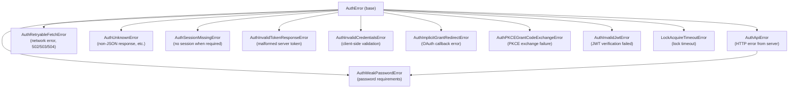

### AuthError Fields

```
AuthError {
  message : String       -- Human-readable error description
  status  : Integer?     -- HTTP status code (for API errors)
  code    : String?      -- Machine-readable error code from server
  name    : String       -- Error class name
}
```

### AuthWeakPasswordError Additional Fields

```
AuthWeakPasswordError extends AuthApiError {
  reasons : List<String>  -- List of reasons the password is weak
}
```

### Error Type Guards

Implementations MUST provide the following type guard functions:

- `isAuthError(error) -> Boolean`
- `isAuthApiError(error) -> Boolean`
- `isAuthSessionMissingError(error) -> Boolean`
- `isAuthRetryableFetchError(error) -> Boolean`
- `isAuthImplicitGrantRedirectError(error) -> Boolean`

### Error Classification Rules

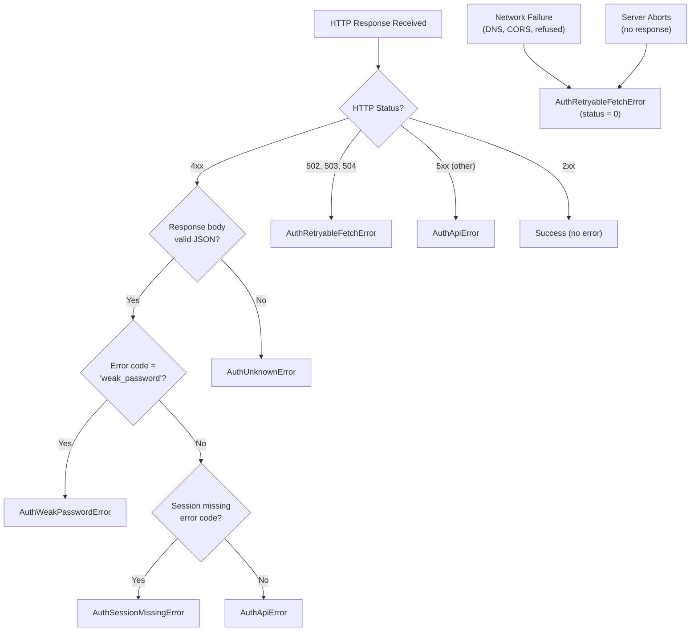

| Condition | Error Type |
|-----------|-----------|
| HTTP 4xx with valid JSON body | `AuthApiError` |
| HTTP 4xx with non-JSON body | `AuthUnknownError` |
| HTTP 502, 503, 504 | `AuthRetryableFetchError` |
| Network failure (DNS, CORS, connection refused) | `AuthRetryableFetchError` with status 0 |
| Server aborts request without response | `AuthRetryableFetchError` |
| Session not found (specific server error code) | `AuthSessionMissingError` |
| Weak password (error code `weak_password`) | `AuthWeakPasswordError` |

---

## 6. Public Client API

All methods MUST return a result object `{ data, error }` unless otherwise noted. At most one of `data` or `error` is non-null.

### 6.1 Initialization

#### `initialize() -> Result<{ session: Session? }>`

Called automatically on client construction. Performs:

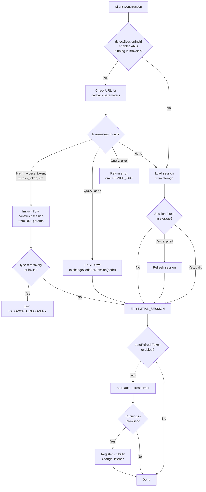

1. If `detectSessionInUrl` is enabled and running in a browser, check the current URL for OAuth callback parameters (in hash fragment or query string).
2. If callback parameters are found, exchange them for a session.
3. If no URL parameters, load the session from storage.
4. If a stored session is found and expired, refresh it.
5. Emit the `INITIAL_SESSION` event.
6. If `autoRefreshToken` is enabled, start the auto-refresh timer.
7. If running in a browser, register a `visibilitychange` listener.

**URL Parameters Detected**:
- Hash fragment: `access_token`, `refresh_token`, `expires_in`, `expires_at`, `token_type`, `type` (for implicit flow)
- Query string: `code` (for PKCE flow), `error`, `error_description`, `error_code`

**Behavior on URL Detection**:
- Implicit flow: Construct session from URL fragment parameters
- PKCE flow: Call `exchangeCodeForSession(code)` with the authorization code
- `type=recovery` or `type=invite`: Emit `PASSWORD_RECOVERY` event
- Error parameters: Return error and emit `SIGNED_OUT`

### 6.2 Sign Up

#### `signUp(credentials) -> Result<{ user: User, session: Session? }>`

Creates a new user account.

**Credentials (email variant)**:
```
email           : String (required)
password        : String (required)
options {
  emailRedirectTo : String?    -- Redirect URL in confirmation email
  data            : Map?       -- Custom user metadata
  captchaToken    : String?    -- Captcha verification token
}
```

**Credentials (phone variant)**:
```
phone           : String (required)
password        : String (required)
options {
  data            : Map?       -- Custom user metadata
  captchaToken    : String?    -- Captcha verification token
  channel         : String?    -- "sms" | "whatsapp" (default: "sms")
}
```

**Behavior**:
1. Validate that either `email` or `phone` is provided (not both, not neither).
2. Send `POST /signup` with credentials.
3. If email confirmation is enabled on the server, return `{ user, session: null }`.
4. If auto-confirm is enabled, return `{ user, session }` and emit `SIGNED_IN`.
5. If `flowType` is `pkce`, include `code_challenge` and `code_challenge_method` in the request.

**Client-side validation**: MUST return `AuthInvalidCredentialsError` if neither `email` nor `phone` is provided.

### 6.3 Sign In with Password

#### `signInWithPassword(credentials) -> Result<{ user: User, session: Session, weakPassword: WeakPasswordInfo? }>`

Authenticates with email/phone and password.

**Credentials**:
```
email           : String (required, if no phone)
phone           : String (required, if no email)
password        : String (required)
options {
  captchaToken    : String?
}
```

**Behavior**:

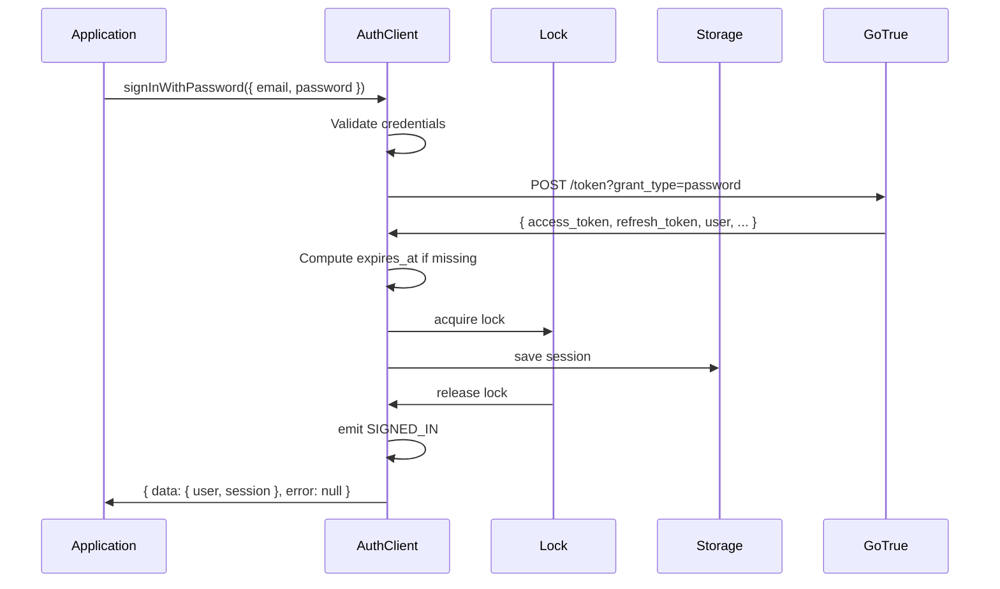

1. Validate that either `email` or `phone` is provided.
2. Send `POST /token?grant_type=password`.
3. On success, save session and emit `SIGNED_IN`.
4. If server returns `weak_password` info, include it in the response.

### 6.4 Sign In with OAuth

#### `signInWithOAuth(credentials) -> Result<{ provider: String, url: String }>`

Initiates OAuth sign-in by generating the authorization URL.

**Credentials**:
```
provider            : Provider (required)  -- OAuth provider name
options {
  redirectTo          : String?            -- Post-login redirect URL
  scopes              : String?            -- Space-separated OAuth scopes
  queryParams         : Map<String, String>?  -- Additional query parameters
  skipBrowserRedirect : Boolean?           -- If true, do not auto-redirect browser
}
```

**Behavior**:

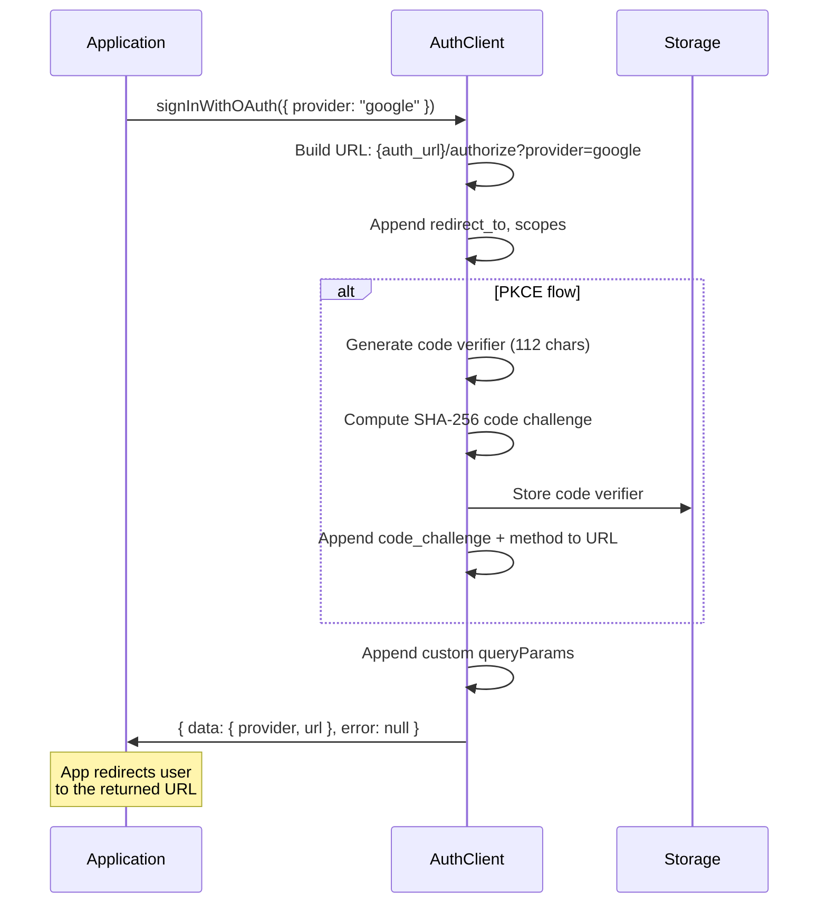

1. Construct URL: `{auth_url}/authorize?provider={provider}`.
2. Append optional parameters: `redirect_to`, `scopes`.
3. If `flowType` is `pkce`, generate and store code verifier, append `code_challenge` and `code_challenge_method`.
4. Append any custom `queryParams`.
5. If `skipBrowserRedirect` is true, append `skip_http_redirect=true`.
6. Return the URL; MUST NOT make an HTTP request.
7. MUST NOT create a session (the session is created when the user is redirected back).

### 6.5 Sign In with OTP (Magic Link / SMS OTP)

#### `signInWithOtp(credentials) -> Result<{ messageId: String? }>`

Sends a one-time password to the user's email or phone.

**Credentials (email variant)**:
```
email               : String (required)
options {
  emailRedirectTo     : String?
  shouldCreateUser    : Boolean?    -- Default: true
  data                : Map?
  captchaToken        : String?
}
```

**Credentials (phone variant)**:
```
phone               : String (required)
options {
  shouldCreateUser    : Boolean?    -- Default: true
  data                : Map?
  captchaToken        : String?
  channel             : String?    -- "sms" | "whatsapp" (default: "sms")
}
```

**Behavior**:
1. Validate that either `email` or `phone` is provided.
2. For email: Send `POST /otp` with email. If `flowType` is `pkce`, include `code_challenge` and `code_challenge_method`.
3. For phone: Send `POST /otp` with phone and `create_user` flag.
4. Return `{ messageId }` on success. MUST NOT return a session.
5. The user must call `verifyOtp()` to complete authentication.

### 6.6 Verify OTP

#### `verifyOtp(params) -> Result<{ user: User, session: Session? }>`

Verifies a one-time password.

**Params (email variant)**:
```
email   : String (required)
token   : String (required)         -- The OTP code
type    : EmailOtpType (required)   -- "signup" | "invite" | "magiclink" | "recovery" | "email_change" | "email"
options {
  redirectTo   : String?
  captchaToken : String? (deprecated)
}
```

**Params (phone variant)**:
```
phone   : String (required)
token   : String (required)
type    : MobileOtpType (required)  -- "sms" | "phone_change"
options {
  redirectTo   : String?
  captchaToken : String? (deprecated)
}
```

**Params (token hash variant)**:
```
token_hash : String (required)
type       : EmailOtpType (required)
```

**Behavior**:
1. Send `POST /verify` with the OTP parameters.
2. On success, save session (if returned) and emit `SIGNED_IN`.
3. If `type` is `recovery` or `invite`, emit `PASSWORD_RECOVERY`.

### 6.7 Sign In with ID Token

#### `signInWithIdToken(credentials) -> Result<{ user: User, session: Session }>`

Authenticates with an OIDC ID token from a third-party provider.

**Credentials**:
```
provider     : String (required)    -- "google" | "apple" | "azure" | "facebook" | "kakao" | custom
token        : String (required)    -- OIDC ID token
access_token : String?              -- Required if ID token has at_hash claim
nonce        : String?              -- Required if ID token has nonce claim
options {
  captchaToken : String?
}
```

**Behavior**:
1. Send `POST /token?grant_type=id_token`.
2. On success, save session and emit `SIGNED_IN`.

### 6.8 Sign In with SSO

#### `signInWithSSO(params) -> Result<{ url: String }>`

Initiates Single Sign-On authentication.

**Params (by provider ID)**:
```
providerId : String (required)      -- SSO provider UUID
options {
  redirectTo          : String?
  captchaToken        : String?
  skipBrowserRedirect : Boolean?
}
```

**Params (by domain)**:
```
domain     : String (required)      -- Organization domain
options {
  redirectTo          : String?
  captchaToken        : String?
  skipBrowserRedirect : Boolean?
}
```

**Behavior**:
1. Validate that either `providerId` or `domain` is provided.
2. Send `POST /sso` with the parameters.
3. If `flowType` is `pkce`, include `code_challenge` and `code_challenge_method`.
4. Return the SSO redirect URL. MUST NOT create a session.

### 6.9 Sign In with Web3

#### `signInWithWeb3(credentials) -> Result<{ user: User, session: Session }>`

Authenticates using a Web3 wallet signature (Ethereum SIWE or Solana SIWS).

**Credentials (Ethereum)**:
```
chain  : "ethereum" (required)
wallet : EthereumWallet?            -- Wallet interface; defaults to platform wallet
```

**Credentials (Solana)**:
```
chain  : "solana" (required)
wallet : SolanaWallet?              -- Wallet interface; defaults to platform wallet
```

**Behavior**:

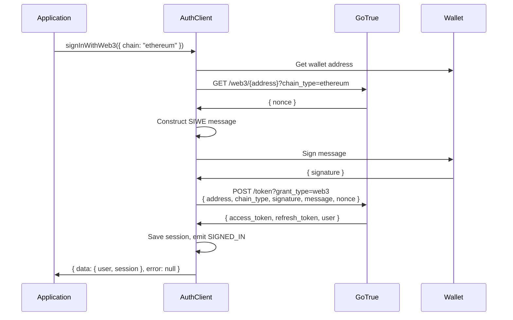

1. Request a nonce from the server: `GET /web3/{address}?chain_type={chain}`.
2. Construct a sign-in message (SIWE for Ethereum, SIWS for Solana).
3. Request the wallet to sign the message.
4. Send the signed message to `POST /token?grant_type=web3` with `{ address, chain_type, signature, message, nonce }`.
5. On success, save session and emit `SIGNED_IN`.

**Ethereum SIWE Message Format** (EIP-4361):
```
{domain} wants you to sign in with your Ethereum account:
{address}

{statement}

URI: {uri}
Version: {version}
Chain ID: {chainId}
Nonce: {nonce}
Issued At: {issuedAt}
```

### 6.10 Sign In Anonymously

#### `signInAnonymously(credentials?) -> Result<{ user: User, session: Session }>`

Creates an anonymous user session.

**Credentials (optional)**:
```
options {
  data         : Map?               -- Custom user metadata
  captchaToken : String?
}
```

**Behavior**:
1. Send `POST /signup` with empty body (plus optional metadata/captcha).
2. On success, save session and emit `SIGNED_IN`.
3. The returned `user.is_anonymous` MUST be `true`.
4. If anonymous sign-ins are disabled on the server, return an error.

### 6.11 Exchange Code for Session (PKCE)

#### `exchangeCodeForSession(authCode) -> Result<{ user: User, session: Session }>`

Exchanges a PKCE authorization code for a session.

**Behavior**:
1. Retrieve the stored code verifier from storage (key: `{storageKey}-code-verifier`).
2. If no code verifier is found, return `AuthPKCEGrantCodeExchangeError`.
3. Send `POST /token?grant_type=pkce` with `{ auth_code, code_verifier }`.
4. On success, save session.
5. If the code verifier had a `/PASSWORD_RECOVERY` suffix, emit `PASSWORD_RECOVERY`.
6. Otherwise, emit `SIGNED_IN`.
7. Remove code verifier from storage regardless of success/failure.

### 6.12 Get Session

#### `getSession() -> Result<{ session: Session? }>`

Returns the current session.

**Behavior**:
1. Acquire lock.
2. Load session from storage.
3. If no session exists, return `{ session: null }`.
4. If session exists and the access token has NOT expired (with `EXPIRY_MARGIN_MS` buffer), return it as-is.
5. If session exists and the access token IS expired (or within `EXPIRY_MARGIN_MS` of expiry), call `_refreshAccessToken()` and return the refreshed session.
6. If refresh fails, remove session and return the error.

**Expiry Check**: A session MUST be considered expired if `expires_at * 1000 - currentTimeMs <= EXPIRY_MARGIN_MS`.

### 6.13 Get User

#### `getUser(jwt?) -> Result<{ user: User }>`

Fetches the current user from the server.

**Behavior**:
1. If `jwt` is provided, use it directly.
2. Otherwise, get the access token from the current session.
3. Send `GET /user` with `Authorization: Bearer {token}`.
4. Return the fresh user object from the server.

**Note**: Unlike `getSession()`, this MUST always make an HTTP call and MUST NOT return cached data.

### 6.14 Update User

#### `updateUser(attributes, options?) -> Result<{ user: User }>`

Updates the currently authenticated user.

**Attributes**:
```
email    : String?      -- New email (triggers confirmation flow)
phone    : String?      -- New phone (triggers confirmation flow)
password : String?      -- New password
nonce    : String?      -- Reauthentication nonce (required for password changes when reauthenticate is needed)
data     : Map?         -- Custom user metadata
```

**Options**:
```
emailRedirectTo : String?   -- Redirect URL for email change confirmation
```

**Behavior**:
1. Send `PUT /user` with the attributes.
2. On success, update the local session's user object and emit `USER_UPDATED`.
3. If email or phone is changed, a confirmation is sent; the session MUST NOT be immediately updated with the new value.

### 6.15 Reset Password for Email

#### `resetPasswordForEmail(email, options?) -> Result<{}>`

Sends a password reset email.

**Options**:
```
redirectTo   : String?     -- Redirect URL in the reset email
captchaToken : String?
```

**Behavior**:
1. Send `POST /recover` with `{ email }`.
2. If `flowType` is `pkce`, include code challenge and store code verifier with `/PASSWORD_RECOVERY` flag.
3. Return empty data on success.

### 6.16 Reauthenticate

#### `reauthenticate() -> Result<{}>`

Sends a reauthentication nonce to the user's email or phone. Used before sensitive operations like password change.

**Behavior**:
1. Send `GET /reauthenticate` with the current session's access token.
2. Return empty data on success.
3. The user receives a nonce that must be passed to `updateUser()`.

### 6.17 Resend

#### `resend(params) -> Result<{ messageId: String? }>`

Resends a confirmation or OTP message.

**Params (email variant)**:
```
type  : "signup" | "email_change" (required)
email : String (required)
options {
  emailRedirectTo : String?
  captchaToken    : String?
}
```

**Params (phone variant)**:
```
type  : "sms" | "phone_change" (required)
phone : String (required)
options {
  captchaToken : String?
}
```

**Behavior**:
1. Validate that either `email` or `phone` is provided.
2. Send `POST /resend` with the parameters.

### 6.18 Sign Out

#### `signOut(options?) -> Result<Null>`

Signs out the user.

**Options**:
```
scope : SignOutScope?   -- "global" | "local" | "others" (default: "global")
```

**Behavior**:

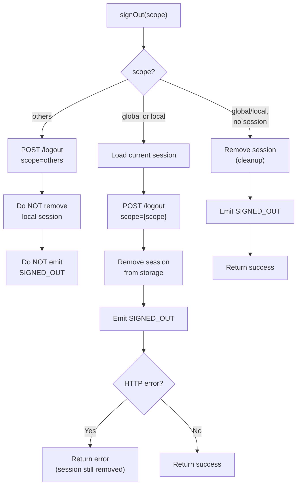

1. If `scope` is `others`:
   - Send `POST /logout` with `scope=others` and access token.
   - MUST NOT remove local session or emit `SIGNED_OUT`.
2. If `scope` is `global` or `local`:
   - Load current session.
   - Send `POST /logout` with the scope and access token.
   - Remove session from storage.
   - Emit `SIGNED_OUT`.
   - Errors from the HTTP call MUST be returned but the local session MUST still be removed.
3. If no session exists and scope is `global` or `local`:
   - Remove session from storage (cleanup).
   - Emit `SIGNED_OUT`.
   - Return no error.

### 6.19 Get User Identities

#### `getUserIdentities() -> Result<{ identities: List<UserIdentity> }>`

Returns the user's linked identity providers.

**Behavior**:
1. Call `getUser()` internally.
2. Return `user.identities` from the response.

### 6.20 Link Identity

#### `linkIdentity(credentials) -> Result<{ provider: String, url: String }> | Result<{ user: User, session: Session }>`

Links an additional identity provider to the current user.

**Credentials**: Same as `signInWithOAuth` or `signInWithIdToken`.

**Behavior**:
- For OAuth: Generate an authorization URL to `/authorize` that links the identity when the user completes the flow.
- For ID Token: Send `PUT /user` with the ID token credentials.

### 6.21 Unlink Identity

#### `unlinkIdentity(identity) -> Result<{}>`

Removes a linked identity provider.

**Behavior**:
1. Send `DELETE /user/identities/{identity.identity_id}`.

### 6.22 Set Session

#### `setSession({ access_token, refresh_token }) -> Result<{ user: User, session: Session }>`

Manually sets a session from a pair of tokens.

**Behavior**:
1. Decode the `access_token` JWT (without verifying signature).
2. Validate that the JWT has a valid structure (3 parts, valid base64url, valid JSON).
3. Check `exp` claim; if expired, use the `refresh_token` to refresh.
4. If not expired, fetch the user with `getUser(access_token)`.
5. Save the session and emit `SIGNED_IN` and `TOKEN_REFRESHED`.
6. Return error if `access_token` or `refresh_token` is missing or malformed.

### 6.23 Refresh Session

#### `refreshSession(currentSession?) -> Result<{ user: User, session: Session }>`

Refreshes the current session.

**Behavior**:
1. If `currentSession` with `refresh_token` is provided, use it.
2. Otherwise, load the current session from storage.
3. If no session/refresh token exists, return `AuthSessionMissingError`.
4. Call the token refresh endpoint and save the new session.

### 6.24 Get Claims (JWT Verification)

#### `getClaims(jwt?, options?) -> Result<{ claims: JwtPayload, header: JwtHeader, signature: Bytes }>`

Decodes and optionally verifies JWT claims.

**Options**:
```
allowExpired : Boolean?      -- Skip expiration check
keys         : List<JWK>?   -- Explicit JWK keys for verification
jwks         : { keys: List<JWK> }?  -- Explicit JWKS for verification
```

**Behavior**:
1. If no `jwt`, get the access token from the current session.
2. Decode the JWT.
3. If JWKs are provided (or can be fetched from `{url}/.well-known/jwks.json`), verify the signature.
4. JWKS responses MUST be cached for `JWKS_TTL` (10 minutes).
5. Return decoded claims, header, and raw signature.

### 6.25 Auth State Change Subscription

#### `onAuthStateChange(callback) -> { data: { subscription: Subscription } }`

Registers a listener for authentication state changes.

**Note**: This method is synchronous and returns immediately. It MUST NOT return `{ data, error }` like other methods.

**Callback**: `(event: AuthChangeEvent, session: Session?) -> Void`

**Subscription**:
```
Subscription {
  id          : UniqueId        -- Unique subscription identifier
  callback    : Callback        -- The registered callback
  unsubscribe : () -> Void      -- Call to remove the listener
}
```

**Behavior**:
1. Register the callback.
2. The callback MUST be called asynchronously for the `INITIAL_SESSION` event with the current session (or null).
3. Subsequent events fire the callback as they occur.
4. `unsubscribe()` removes the listener.

### 6.26 Start/Stop Auto Refresh

#### `startAutoRefresh() -> Void`
#### `stopAutoRefresh() -> Void`

Manually controls the auto-refresh timer. Useful for platforms where visibility change detection is not available.

---

## 7. Admin API

Admin methods require a service role key. They MUST be available on the `client.admin` namespace.

### 7.1 Create User

#### `admin.createUser(attributes) -> Result<{ user: User }>`

**Attributes** (extends UserAttributes):
```
email          : String?
phone          : String?
password       : String?
user_metadata  : Map?          -- User-controlled metadata
app_metadata   : Map?          -- Service-controlled metadata
email_confirm  : Boolean?      -- Auto-confirm email
phone_confirm  : Boolean?      -- Auto-confirm phone
ban_duration   : String?       -- Ban duration (e.g., "24h", "none")
```

**Behavior**: Send `POST /admin/users`.

### 7.2 List Users

#### `admin.listUsers(params?) -> Result<{ users: List<User>, aud: String, ...pagination }>`

**Params**:
```
page    : Integer?             -- Page number (1-based)
perPage : Integer?             -- Users per page
```

**Behavior**: Send `GET /admin/users` with pagination query parameters.

### 7.3 Get User By ID

#### `admin.getUserById(uid) -> Result<{ user: User }>`

**Behavior**: Send `GET /admin/users/{uid}`.

### 7.4 Update User By ID

#### `admin.updateUserById(uid, attributes) -> Result<{ user: User }>`

**Behavior**: Send `PUT /admin/users/{uid}` with admin attributes.

### 7.5 Delete User

#### `admin.deleteUser(id, shouldSoftDelete?) -> Result<{ user: User }>`

**Behavior**: Send `DELETE /admin/users/{id}`. If `shouldSoftDelete` is `true`, perform a soft delete.

### 7.6 Invite User By Email

#### `admin.inviteUserByEmail(email, options?) -> Result<{ user: User }>`

**Options**:
```
data       : Map?              -- User metadata
redirectTo : String?           -- Redirect URL in invite email
```

**Behavior**: Send `POST /invite` with the email and options.

### 7.7 Generate Link

#### `admin.generateLink(params) -> Result<{ properties: LinkProperties, user: User }>`

Generates authentication links server-side (signup, invite, magic link, recovery, email change).

**Params variants**:
```
type: "signup"
  email: String, password: String
  options: { data?, redirectTo? }

type: "invite" | "magiclink"
  email: String
  options: { data?, redirectTo? }

type: "recovery"
  email: String
  options: { redirectTo? }

type: "email_change_current" | "email_change_new"
  email: String, newEmail: String
  options: { redirectTo? }
```

**LinkProperties**:
```
LinkProperties {
  action_link       : String   -- Full verification URL
  email_otp         : String   -- Raw OTP code
  hashed_token      : String   -- Hashed token in the URL
  redirect_to       : String   -- Redirect URL
  verification_type : String   -- Link type
}
```

**Behavior**: Send `POST /admin/generate_link`.

### 7.8 Admin Sign Out

#### `admin.signOut(jwt, scope?) -> Result<Null>`

Signs out a user by their JWT. Send `POST /logout` with the provided token.

---

## 8. Multi-Factor Authentication API

MFA methods MUST be available on the `client.mfa` namespace.

### MFA Flow Overview

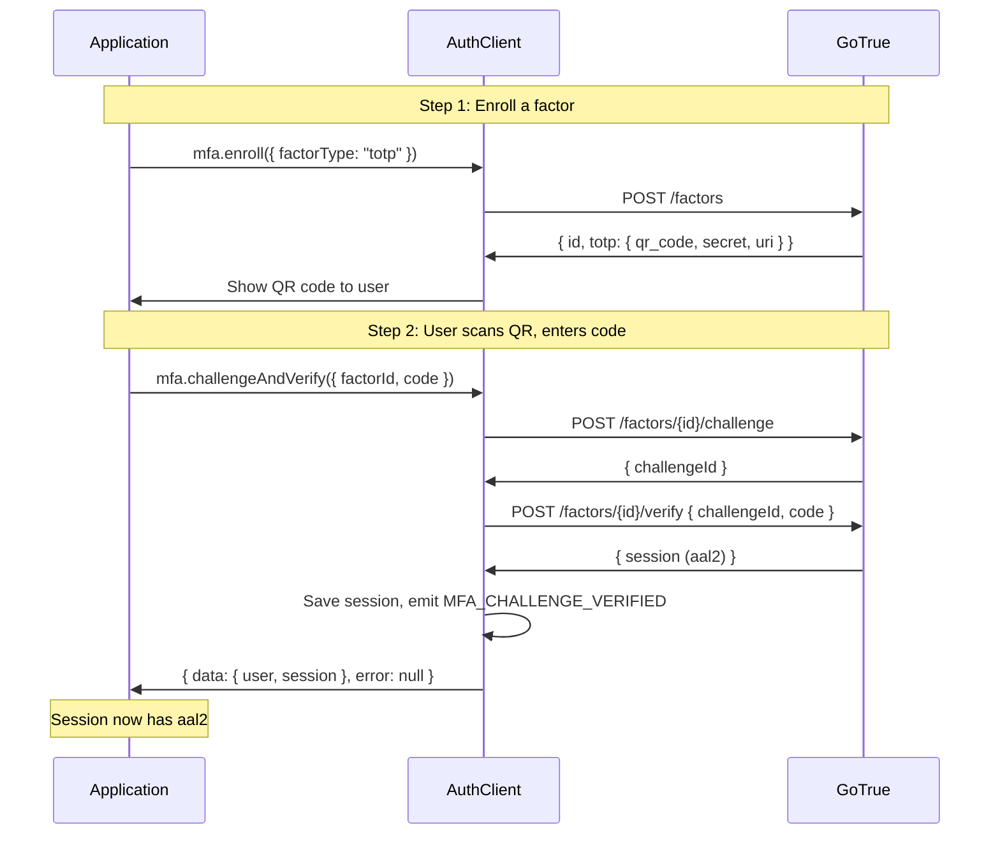

### 8.1 Enroll

#### `mfa.enroll(params) -> Result<EnrollResponse>`

Enrolls a new MFA factor.

**Params (TOTP)**:
```
factorType   : "totp" (required)
friendlyName : String?
issuer       : String?              -- TOTP issuer (appears in authenticator app)
```

**Response (TOTP)**:
```
id           : String               -- Factor UUID
type         : "totp"
totp {
  qr_code    : String               -- Data URI of QR code SVG image
  secret     : String               -- TOTP secret (base32)
  uri        : String               -- otpauth:// URI
}
friendly_name : String?
```

**Params (Phone)**:
```
factorType   : "phone" (required)
friendlyName : String?
phone        : String (required)    -- Phone number to receive SMS codes
```

**Response (Phone)**:
```
id            : String
type          : "phone"
phone         : String
friendly_name : String?
```

**Params (WebAuthn)**:
```
factorType   : "webauthn" (required)
friendlyName : String?
```

**Response (WebAuthn)**:
```
id           : String
type         : "webauthn"
webauthn {
  type                : "create"
  credential_options  : PublicKeyCredentialCreationOptions
}
```

**Behavior**:
1. Send `POST /factors` with the factor type and parameters.
2. For TOTP: Prepend `data:image/svg+xml;utf-8,` to the `qr_code` SVG from the server.
3. For WebAuthn: Deserialize the credential creation options from the server's JSON format into platform-native objects.

### 8.2 Challenge

#### `mfa.challenge(params) -> Result<ChallengeResponse>`

Creates an MFA challenge for a factor.

**Params**:
```
factorId : String (required)        -- Factor UUID
```

**Response (TOTP/Phone)**:
```
id         : String                 -- Challenge UUID
type       : "totp" | "phone"
expires_at : Integer                -- Unix timestamp
```

**Response (WebAuthn)**:
```
id       : String
type     : "webauthn"
webauthn {
  type               : "create" | "request"
  credential_options : PublicKeyCredentialCreationOptions | PublicKeyCredentialRequestOptions
}
```

**Behavior**:
1. Acquire lock.
2. Send `POST /factors/{factorId}/challenge`.
3. For WebAuthn: Deserialize credential options from server's serialized format.

### 8.3 Verify

#### `mfa.verify(params) -> Result<{ user: User, session: Session }>`

Verifies an MFA challenge.

**Params (TOTP/Phone)**:
```
factorId    : String (required)
challengeId : String (required)
code        : String (required)     -- 6-digit TOTP or SMS code
```

**Params (WebAuthn)**:
```
factorId    : String (required)
challengeId : String (required)
webauthn {
  type                : "create" | "request"
  credential_response : WebAuthn credential response
}
```

**Behavior**:
1. Acquire lock.
2. Send `POST /factors/{factorId}/verify` with the challenge ID and code/credential.
3. For WebAuthn: Serialize the credential response to JSON format before sending.
4. On success, save the new session (which now has `aal2`).
5. Emit `MFA_CHALLENGE_VERIFIED`.

### 8.4 Unenroll

#### `mfa.unenroll(params) -> Result<{ id: String }>`

Removes an MFA factor.

**Params**:
```
factorId : String (required)
```

**Behavior**: Send `DELETE /factors/{factorId}`.

### 8.5 Challenge and Verify

#### `mfa.challengeAndVerify(params) -> Result<{ user: User, session: Session }>`

Convenience method that combines challenge and verify in one call.

**Params**:
```
factorId : String (required)
code     : String (required)
```

**Behavior**: Call `challenge({ factorId })`, then `verify({ factorId, challengeId: challenge.id, code })`.

### 8.6 List Factors

#### `mfa.listFactors() -> Result<{ all: List<Factor>, totp: List<Factor>, phone: List<Factor> }>`

Lists all MFA factors for the current user.

**Behavior**:
1. Call `getUser()` to get fresh user data.
2. Categorize `user.factors` by type.

### 8.7 Get Authenticator Assurance Level

#### `mfa.getAuthenticatorAssuranceLevel(jwt?) -> Result<{ currentLevel: AAL?, nextLevel: AAL?, currentAuthenticationMethods: List<AMREntry> }>`

Returns the current and next AAL for the session.

**Behavior**:
1. Decode the JWT (from parameter or current session).
2. Read the `aal` claim as `currentLevel`.
3. Read the `amr` claim as `currentAuthenticationMethods`.
4. Determine `nextLevel`:
   - If user has any verified factors, `nextLevel` is `aal2`.
   - Otherwise, `nextLevel` is `currentLevel`.

---

## 9. OAuth 2.1 Server API

These methods are for implementing an OAuth consent page. They MUST be available on the `client.oauth` namespace. Only relevant when the OAuth 2.1 server is enabled in Supabase Auth.

### 9.1 Get Authorization Details

#### `oauth.getAuthorizationDetails(authorizationId) -> Result<AuthorizationDetails | OAuthRedirect>`

**AuthorizationDetails** (consent needed):
```
AuthorizationDetails {
  authorization_id : String
  redirect_uri     : String         -- Base OAuth client redirect URI
  client {
    id       : String
    name     : String
    uri      : String
    logo_uri : String
  }
  user {
    id    : String
    email : String
  }
  scope : String                    -- Space-separated scopes
}
```

**OAuthRedirect** (already consented):
```
OAuthRedirect {
  redirect_url : String             -- Full redirect URL with code
}
```

**Behavior**: Send `GET /oauth/authorize?authorization_id={id}` with the user's access token. Return authorization details if user must consent, or a redirect URL if already consented.

### 9.2 Approve Authorization

#### `oauth.approveAuthorization(authorizationId, options?) -> Result<{ redirect_url: String }>`

**Behavior**: Send `POST /oauth/authorize` with `{ authorization_id, consent: "approve" }`.

### 9.3 Deny Authorization

#### `oauth.denyAuthorization(authorizationId, options?) -> Result<{ redirect_url: String }>`

**Behavior**: Send `POST /oauth/authorize` with `{ authorization_id, consent: "deny" }`.

### 9.4 List Grants

#### `oauth.listGrants() -> Result<List<OAuthGrant>>`

**OAuthGrant**:
```
OAuthGrant {
  client     : OAuthAuthorizationClient
  scopes     : List<String>
  granted_at : String               -- ISO 8601
}
```

**Behavior**: Send `GET /oauth/grants` with the user's access token.

### 9.5 Revoke Grant

#### `oauth.revokeGrant({ clientId }) -> Result<{}>`

**Behavior**: Send `DELETE /oauth/grants` with `{ client_id }`. Revokes consent, deletes sessions, and invalidates refresh tokens for the specified OAuth client.

---

## 10. Session Management

### Session Lifecycle

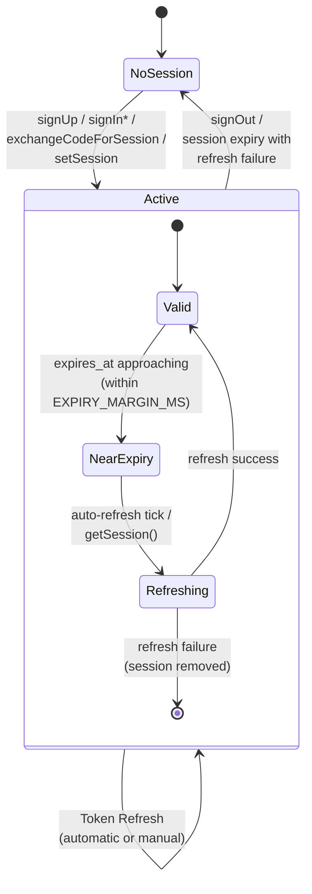

### Session Storage

Sessions MUST be stored as JSON strings under the configured `storageKey`. The SDK MUST handle both synchronous and asynchronous storage adapters transparently.

**Stored format**: JSON serialization of the `Session` object.

### Session Recovery

On visibility change (tab becoming active) or initialization:

1. Load session from storage.
2. Validate session structure (MUST have `access_token`, `refresh_token`, `expires_at`).
3. If expired or near-expiry, refresh.
4. If refresh fails, remove session.
5. If valid, emit `SIGNED_IN` to re-sync state.

### Concurrent Refresh Deduplication

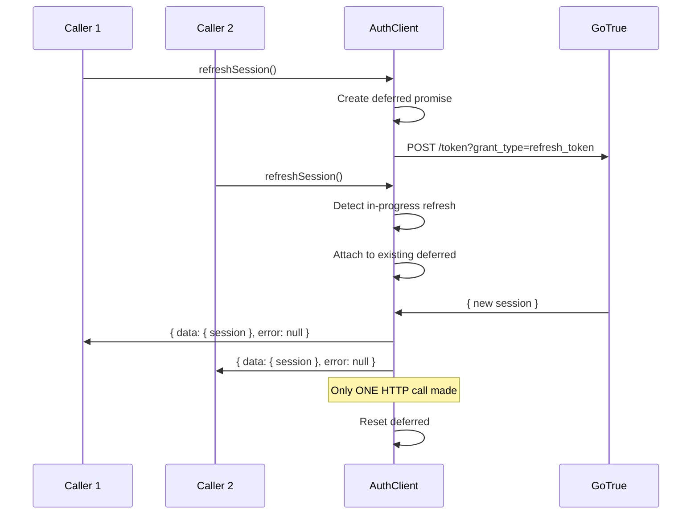

When multiple components or tabs simultaneously request a token refresh:

1. The first caller creates a deferred promise and starts the refresh HTTP call.
2. Subsequent callers detect the in-progress refresh and attach to the same deferred.
3. When the HTTP call completes, all callers receive the same result.
4. The deferred MUST be reset after resolution/rejection.

---

## 11. Token Auto-Refresh

### Auto-Refresh Flow

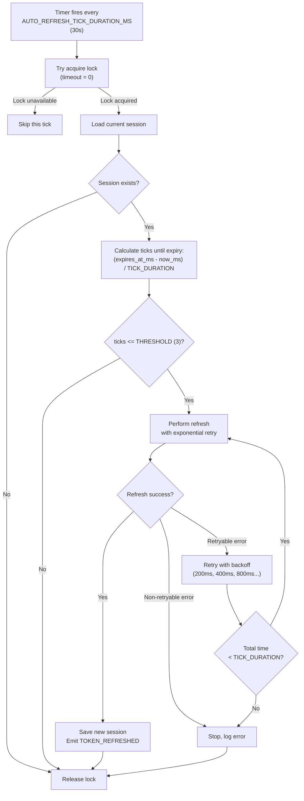

### Timer Behavior

1. A periodic timer MUST fire every `AUTO_REFRESH_TICK_DURATION_MS` (30 seconds).
2. On each tick:
   a. Try to acquire lock with timeout 0 (fail immediately if unavailable).
   b. If lock acquisition fails, skip this tick silently.
   c. Load current session.
   d. Calculate ticks until expiry: `(expires_at_ms - currentTimeMs) / TICK_DURATION`.
   e. If `ticks <= AUTO_REFRESH_TICK_THRESHOLD` (3), perform refresh.
3. On server-side runtimes: The timer SHOULD be unreferenced so it does not prevent process exit.

### Refresh with Retry

Token refresh MUST use exponential backoff for retryable errors:

1. Base interval: 200ms (doubles each retry).
2. Only `AuthRetryableFetchError` triggers retry.
3. Total retry time MUST be bounded by `AUTO_REFRESH_TICK_DURATION_MS` (30s).
4. If the next backoff would exceed the tick duration, stop retrying.
5. Maximum retries: 10 (configurable constant).

### Visibility Change Integration (Browser)

- **Tab becomes visible**: Start auto-refresh timer and immediately recover/refresh session.
- **Tab becomes hidden**: Stop auto-refresh timer.
- **Not in browser**: Auto-refresh MUST run continuously.

---

## 12. Auth State Change Events

### Event Types

| Event | When Emitted |
|-------|-------------|
| `INITIAL_SESSION` | Once during initialization, with the loaded or recovered session |
| `SIGNED_IN` | After successful sign-in, token exchange, or session recovery |
| `SIGNED_OUT` | After sign-out or session removal |
| `TOKEN_REFRESHED` | After a successful token refresh |
| `USER_UPDATED` | After `updateUser()` succeeds |
| `PASSWORD_RECOVERY` | When a password recovery flow is detected (URL or OTP verify) |
| `MFA_CHALLENGE_VERIFIED` | After successful MFA verification |

### Event Emission Timeline

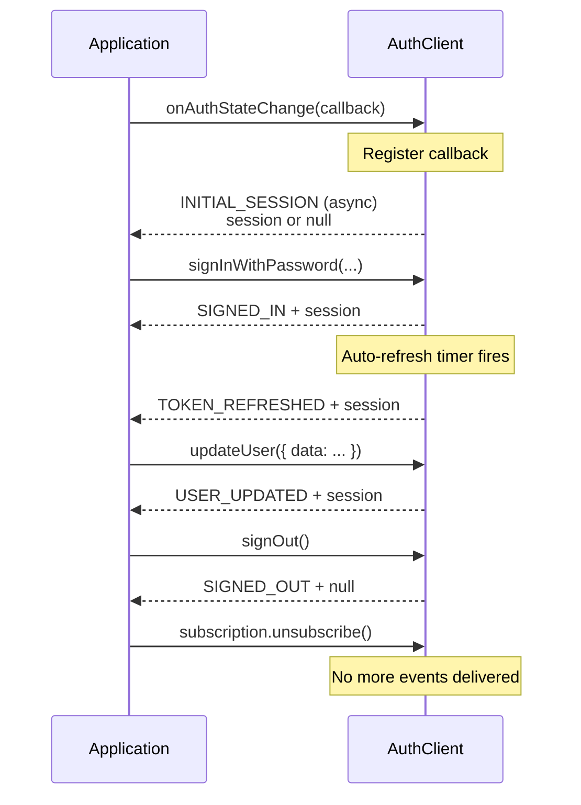

### Event Delivery Guarantees

1. Events MUST be delivered to all registered listeners in registration order.
2. Listener callbacks MUST be invoked asynchronously.
3. Errors thrown in listener callbacks MUST be caught and logged (MUST NOT propagate).
4. The `INITIAL_SESSION` event MUST be emitted once per subscription, even if registered after initialization.
5. Events are NOT deduplicated; the same event MAY fire multiple times if the underlying operation occurs multiple times.

### Cross-Tab Synchronization

In browser environments, auth state changes SHOULD be synchronized across tabs using broadcast mechanisms (e.g., BroadcastChannel or equivalent). When a session change is detected in another tab:

1. The session MUST be reloaded from storage.
2. Appropriate events MUST be emitted (`SIGNED_IN` or `SIGNED_OUT`).

---

## 13. PKCE Flow

### PKCE Flow Overview

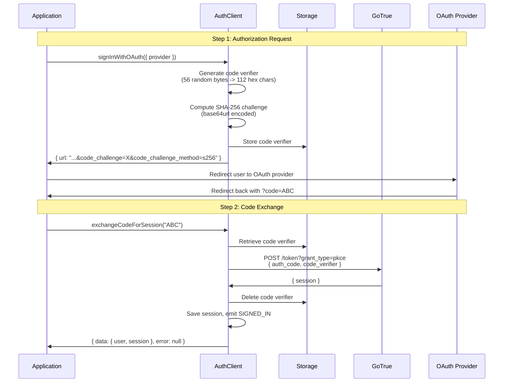

### Code Verifier Generation

1. Generate 56 random bytes using a cryptographically secure random number generator.
2. If secure random is unavailable, fall back to a platform random (with warning).
3. Encode each byte as 2-character hex string, resulting in a 112-character string.

### Code Challenge Generation

1. Compute SHA-256 hash of the code verifier using platform crypto API.
2. Base64url-encode the hash (no padding).
3. Method: `s256`.
4. If SHA-256 is unavailable, use `plain` method (code challenge = code verifier).

### Storage

- Code verifier MUST be stored under key `{storageKey}-code-verifier`.
- For password recovery flows, append `/PASSWORD_RECOVERY` to the stored value.
- The stored verifier MUST be consumed (deleted) after use.

### Flow

1. **Authorization Request**: Client generates verifier, computes challenge, stores verifier, sends challenge with auth request.
2. **Callback**: Server redirects with `code` parameter.
3. **Token Exchange**: Client retrieves stored verifier, sends `code` + `code_verifier` to token endpoint, deletes stored verifier.

---

## 14. Locking Mechanism

### Purpose

Prevent concurrent modifications to session state (especially token refresh) across browser tabs and concurrent async operations within a single process.

### Lock Acquisition Flow

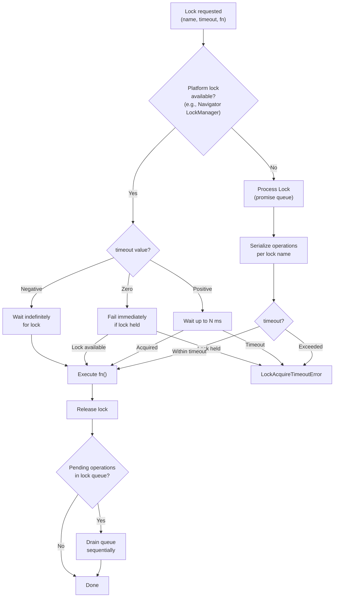

### Browser Lock (Navigator LockManager API)

When a platform lock manager is available:

1. Request an exclusive lock with the configured name.
2. `acquireTimeout` behavior:
   - Negative: Wait indefinitely.
   - Zero: Fail immediately if lock is held by another context.
   - Positive: Wait up to N milliseconds, then fail with `LockAcquireTimeoutError`.
3. Lock MUST be released when the callback completes.

### Process Lock (Non-Browser)

For environments without a platform lock manager:

1. Maintain a per-name promise queue.
2. Operations MUST be serialized: each waits for the previous to complete.
3. Timeout MUST be enforced via a race between the operation and a timer.
4. MUST fail with `LockAcquireTimeoutError` on timeout.

### Re-entrant Lock Handling

If a lock is already acquired by the current context:

1. The operation MUST be queued in a `pendingInLock` list.
2. After the primary lock callback completes, the queue MUST be drained sequentially.
3. This prevents deadlocks from nested lock acquisitions.

---

## 15. HTTP Layer

### Request Construction

Every HTTP request to the GoTrue server MUST include:

1. **Headers**:
   - `X-Supabase-Api-Version: 2024-01-01` (API version)
   - `X-Client-Info: {sdk_name}/{sdk_version}` (client identification)
   - Any custom headers from configuration
   - `Authorization: Bearer {jwt}` when a session/token is available
2. **Content-Type**: `application/json;charset=UTF-8` for requests with bodies.

### Response Handling

1. Parse response JSON.
2. If HTTP status indicates error, classify and return appropriate error type.
3. For session responses, compute `expires_at` if not present: `floor(currentTimeSeconds) + expires_in`.
4. For user responses, extract and return the user object.

### Retryable Requests

Certain requests (primarily token refresh) support automatic retry:

1. Only `AuthRetryableFetchError` triggers retry.
2. Exponential backoff: 200ms, 400ms, 800ms, 1600ms...
3. Total retry time MUST be bounded by the caller's timeout.
4. Non-retryable errors MUST terminate immediately.

---

## 16. Storage Abstraction

### Interface

```
StorageAdapter {
  getItem(key: String) -> String?   -- MAY be sync or async
  setItem(key: String, value: String)  -- MAY be sync or async
  removeItem(key: String)           -- MAY be sync or async
}
```

### Built-in Adapters

| Adapter | Environment | Description |
|---------|------------|-------------|
| Platform storage | Browser | Uses the platform's local storage API |
| Memory | Any | In-memory key-value store (non-persistent) |

### Storage Operations

- **Save**: JSON-serialize the value, then `setItem`.
- **Load**: `getItem`, then JSON-parse (fallback to raw string if parse fails).
- **Remove**: `removeItem`.

### Storage Keys

| Key | Contents |
|-----|----------|
| `{storageKey}` | Serialized `Session` object |
| `{storageKey}-code-verifier` | PKCE code verifier (temporary, deleted after use) |

---

## 17. Integration with Parent SDK

### Token Propagation Architecture

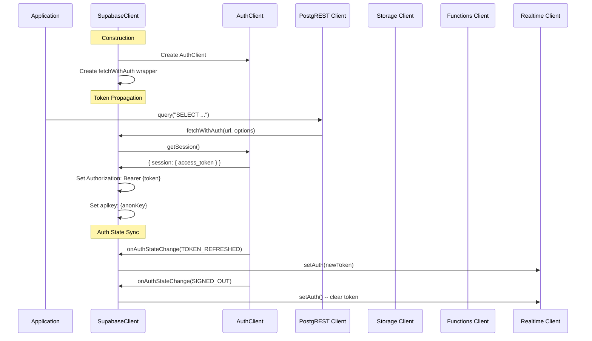

### Token Propagation

When embedded in the main Supabase client:

1. The Supabase client MUST create a `fetchWithAuth` wrapper that:
   - Calls `auth.getSession()` to get the current access token.
   - Falls back to the anonymous key if no session exists.
   - Sets `Authorization: Bearer {token}` and `apikey: {key}` headers.
   - MUST respect existing headers (MUST NOT override if already set).
2. This wrapper MUST be passed to PostgREST, Storage, Functions, and Realtime clients.

### Realtime Token Sync

The parent SDK MUST listen to auth state changes:

1. On `SIGNED_IN` or `TOKEN_REFRESHED`: Update the Realtime client's auth token.
2. On `SIGNED_OUT`: Clear the Realtime client's auth token.

### Storage Key Convention

When used as part of the Supabase client, the storage key MUST follow the pattern:
```
sb-{project_ref}-auth-token
```
Where `{project_ref}` is extracted from the Supabase URL hostname.

---

## 18. Required Test Scenarios

Every conformant implementation MUST pass the following test scenarios. Tests are organized by category with expected behaviors.

### 18.1 Client Configuration

| ID | Scenario | Expected Behavior |
|----|----------|-------------------|
| CF-01 | Client initializes with default options | Client uses default URL, default headers, default storage key |
| CF-02 | Client accepts custom storage adapter | Sessions persisted to and loaded from custom adapter |
| CF-03 | Client accepts custom fetch implementation | All HTTP requests use the custom function |
| CF-04 | Client accepts custom lock implementation | Lock acquisition uses the custom function |
| CF-05 | Client accepts debug logger | Debug messages passed to the function |

### 18.2 Email/Password Sign Up

| ID | Scenario | Expected Behavior |
|----|----------|-------------------|
| SU-01 | Sign up with email and password | Returns user object, may or may not include session |
| SU-02 | Sign up with email, password, and user metadata | User metadata is set on the created user |
| SU-03 | Sign up fails with invalid email format | Returns error |
| SU-04 | Sign up fails with weak password | Returns `AuthWeakPasswordError` with reasons list |
| SU-05 | Sign up fails when both email and phone are missing | Returns `AuthInvalidCredentialsError` |
| SU-06 | Sign up same user twice | Returns appropriate error message |
| SU-07 | Sign up with PKCE flow | Request includes `code_challenge` and `code_challenge_method` |

### 18.3 Email/Password Sign In

| ID | Scenario | Expected Behavior |
|----|----------|-------------------|
| SI-01 | Sign in with email and password | Returns session with `access_token`, `refresh_token`, `expires_in`, `expires_at` and user with id, email, app_metadata |
| SI-02 | Sign in fails with wrong password | Returns error, session is null |
| SI-03 | Sign in fails when email and phone are both missing | Returns error containing "email or phone number and a password" |
| SI-04 | Sign in with captcha token | Request includes captchaToken |

### 18.4 Phone/Password Authentication

| ID | Scenario | Expected Behavior |
|----|----------|-------------------|
| PH-01 | Sign up with phone and password | Returns user with matching phone number |
| PH-02 | Sign in with phone and password | Returns session, user has `phone_confirmed_at` set |
| PH-03 | Sign in fails with wrong phone | Returns error |

### 18.5 OAuth Sign In

| ID | Scenario | Expected Behavior |
|----|----------|-------------------|
| OA-01 | Sign in with OAuth provider returns URL | Returns `{ url, provider }` with no error, URL contains provider parameter |
| OA-02 | Sign in with OAuth includes redirect URL | URL contains `redirect_to` parameter |
| OA-03 | Sign in with OAuth includes scopes | URL contains scopes parameter |
| OA-04 | Sign in with OAuth and PKCE includes code challenge | URL contains `code_challenge` and `code_challenge_method` |
| OA-05 | Sign in with OAuth and skipBrowserRedirect | URL contains `skip_http_redirect=true` |

### 18.6 OTP (Magic Link) Authentication

| ID | Scenario | Expected Behavior |
|----|----------|-------------------|
| OT-01 | Send OTP to email | Returns success (no session returned) |
| OT-02 | Send OTP to phone | Returns success |
| OT-03 | OTP fails when both email and phone are missing | Returns error |
| OT-04 | Verify OTP with valid token | Returns session |
| OT-05 | Verify OTP with invalid token | Returns error: "Token has expired or is invalid" |

### 18.7 ID Token Sign In

| ID | Scenario | Expected Behavior |
|----|----------|-------------------|
| IT-01 | Sign in with valid OIDC ID token | Returns session |
| IT-02 | Sign in with ID token including access_token for at_hash | Request includes `access_token` |

### 18.8 SSO Sign In

| ID | Scenario | Expected Behavior |
|----|----------|-------------------|
| SS-01 | Sign in with SSO by provider ID | Returns redirect URL |
| SS-02 | Sign in with SSO by domain | Returns redirect URL |

### 18.9 Anonymous Sign In

| ID | Scenario | Expected Behavior |
|----|----------|-------------------|
| AN-01 | Anonymous sign in succeeds | Returns session with `user.is_anonymous == true` |
| AN-02 | Anonymous sign in with metadata | User metadata includes provided data |
| AN-03 | Anonymous sign in fails when disabled | Returns error: "Anonymous sign-ins are disabled" |

### 18.10 Session Management

| ID | Scenario | Expected Behavior |
|----|----------|-------------------|
| SM-01 | getSession() returns current session | Returns the active session |
| SM-02 | getSession() returns null when not signed in | Returns `{ session: null }` |
| SM-03 | getSession() refreshes expired session | Refreshes the token and returns new session with different access_token |
| SM-04 | setSession() with valid tokens | Session is saved and retrievable via getSession() |
| SM-05 | setSession() fails with invalid access token | Returns error: "Invalid JWT structure" |
| SM-06 | setSession() fails without refresh token | Returns error |
| SM-07 | refreshSession() with explicit refresh token | Returns new session with different refresh_token |
| SM-08 | refreshSession() without argument | Returns refreshed session from storage |
| SM-09 | Concurrent refresh requests are deduplicated | Both callers receive the same access_token, only one HTTP call made |

### 18.11 Code Exchange (PKCE)

| ID | Scenario | Expected Behavior |
|----|----------|-------------------|
| PK-01 | exchangeCodeForSession() with valid code | Returns session |
| PK-02 | exchangeCodeForSession() fails with missing code verifier | Returns `AuthPKCEGrantCodeExchangeError` |
| PK-03 | exchangeCodeForSession() fails with invalid code | Returns error (HTTP 400) |

### 18.12 Sign Out

| ID | Scenario | Expected Behavior |
|----|----------|-------------------|
| SO-01 | Sign out removes session | `getSession()` returns null |
| SO-02 | Sign out with invalid/expired JWT still clears local session | Local session removed, `SIGNED_OUT` emitted |
| SO-03 | Sign out with scope "others" does not clear local session | Local session still present |

### 18.13 User Management

| ID | Scenario | Expected Behavior |
|----|----------|-------------------|
| UM-01 | getUser() returns current user from server | Returns user with correct id and email |
| UM-02 | getUser() returns error after sign out | Returns error |
| UM-03 | updateUser() with custom metadata | Returns updated user with metadata |
| UM-04 | getUserIdentities() returns linked providers | Returns list of identity objects |

### 18.14 Password Recovery

| ID | Scenario | Expected Behavior |
|----|----------|-------------------|
| PR-01 | resetPasswordForEmail() sends reset email | Returns success (empty data) |
| PR-02 | resetPasswordForEmail() with PKCE stores verifier with recovery flag | Code verifier stored with `/PASSWORD_RECOVERY` suffix |

### 18.15 Auth State Events

| ID | Scenario | Expected Behavior |
|----|----------|-------------------|
| EV-01 | INITIAL_SESSION fires on subscription | Callback receives `INITIAL_SESSION` event |
| EV-02 | SIGNED_IN fires after sign in | Callback receives `SIGNED_IN` event with session |
| EV-03 | SIGNED_OUT fires after sign out | Callback receives `SIGNED_OUT` event with null session |
| EV-04 | TOKEN_REFRESHED fires after token refresh | Callback receives `TOKEN_REFRESHED` event |
| EV-05 | USER_UPDATED fires after updateUser | Callback receives `USER_UPDATED` event |
| EV-06 | unsubscribe() stops event delivery | No further events delivered to the callback |

### 18.16 Admin API

| ID | Scenario | Expected Behavior |
|----|----------|-------------------|
| AD-01 | admin.createUser() creates user | Returns created user |
| AD-02 | admin.createUser() with metadata | Returns user with correct metadata |
| AD-03 | admin.createUser() fails with invalid email | Returns AuthError |
| AD-04 | admin.listUsers() returns users | Returns users list with aud field |
| AD-05 | admin.listUsers() with invalid page | Returns error |
| AD-06 | admin.getUserById() returns user | Returns matching user |
| AD-07 | admin.getUserById() fails with invalid ID | Returns error |
| AD-08 | admin.updateUserById() modifies user | Returns updated user |
| AD-09 | admin.updateUserById() confirms email | `user.email_confirmed_at` changes from null to non-null |
| AD-10 | admin.deleteUser() removes user | User is deleted |
| AD-11 | admin.deleteUser() fails with invalid ID | Returns error |
| AD-12 | admin.generateLink() creates signup link | Returns `action_link`, `email_otp`, `hashed_token`, `verification_type` |
| AD-13 | admin.inviteUserByEmail() sends invite | Returns user object |

### 18.17 HTTP Error Handling

| ID | Scenario | Expected Behavior |
|----|----------|-------------------|
| HE-01 | 400 with valid JSON returns AuthApiError | Error is `AuthApiError` with message and status |
| HE-02 | 400 with non-JSON returns AuthUnknownError | Error is `AuthUnknownError` |
| HE-03 | 500 does NOT return AuthRetryableFetchError | Error is NOT `AuthRetryableFetchError` |
| HE-04 | Network failure returns AuthRetryableFetchError | Error is `AuthRetryableFetchError` with status 0 |
| HE-05 | Server aborts returns AuthRetryableFetchError | Error is `AuthRetryableFetchError` |

### 18.18 Locking

| ID | Scenario | Expected Behavior |
|----|----------|-------------------|
| LK-01 | Lock serializes concurrent access | Operations execute one at a time |
| LK-02 | Lock times out when held too long | Fails with `LockAcquireTimeoutError` |
| LK-03 | Lock fails immediately when timeout is 0 and lock is held | Fails with `LockAcquireTimeoutError` immediately |
| LK-04 | Lock handles errors in locked operation | Lock is released, error propagates |

### 18.19 Storage Adapter

| ID | Scenario | Expected Behavior |
|----|----------|-------------------|
| SA-01 | Memory storage adapter stores and retrieves values | `getItem` returns previously stored value |
| SA-02 | Memory storage returns null for unknown keys | Returns null |
| SA-03 | Memory storage removes items | `getItem` returns null after `removeItem` |

### 18.20 JWT Utilities

| ID | Scenario | Expected Behavior |
|----|----------|-------------------|
| JW-01 | decodeJWT rejects non-JWT strings | Returns error |
| JW-02 | decodeJWT rejects invalid base64url | Returns error |
| JW-03 | decodeJWT decodes valid JWT | Returns header, payload, and signature with expected claims |

### 18.21 Base64URL Encoding

| ID | Scenario | Expected Behavior |
|----|----------|-------------------|
| B6-01 | Encodes ASCII strings to base64url | Correct base64url output |
| B6-02 | Encodes Unicode/multi-byte strings | Correct base64url output (Cyrillic, CJK, emoji) |
| B6-03 | Decodes base64url to strings | Original strings recovered |
| B6-04 | Handles whitespace in base64url input | Correctly decoded |
| B6-05 | Rejects invalid base64url characters | Fails with error |

### 18.22 Resend Operations

| ID | Scenario | Expected Behavior |
|----|----------|-------------------|
| RS-01 | Resend email confirmation | Returns success |
| RS-02 | Resend phone OTP | Returns success |
| RS-03 | Resend fails without email or phone | Returns error |

### 18.23 Server Feature Flags

| ID | Scenario | Expected Behavior |
|----|----------|-------------------|
| FF-01 | Sign up fails when signups are disabled | Returns error: "Signups not allowed for this instance" |

---

## 19. API Endpoint Reference

All endpoints are relative to the GoTrue server URL.

| Method | Path | Purpose |
|--------|------|---------|
| POST | `/signup` | Create user account |
| POST | `/token?grant_type=password` | Sign in with password |
| POST | `/token?grant_type=id_token` | Sign in with OIDC ID token |
| POST | `/token?grant_type=pkce` | Exchange PKCE code for session |
| POST | `/token?grant_type=refresh_token` | Refresh access token |
| POST | `/token?grant_type=web3` | Sign in with Web3 wallet |
| GET | `/authorize` | OAuth authorization redirect |
| POST | `/otp` | Send magic link or OTP |
| POST | `/verify` | Verify OTP |
| POST | `/recover` | Send password reset email |
| POST | `/resend` | Resend OTP/confirmation |
| POST | `/sso` | Initiate SSO sign-in |
| GET | `/user` | Get current user |
| PUT | `/user` | Update current user |
| DELETE | `/user/identities/{id}` | Unlink identity |
| POST | `/logout` | Sign out |
| GET | `/reauthenticate` | Request reauthentication nonce |
| POST | `/factors` | Enroll MFA factor |
| POST | `/factors/{id}/challenge` | Create MFA challenge |
| POST | `/factors/{id}/verify` | Verify MFA challenge |
| DELETE | `/factors/{id}` | Unenroll MFA factor |
| GET | `/web3/{address}` | Get Web3 nonce |
| GET | `/.well-known/jwks.json` | Get JSON Web Key Set |
| POST | `/admin/users` | Create user (admin) |
| GET | `/admin/users` | List users (admin) |
| GET | `/admin/users/{id}` | Get user by ID (admin) |
| PUT | `/admin/users/{id}` | Update user (admin) |
| DELETE | `/admin/users/{id}` | Delete user (admin) |
| POST | `/invite` | Invite user by email (admin) |
| POST | `/admin/generate_link` | Generate auth link (admin) |
| GET | `/oauth/authorize` | Get OAuth authorization details |
| POST | `/oauth/authorize` | Approve/deny authorization |
| GET | `/oauth/grants` | List user's OAuth grants |
| DELETE | `/oauth/grants` | Revoke OAuth grant |

---

## 20. Constants and Defaults

| Constant | Value | Description |
|----------|-------|-------------|
| `AUTO_REFRESH_TICK_DURATION_MS` | `30000` (30s) | Interval between auto-refresh checks |
| `AUTO_REFRESH_TICK_THRESHOLD` | `3` | Number of ticks before expiry to trigger refresh |
| `EXPIRY_MARGIN_MS` | `90000` (90s) | Margin before token expiry considered "expired" |
| `DEFAULT_URL` | `http://localhost:9999` | Default GoTrue server URL |
| `DEFAULT_STORAGE_KEY` | `supabase.auth.token` | Default key for session persistence |
| `NETWORK_FAILURE_MAX_RETRIES` | `10` | Maximum retries for retryable network errors |
| `NETWORK_FAILURE_RETRY_INTERVAL` | `200` (ms) | Base retry interval (doubles each attempt) |
| `JWKS_TTL` | `600000` (10min) | Cache duration for JWKS responses |
| `LOCK_ACQUIRE_TIMEOUT` | `10000` (10s) | Default timeout for acquiring a lock |
| `API_VERSION_HEADER_NAME` | `X-Supabase-Api-Version` | API version header key |
| `API_VERSION` | `2024-01-01` | API version value |

### Default Headers

```
X-Client-Info: {sdk_name}/{sdk_version}
```

Where `{sdk_name}` is the platform-specific SDK name (e.g., `auth-js`, `auth-swift`, `auth-kotlin`) and `{sdk_version}` is the current version.

---

## Appendix A: Implementation Checklist

Use this checklist to track completeness of a new SDK implementation.

### Core Infrastructure

- [ ] Client configuration with all options
- [ ] Result pattern (`{ data, error }`) on all public methods
- [ ] Storage adapter interface
- [ ] Lock mechanism (platform-appropriate)
- [ ] HTTP layer with error classification
- [ ] Error hierarchy with type guards

### Session Management

- [ ] Session persistence (save, load, remove)
- [ ] Auto-refresh timer with exponential backoff retry
- [ ] Visibility change detection (if applicable)
- [ ] Concurrent refresh deduplication
- [ ] Auth state change event system
- [ ] Cross-tab session synchronization (if applicable)

### Authentication Methods

- [ ] Sign up (email, phone)
- [ ] Sign in with password
- [ ] Sign in with OAuth (URL generation)
- [ ] Sign in with OTP / magic link
- [ ] Verify OTP
- [ ] Sign in with ID token
- [ ] Sign in with SSO
- [ ] Sign in anonymously
- [ ] Sign in with Web3 (Ethereum, Solana)

### Security

- [ ] PKCE flow (verifier generation, challenge computation, storage)
- [ ] Base64URL encoding/decoding with Unicode support
- [ ] JWT decoding (without signature verification)
- [ ] JWT signature verification (optional, for getClaims)

### Session Operations

- [ ] Exchange code for session
- [ ] Get session
- [ ] Set session
- [ ] Refresh session
- [ ] Get user (from server)
- [ ] Update user
- [ ] Reset password
- [ ] Reauthenticate
- [ ] Resend confirmation/OTP
- [ ] Sign out (global, local, others)
- [ ] Get/link/unlink identities

### MFA

- [ ] MFA: Enroll (TOTP, phone, WebAuthn)
- [ ] MFA: Challenge
- [ ] MFA: Verify
- [ ] MFA: Unenroll
- [ ] MFA: List factors
- [ ] MFA: Get AAL
- [ ] MFA: Challenge and verify (convenience)

### Admin API

- [ ] Admin: Create, list, get, update, delete users
- [ ] Admin: Invite user
- [ ] Admin: Generate link
- [ ] Admin: Sign out

### OAuth 2.1 Server

- [ ] OAuth 2.1: Get authorization details
- [ ] OAuth 2.1: Approve/deny authorization
- [ ] OAuth 2.1: List/revoke grants

### Validation

- [ ] All test scenarios from Section 18 passing
