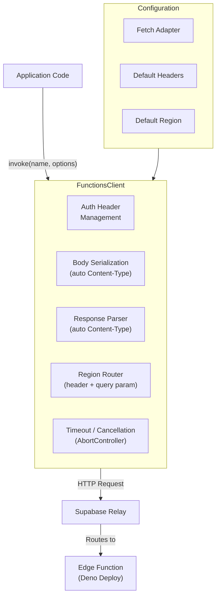
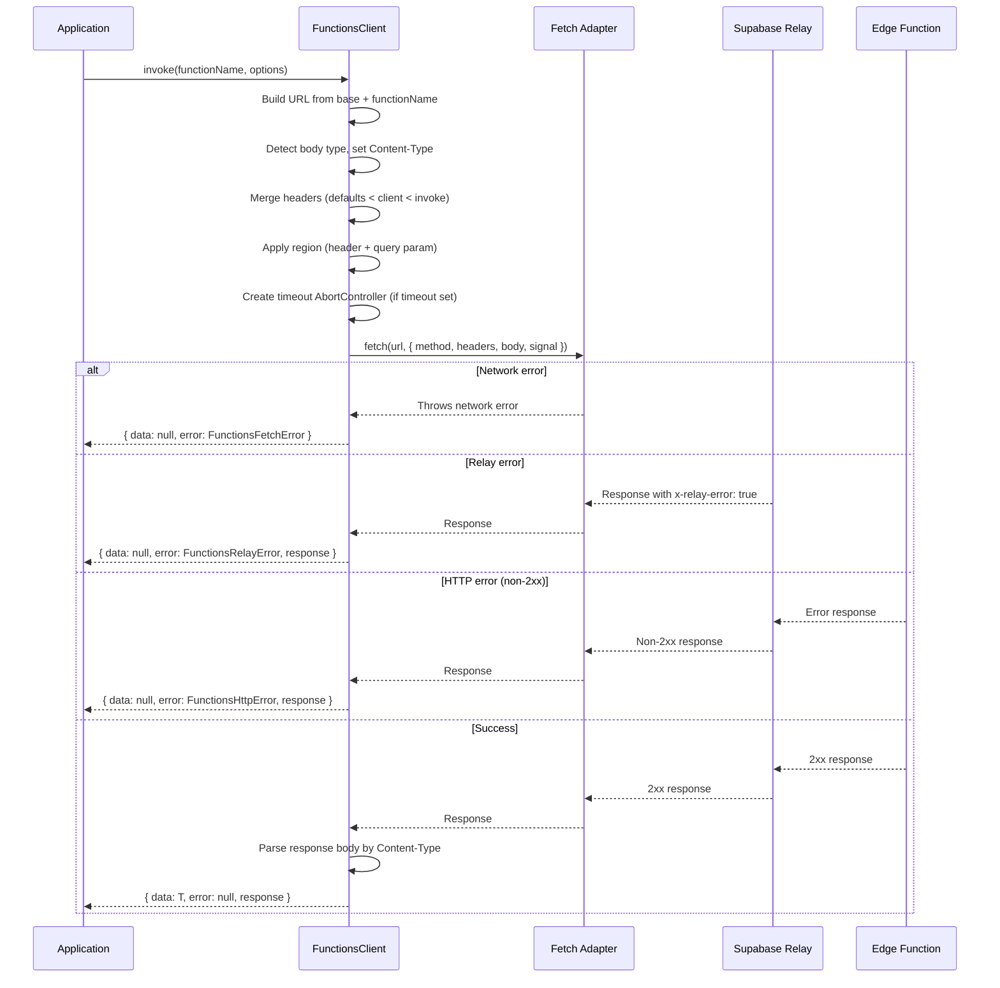
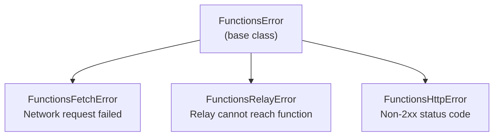
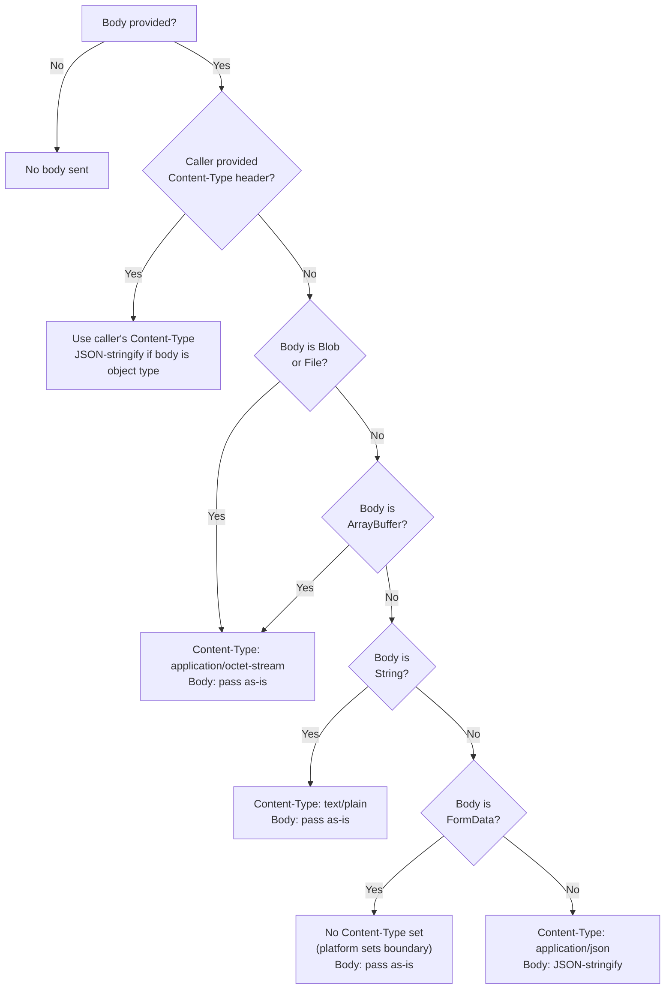
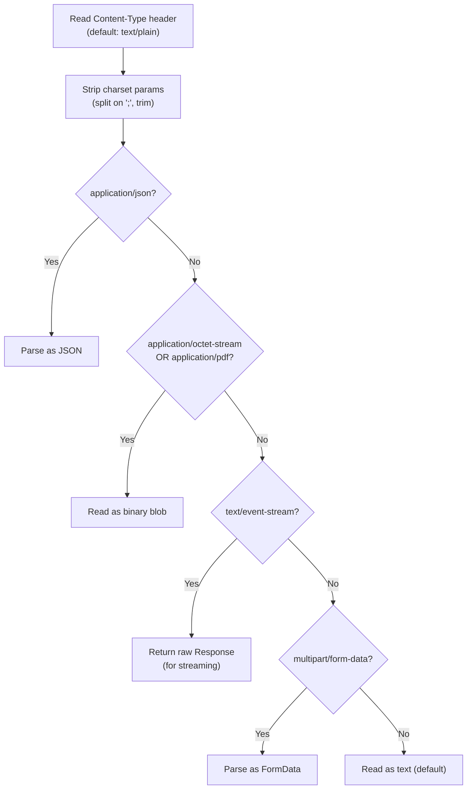
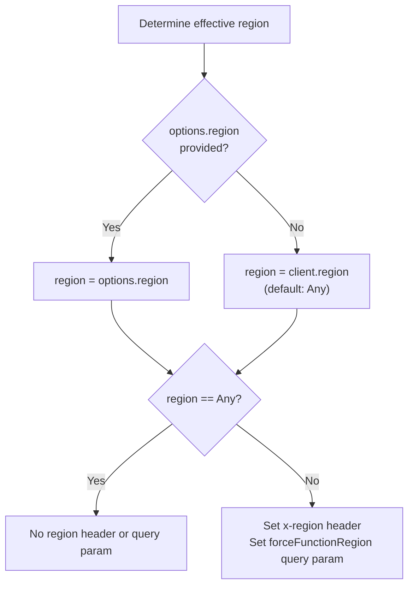
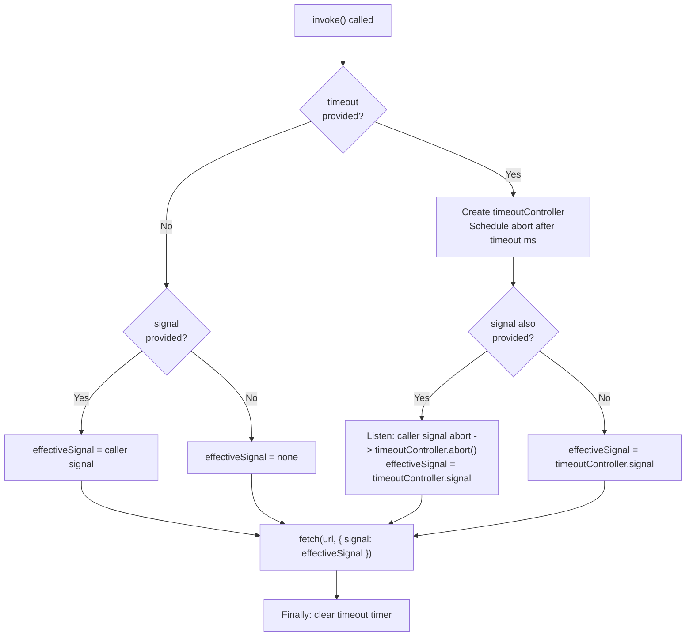
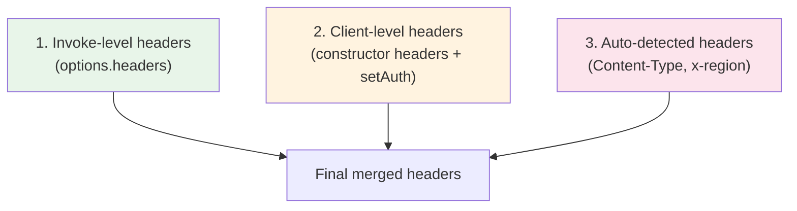
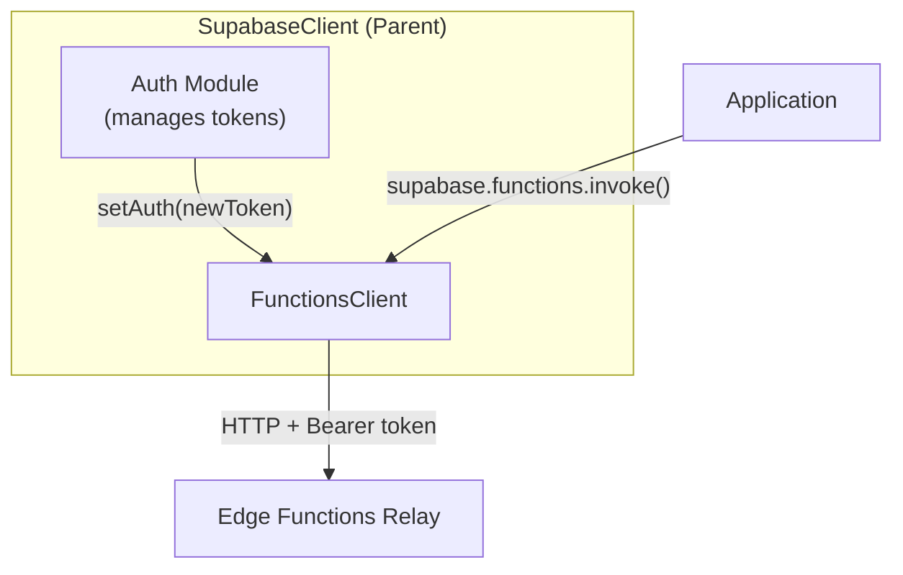

# Supabase Functions SDK Specification

**Version**: 2.0.0
**Status**: Draft
**Last Updated**: 2026-02-09
**Reference Implementation**: `@supabase/functions-js`

> This specification defines the canonical behavior for all Supabase Functions SDK implementations.
> It is **stack-agnostic** and uses RFC 2119 keywords: **MUST**, **MUST NOT**, **SHOULD**,
> **SHOULD NOT**, and **MAY** to indicate requirement levels.
> All code examples use pseudocode notation unless otherwise noted.

---

## Table of Contents

1. [Overview](#1-overview)
2. [Architecture](#2-architecture)
3. [Configuration](#3-configuration)
4. [Data Models](#4-data-models)
5. [Error Model](#5-error-model)
6. [Public Client API](#6-public-client-api)
7. [Request Body Handling](#7-request-body-handling)
8. [Response Parsing](#8-response-parsing)
9. [Region Routing](#9-region-routing)
10. [Timeout and Cancellation](#10-timeout-and-cancellation)
11. [Header Precedence](#11-header-precedence)
12. [HTTP Layer](#12-http-layer)
13. [Integration with Parent SDK](#13-integration-with-parent-sdk)
14. [Required Test Scenarios](#14-required-test-scenarios)
15. [Constants and Defaults](#15-constants-and-defaults)

---

## 1. Overview

The Supabase Functions SDK is a client library for invoking Supabase Edge Functions. Edge Functions are server-side functions running on Deno Deploy that can be invoked via HTTP. The SDK handles:

- Function invocation with configurable HTTP methods
- Automatic body serialization based on content type
- Response parsing based on content type headers
- Region-based function routing
- Request timeout and cancellation
- Authentication header management

### Design Principles

1. **Never throw by default**: All public methods MUST return `{ data, error }` result objects. Errors are returned as values, not thrown.
2. **Content-type auto-detection**: The SDK MUST automatically detect request body type and set appropriate `Content-Type` headers when the caller does not provide one.
3. **Response-type auto-parsing**: The SDK MUST automatically parse response bodies based on the response `Content-Type` header.
4. **Platform agnostic**: The SDK MUST work across runtimes (browsers, server-side, edge runtimes). Platform-specific concerns (fetch implementation, Blob/FormData availability) MUST be handled gracefully.
5. **Minimal surface area**: The SDK provides a single client with a single invocation method. Simplicity is a core design goal.

### Terminology

| Term | Definition |
|------|-----------|
| **Edge Function** | A server-side Deno function deployed to Supabase infrastructure |
| **Relay** | The Supabase infrastructure layer that routes requests to Edge Functions |
| **Region** | An AWS region identifier where Edge Functions can be invoked |
| **Invocation** | A single HTTP request to an Edge Function |
| **Function Name** | The identifier used in the URL path to route to a specific Edge Function |

---

## 2. Architecture

### Component Diagram



### Invocation Flow



---

## 3. Configuration

### Constructor Options

| Parameter | Type | Default | Description |
|-----------|------|---------|-------------|
| `url` | String | **(required)** | Base URL of the Edge Functions endpoint (e.g., `https://<project>.supabase.co/functions/v1`) |
| `headers` | Map<String, String> | `{}` | Default headers sent with every invocation |
| `customFetch` | FetchFunction | platform fetch | Custom fetch implementation for environments without native fetch |
| `region` | FunctionRegion | `Any` | Default region for all invocations |

### Pseudocode

```
FunctionsClient {
  -- Properties
  url: String              -- Base URL for Edge Functions
  headers: Map<String, String>  -- Default headers
  region: FunctionRegion   -- Default region
  fetch: FetchFunction     -- Fetch implementation

  -- Constructor
  constructor(url, options?) {
    this.url = url
    this.headers = options.headers OR {}
    this.region = options.region OR FunctionRegion.Any
    this.fetch = resolveFetch(options.customFetch)
  }
}
```

### Fetch Resolution

The SDK MUST resolve the fetch implementation in this order:

1. If `customFetch` is provided, wrap it in a function and use it
2. Otherwise, use the platform's native `fetch`

---

## 4. Data Models

### FunctionsResponse

All invocations MUST return a discriminated union of success and failure:

```
FunctionsResponseSuccess<T> {
  data: T              -- Parsed response body
  error: null          -- Always null on success
  response: HttpResponse?  -- Raw HTTP response object (optional)
}

FunctionsResponseFailure {
  data: null           -- Always null on failure
  error: Any           -- The error object (FunctionsError subclass)
  response: HttpResponse?  -- Raw HTTP response (present for HTTP/Relay errors, absent for fetch errors)
}

FunctionsResponse<T> = FunctionsResponseSuccess<T> | FunctionsResponseFailure
```

### FunctionInvokeOptions

```
FunctionInvokeOptions {
  headers: Map<String, String>?   -- Per-invocation headers (override client headers)
  method: HttpMethod?             -- HTTP method (default: POST)
  region: FunctionRegion?         -- Region override for this invocation
  body: RequestBody?              -- Request body (see Section 7)
  signal: AbortSignal?            -- Cancellation signal
  timeout: Integer?               -- Timeout in milliseconds
}
```

### HttpMethod

```
HttpMethod = "POST" | "GET" | "PUT" | "PATCH" | "DELETE"
```

---

## 5. Error Model

### Error Hierarchy



### FunctionsError (Base)

All SDK errors MUST extend a common base error type.

```
FunctionsError {
  message: String    -- Human-readable error description
  name: String       -- Error type identifier
  context: Any       -- Additional context (Response object, original error, etc.)

  constructor(message, name = "FunctionsError", context?) {
    this.message = message
    this.name = name
    this.context = context
  }
}
```

### FunctionsFetchError

Created when the underlying fetch call fails (network error, DNS failure, etc.).

```
FunctionsFetchError extends FunctionsError {
  constructor(context) {
    super("Failed to send a request to the Edge Function",
          "FunctionsFetchError", context)
  }
}
```

- `context` MUST contain the original network error

### FunctionsRelayError

Created when the Supabase relay infrastructure cannot reach the Edge Function.

```
FunctionsRelayError extends FunctionsError {
  constructor(context) {
    super("Relay Error invoking the Edge Function",
          "FunctionsRelayError", context)
  }
}
```

- `context` MUST contain the HTTP response object
- Detection: The relay sets the response header `x-relay-error: true`

### FunctionsHttpError

Created when the Edge Function returns a non-2xx HTTP status code.

```
FunctionsHttpError extends FunctionsError {
  constructor(context) {
    super("Edge Function returned a non-2xx status code",
          "FunctionsHttpError", context)
  }
}
```

- `context` MUST contain the HTTP response object

### Error Detection Flowchart

```mermaid
flowchart TD
    START["fetch() called"] --> CATCH{Fetch throws?}
    CATCH -->|Yes| FETCH_ERR["Create FunctionsFetchError<br/>context = original error"]
    CATCH -->|No| RELAY{x-relay-error<br/>header = 'true'?}
    RELAY -->|Yes| RELAY_ERR["Create FunctionsRelayError<br/>context = response"]
    RELAY -->|No| OK{response.ok?<br/>(2xx status)}
    OK -->|No| HTTP_ERR["Create FunctionsHttpError<br/>context = response"]
    OK -->|Yes| PARSE["Parse response body<br/>by Content-Type"]
    PARSE --> SUCCESS["Return { data, error: null, response }"]

    FETCH_ERR --> FAIL["Return { data: null, error, response? }"]
    RELAY_ERR --> FAIL
    HTTP_ERR --> FAIL
```

### Response Object in Errors

- For `FunctionsHttpError` and `FunctionsRelayError`: the `response` field in the return value MUST be the raw HTTP response object (extracted from `error.context`)
- For `FunctionsFetchError`: the `response` field MUST be absent or null (no HTTP response exists)

---

## 6. Public Client API

### `setAuth(token)`

Updates the authorization header on the client instance.

```
setAuth(token: String): Void

-- Behavior:
-- Sets Authorization header to "Bearer {token}" in client headers
-- This header persists for all subsequent invocations until changed again
```

| Parameter | Type | Description |
|-----------|------|-------------|
| `token` | String | JWT access token |

**Requirements:**
- MUST set the `Authorization` header to `Bearer {token}`
- MUST mutate the client's headers map in place (subsequent calls inherit the new token)
- MUST NOT trigger any network request

### `invoke(functionName, options?)`

Invokes an Edge Function by name.

```
invoke<T>(functionName: String, options?: FunctionInvokeOptions): Async<FunctionsResponse<T>>
```

| Parameter | Type | Default | Description |
|-----------|------|---------|-------------|
| `functionName` | String | **(required)** | Name of the Edge Function to invoke |
| `options` | FunctionInvokeOptions | `{}` | Invocation options |

**Requirements:**
- MUST construct URL as `{baseUrl}/{functionName}`
- MUST use URL parsing to construct the URL (to support query parameters)
- MUST default to HTTP method `POST` when not specified
- MUST auto-detect body content type when no `Content-Type` header is provided (see Section 7)
- MUST merge headers according to precedence rules (see Section 11)
- MUST apply region routing when region is not `Any` (see Section 9)
- MUST set up timeout/cancellation when `timeout` is provided (see Section 10)
- MUST detect relay errors via `x-relay-error` response header
- MUST detect HTTP errors via non-2xx status codes
- MUST parse response body based on `Content-Type` header (see Section 8)
- MUST catch all errors and return them in the `{ data, error }` tuple
- MUST NOT throw exceptions to the caller under any circumstances
- MUST clear timeout timers in a finally block

---

## 7. Request Body Handling

The SDK MUST automatically detect the request body type and set the appropriate `Content-Type` header **only when the caller does not provide a `Content-Type` header**.

### Auto-Detection Rules



### Body Type Resolution Table

| Body Type | Content-Type Set | Serialization | Notes |
|-----------|-----------------|---------------|-------|
| Blob / File | `application/octet-stream` | Pass as-is | File inherits from Blob |
| ArrayBuffer | `application/octet-stream` | Pass as-is | Raw binary data |
| String | `text/plain` | Pass as-is | No double-stringify |
| FormData | *(none set)* | Pass as-is | Platform/Request sets multipart boundary |
| ReadableStream | *(depends on caller)* | Pass as-is | Streaming upload |
| Object / Map | `application/json` | JSON-stringify | Default fallback |

### When Caller Provides Content-Type

If the caller provides a `Content-Type` header:
- The SDK MUST NOT set its own `Content-Type`
- The SDK MUST still JSON-stringify the body if it is an object type (not String, Blob, ArrayBuffer, or FormData)
- String, Blob, ArrayBuffer, and FormData bodies MUST be passed as-is regardless of caller-provided Content-Type

### Platform Type Detection

The SDK MUST check for the existence of platform types before using `instanceof`:
- Blob: MUST check `typeof Blob !== 'undefined'` before `body instanceof Blob`
- FormData: MUST check `typeof FormData !== 'undefined'` before `body instanceof FormData`
- This ensures the SDK works in environments where these types may not exist (e.g., some server-side runtimes)

---

## 8. Response Parsing

The SDK MUST parse the response body based on the `Content-Type` response header.

### Parsing Rules

1. The `Content-Type` header MUST be read from the response
2. Charset parameters MUST be stripped (split on `;`, take first part, trim whitespace)
3. If no `Content-Type` is present, default to `text/plain`

### Response Type Resolution Table

| Content-Type | Parsing Method | Return Value |
|-------------|----------------|--------------|
| `application/json` | Parse as JSON | Parsed object/array/value |
| `application/octet-stream` | Read as binary blob | Binary blob |
| `application/pdf` | Read as binary blob | Binary blob |
| `text/event-stream` | No parsing | Raw HTTP response object (for streaming) |
| `multipart/form-data` | Parse as form data | FormData object |
| *(any other / default)* | Read as text | String |

### Response Parsing Flowchart



**Important**: For `text/event-stream`, the SDK MUST return the raw HTTP response object itself (not a parsed body), allowing the caller to read the stream incrementally.

---

## 9. Region Routing

Edge Functions can be invoked in specific AWS regions. When a region other than `Any` is specified, the SDK MUST signal the desired region to the relay.

### Region Application Rules

When region is set and is NOT `Any`:
1. MUST set the `x-region` request header to the region value
2. MUST add the `forceFunctionRegion` query parameter to the URL with the region value

When region is `Any` or not set:
1. MUST NOT set the `x-region` header
2. MUST NOT add the `forceFunctionRegion` query parameter

### Region Resolution Priority

1. If `options.region` is provided in `invoke()`, use it
2. Otherwise, use the client's default region (set in constructor)
3. If neither is set, default to `FunctionRegion.Any`

### Region Routing Diagram



### Available Regions

| Enum Value | String Value |
|-----------|-------------|
| Any | `any` |
| ApNortheast1 | `ap-northeast-1` |
| ApNortheast2 | `ap-northeast-2` |
| ApSouth1 | `ap-south-1` |
| ApSoutheast1 | `ap-southeast-1` |
| ApSoutheast2 | `ap-southeast-2` |
| CaCentral1 | `ca-central-1` |
| EuCentral1 | `eu-central-1` |
| EuWest1 | `eu-west-1` |
| EuWest2 | `eu-west-2` |
| EuWest3 | `eu-west-3` |
| SaEast1 | `sa-east-1` |
| UsEast1 | `us-east-1` |
| UsWest1 | `us-west-1` |
| UsWest2 | `us-west-2` |

---

## 10. Timeout and Cancellation

The SDK MUST support both explicit timeout and caller-provided cancellation signals.

### Timeout Behavior

When `timeout` is provided in invoke options:

1. MUST create a new AbortController (`timeoutController`)
2. MUST schedule a timer to call `timeoutController.abort()` after `timeout` milliseconds
3. MUST use the `timeoutController.signal` as the effective signal for the fetch request
4. MUST clear the timer in a finally block (regardless of success or failure)

### Signal Merging

When both `timeout` and `signal` (caller-provided AbortSignal) are present:

1. MUST create the `timeoutController` as above
2. MUST listen for abort on the caller's signal and propagate it to the `timeoutController`
3. MUST use the `timeoutController.signal` as the effective signal (covers both timeout and caller abort)
4. Either source (timeout or caller abort) MUST result in request cancellation

### Signal Merging Diagram



### Cancellation Error

When a request is cancelled (by timeout or caller signal), the fetch call fails with an abort error. This MUST be caught and returned as a `FunctionsFetchError`.

---

## 11. Header Precedence

Headers are merged from three sources with strict priority ordering.

### Priority Order (highest to lowest)



1. **Invoke-level headers** (highest priority): Headers passed in `invoke()` options
2. **Client-level headers**: Headers set in constructor + `setAuth()` mutations
3. **Auto-detected headers** (lowest priority): `Content-Type` from body detection, `x-region` from region routing

### Merge Behavior

The merge MUST be a shallow merge where higher-priority headers overwrite lower-priority headers with the same key. This means:

- A caller can override `Content-Type` by passing it in invoke headers
- A caller can override `Authorization` at invoke time even if `setAuth()` was called
- Auto-detected `Content-Type` is only applied if no higher-priority source provides it

---

## 12. HTTP Layer

### URL Construction

The invocation URL MUST be constructed as:

```
{baseUrl}/{functionName}
```

The SDK MUST use the platform's URL parsing API to construct the URL, ensuring:
- Proper encoding of the function name
- Support for appending query parameters (e.g., `forceFunctionRegion`)

### Request Format

```
Method: {method} (default: POST)
URL: {baseUrl}/{functionName}[?forceFunctionRegion={region}]
Headers:
  Content-Type: {auto-detected or caller-provided}
  Authorization: Bearer {token}  (if set)
  x-region: {region}  (if region != Any)
  {additional merged headers}
Body: {serialized body}
Signal: {effective AbortSignal}
```

### Response Processing Order

1. Catch fetch errors -> `FunctionsFetchError`
2. Check `x-relay-error` header -> `FunctionsRelayError`
3. Check `response.ok` (2xx status) -> `FunctionsHttpError`
4. Parse response body by `Content-Type`
5. Return `{ data, error: null, response }`

---

## 13. Integration with Parent SDK

When used as part of the main Supabase client:

### Initialization

The parent SDK MUST create a `FunctionsClient` with:
- `url`: `{supabaseUrl}/functions/v1`
- `headers`: Global headers from the parent client (including `apikey`, `Authorization`)
- `customFetch`: The parent's custom fetch implementation (if any)

### Token Propagation

The parent SDK MUST call `setAuth(token)` on the FunctionsClient whenever the user's access token changes (e.g., after sign-in, token refresh).

### Integration Diagram



---

## 14. Required Test Scenarios

### Authentication Tests

| ID | Scenario | Given | When | Then |
|----|----------|-------|------|------|
| AU-01 | Constructor auth | Client created with Authorization header | Function invoked | Request includes the Authorization header |
| AU-02 | setAuth updates token | `setAuth(newToken)` called | Function invoked | Request uses `Bearer {newToken}` |
| AU-03 | Invoke-level auth override | Client has auth header AND invoke provides different auth | Function invoked | Invoke-level auth header wins |
| AU-04 | Invalid auth | Client sends invalid JWT | Function invoked | Returns FunctionsRelayError with relay error message |
| AU-05 | setAuth mid-session | Auth set, invoked, auth changed, invoked again | Second invocation | Uses the updated token |

### Body Handling Tests

| ID | Scenario | Given | When | Then |
|----|----------|-------|------|------|
| BH-01 | JSON body auto-detect | Body is an object, no Content-Type header | Function invoked | Content-Type is `application/json`, body is JSON-stringified |
| BH-02 | String body auto-detect | Body is a string, no Content-Type header | Function invoked | Content-Type is `text/plain`, body is the raw string |
| BH-03 | Blob body auto-detect | Body is a Blob, no Content-Type header | Function invoked | Content-Type is `application/octet-stream`, body is raw binary |
| BH-04 | ArrayBuffer body auto-detect | Body is an ArrayBuffer, no Content-Type header | Function invoked | Content-Type is `application/octet-stream`, body is raw binary |
| BH-05 | FormData body auto-detect | Body is FormData, no Content-Type header | Function invoked | No Content-Type set (platform sets boundary), body is FormData |
| BH-06 | Caller Content-Type with object body | Body is an object, caller sets Content-Type | Function invoked | Caller's Content-Type is used, body is still JSON-stringified |
| BH-07 | Caller Content-Type with string body | Body is a string, caller sets Content-Type | Function invoked | Caller's Content-Type is used, body is the raw string |
| BH-08 | No body | No body provided | Function invoked | No Content-Type set, no body in request |

### Response Parsing Tests

| ID | Scenario | Given | When | Then |
|----|----------|-------|------|------|
| RP-01 | JSON response | Response Content-Type is `application/json` | Response received | `data` is parsed JSON |
| RP-02 | Text response | Response Content-Type is `text/plain` | Response received | `data` is string |
| RP-03 | Binary response (octet-stream) | Response Content-Type is `application/octet-stream` | Response received | `data` is binary blob |
| RP-04 | PDF response | Response Content-Type is `application/pdf` | Response received | `data` is binary blob |
| RP-05 | SSE response | Response Content-Type is `text/event-stream` | Response received | `data` is raw Response object |
| RP-06 | FormData response | Response Content-Type is `multipart/form-data` | Response received | `data` is parsed FormData |
| RP-07 | No Content-Type | Response has no Content-Type header | Response received | `data` is string (text fallback) |
| RP-08 | Content-Type with charset | Response Content-Type is `application/json; charset=utf-8` | Response received | `data` is parsed JSON (charset stripped) |

### Error Handling Tests

| ID | Scenario | Given | When | Then |
|----|----------|-------|------|------|
| EH-01 | Network error | Fetch fails (network down, DNS failure) | invoke() called | Returns `{ data: null, error: FunctionsFetchError }`, no response |
| EH-02 | Relay error | Response has `x-relay-error: true` header | invoke() called | Returns `{ data: null, error: FunctionsRelayError, response }` |
| EH-03 | HTTP error (4xx) | Edge Function returns 400 | invoke() called | Returns `{ data: null, error: FunctionsHttpError, response }` |
| EH-04 | HTTP error (5xx) | Edge Function returns 500 | invoke() called | Returns `{ data: null, error: FunctionsHttpError, response }` |
| EH-05 | Error context (relay) | Relay error occurs | Error inspected | `error.context` contains the Response object |
| EH-06 | Error context (http) | HTTP error occurs | Error inspected | `error.context` contains the Response object |
| EH-07 | Error context (fetch) | Fetch error occurs | Error inspected | `error.context` contains the original network error |
| EH-08 | Never throws | Any error occurs | invoke() called | MUST return error in tuple, MUST NOT throw |

### Region Routing Tests

| ID | Scenario | Given | When | Then |
|----|----------|-------|------|------|
| RR-01 | Invoke with region | Invoke options include region | Function invoked | `x-region` header set AND `forceFunctionRegion` query param set |
| RR-02 | Invoke region overrides client | Client has default region, invoke provides different region | Function invoked | Invoke region is used (not client default) |
| RR-03 | Region Any clears routing | Client has region, invoke sets region to Any | Function invoked | No `x-region` header, no `forceFunctionRegion` param |
| RR-04 | Client default region | Client has default region, invoke does not set region | Function invoked | Client default region is applied |
| RR-05 | No region (default Any) | No region set anywhere | Function invoked | No `x-region` header, no `forceFunctionRegion` param |

### Timeout and Cancellation Tests

| ID | Scenario | Given | When | Then |
|----|----------|-------|------|------|
| TC-01 | No timeout | No timeout set | Long-running function completes | Returns success |
| TC-02 | Timeout expires | Short timeout set (e.g., 1ms) on slow function | Timer fires | Returns FunctionsFetchError (abort) |
| TC-03 | Timeout sufficient | Generous timeout set | Function completes within timeout | Returns success, timer cleared |
| TC-04 | Caller signal abort | Caller provides AbortSignal and aborts | Signal fires | Returns FunctionsFetchError (abort) |
| TC-05 | Timeout + signal merge | Both timeout and signal provided | Caller aborts before timeout | Returns FunctionsFetchError, both respected |

### Header Precedence Tests

| ID | Scenario | Given | When | Then |
|----|----------|-------|------|------|
| HP-01 | Invoke overrides client | Client has header X, invoke has header X with different value | Function invoked | Invoke value is used |
| HP-02 | Auto-detect overridden | Body is JSON (auto Content-Type), invoke provides Content-Type | Function invoked | Invoke Content-Type is used |
| HP-03 | Client headers persist | Client has custom headers | Multiple invocations | All invocations include client headers |

### HTTP Method Tests

| ID | Scenario | Given | When | Then |
|----|----------|-------|------|------|
| HM-01 | Default POST | No method specified | Function invoked | HTTP method is POST |
| HM-02 | GET method | Method set to GET | Function invoked | HTTP method is GET |
| HM-03 | PUT method | Method set to PUT | Function invoked | HTTP method is PUT |
| HM-04 | PATCH method | Method set to PATCH | Function invoked | HTTP method is PATCH |
| HM-05 | DELETE method | Method set to DELETE | Function invoked | HTTP method is DELETE |

---

## 15. Constants and Defaults

| Constant | Value | Description |
|----------|-------|-------------|
| Default HTTP Method | `POST` | Used when no method is specified in invoke options |
| Default Region | `FunctionRegion.Any` | Used when no region is specified |
| Default Content-Type | `text/plain` | Used for response parsing when no Content-Type header is present |
| Relay Error Header | `x-relay-error` | Response header indicating a relay error (value: `"true"`) |
| Region Header | `x-region` | Request header for region routing |
| Region Query Param | `forceFunctionRegion` | Query parameter for region routing |

---

## Appendix: Implementation Checklist

### Core Infrastructure

- [ ] FunctionsClient constructor with URL, headers, region, custom fetch
- [ ] Fetch resolution (custom fetch > native fetch)
- [ ] URL construction using platform URL parser

### Authentication

- [ ] `setAuth(token)` sets `Authorization: Bearer {token}`
- [ ] Auth header persists across invocations

### Body Handling

- [ ] Auto-detect Blob/File body -> `application/octet-stream`
- [ ] Auto-detect ArrayBuffer body -> `application/octet-stream`
- [ ] Auto-detect String body -> `text/plain`
- [ ] Auto-detect FormData body -> no Content-Type (platform boundary)
- [ ] Auto-detect Object body -> `application/json` + JSON-stringify
- [ ] Respect caller-provided Content-Type header
- [ ] JSON-stringify object bodies even when caller provides Content-Type
- [ ] Platform type guards for Blob and FormData

### Response Parsing

- [ ] Parse `application/json` as JSON
- [ ] Parse `application/octet-stream` as binary blob
- [ ] Parse `application/pdf` as binary blob
- [ ] Return raw Response for `text/event-stream`
- [ ] Parse `multipart/form-data` as FormData
- [ ] Default to text for unknown Content-Types
- [ ] Strip charset parameters from Content-Type

### Error Handling

- [ ] Catch fetch errors -> FunctionsFetchError
- [ ] Detect relay errors via `x-relay-error` header -> FunctionsRelayError
- [ ] Detect HTTP errors via non-2xx status -> FunctionsHttpError
- [ ] Attach Response to error context for HTTP/Relay errors
- [ ] Never throw - always return `{ data, error }` tuple
- [ ] Include `response` in return value for HTTP/Relay errors

### Region Routing

- [ ] Set `x-region` header when region is not `Any`
- [ ] Set `forceFunctionRegion` query parameter when region is not `Any`
- [ ] Invoke-level region overrides client default
- [ ] No region headers/params when region is `Any`

### Timeout and Cancellation

- [ ] Create AbortController for timeout
- [ ] Schedule abort after timeout milliseconds
- [ ] Merge caller signal with timeout controller
- [ ] Clear timeout timer in finally block
- [ ] Support HTTP methods: POST, GET, PUT, PATCH, DELETE

### Header Merge

- [ ] Three-level merge: auto-detected < client-level < invoke-level
- [ ] Higher priority headers overwrite lower priority
