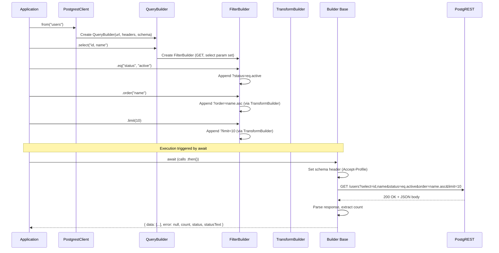
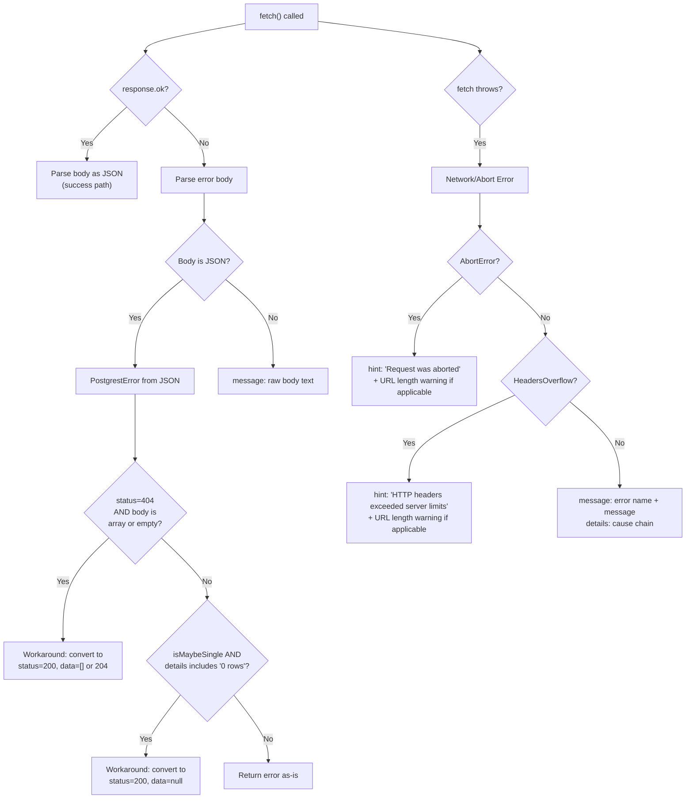
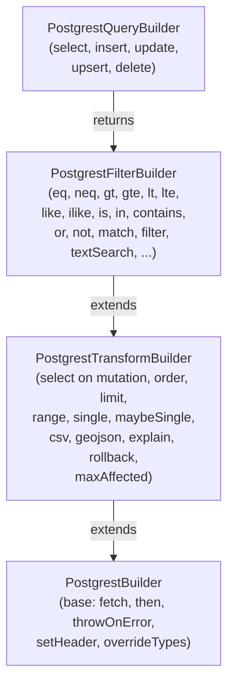
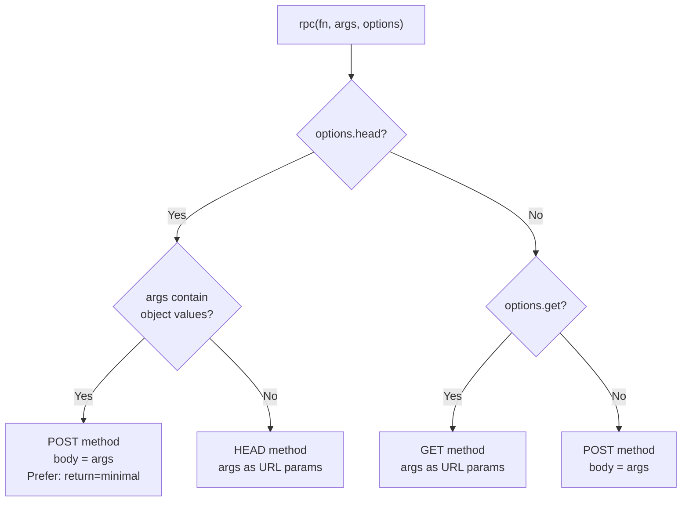
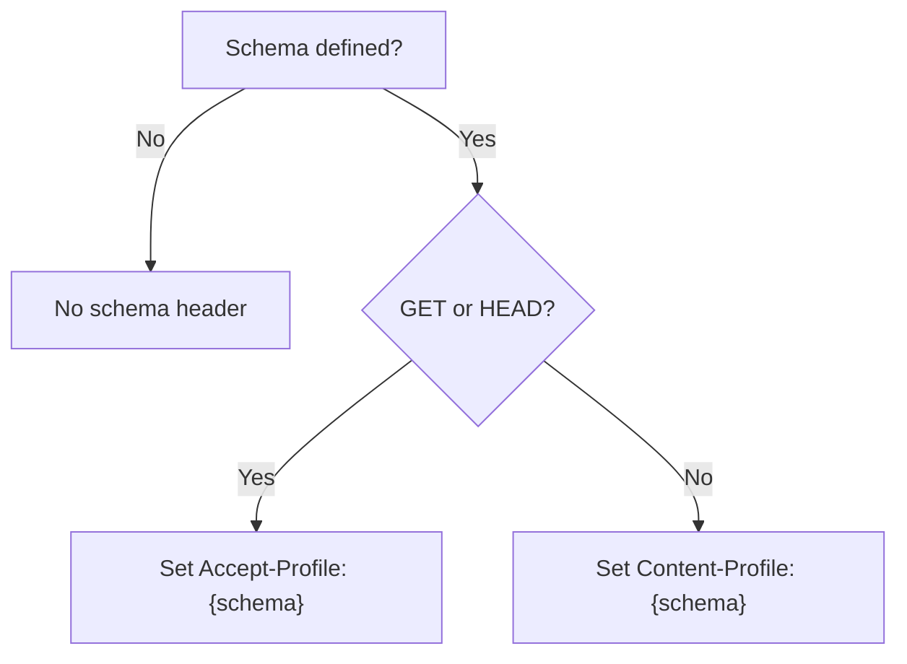
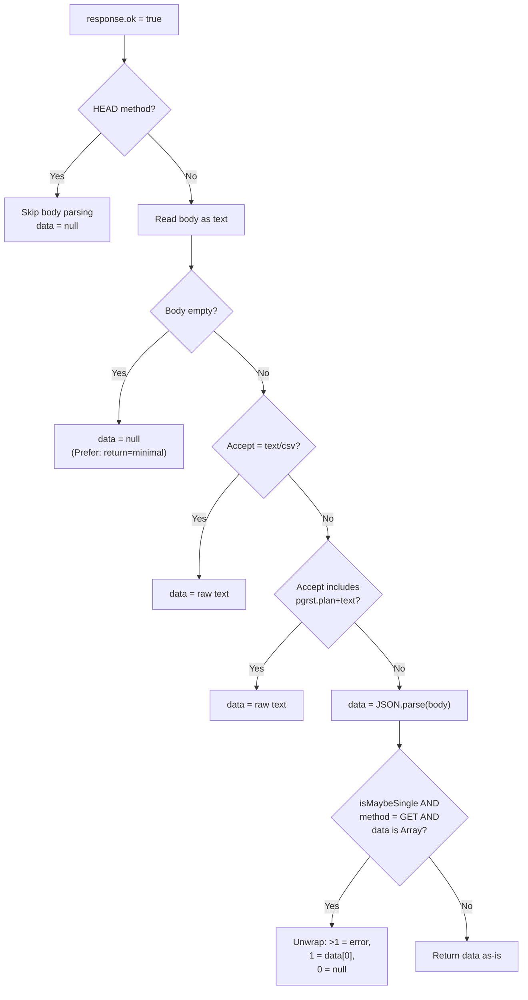
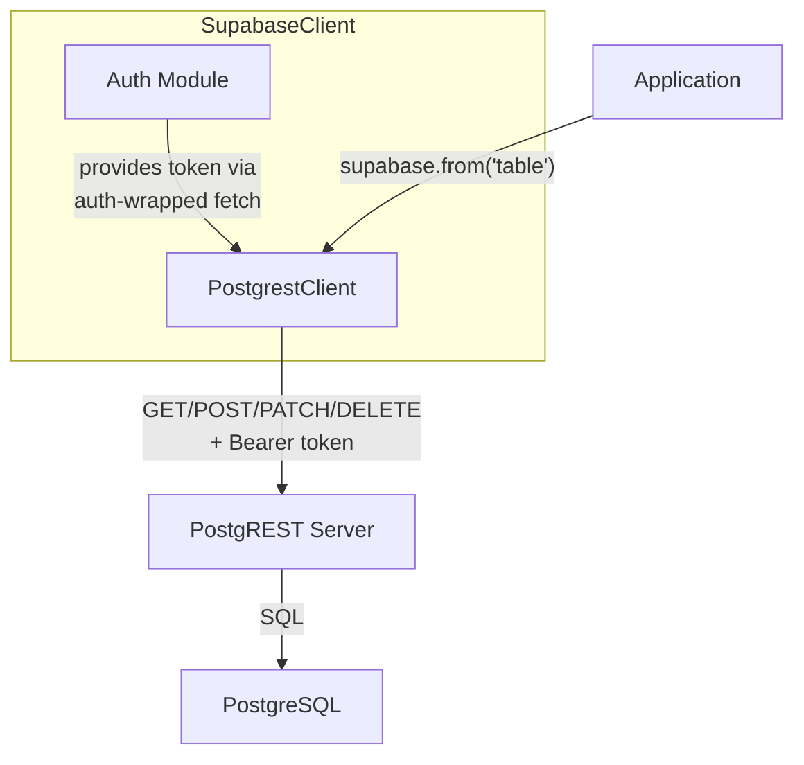

# Supabase PostgREST SDK Specification

**Version**: 2.0.0
**Status**: Draft
**Last Updated**: 2026-02-09
**Reference Implementation**: `@supabase/postgrest-js`

> This specification defines the canonical behavior for all Supabase PostgREST SDK implementations.
> It is **stack-agnostic** and uses RFC 2119 keywords: **MUST**, **MUST NOT**, **SHOULD**,
> **SHOULD NOT**, and **MAY** to indicate requirement levels.
> All code examples use pseudocode notation unless otherwise noted.

---

## Table of Contents

1. [Overview](#1-overview)
2. [Architecture](#2-architecture)
3. [Configuration](#3-configuration)
4. [Data Models](#4-data-models)
5. [Error Model](#5-error-model)
6. [Builder Pattern](#6-builder-pattern)
7. [PostgrestClient API](#7-postgrestclient-api)
8. [Query Builder (CRUD)](#8-query-builder-crud)
9. [Filter Builder](#9-filter-builder)
10. [Transform Builder](#10-transform-builder)
11. [RPC (Remote Procedure Calls)](#11-rpc-remote-procedure-calls)
12. [HTTP Layer](#12-http-layer)
13. [Response Parsing](#13-response-parsing)
14. [Schema Switching](#14-schema-switching)
15. [Timeout and Cancellation](#15-timeout-and-cancellation)
16. [URL Length Handling](#16-url-length-handling)
17. [Type Override System](#17-type-override-system)
18. [Integration with Parent SDK](#18-integration-with-parent-sdk)
19. [Required Test Scenarios](#19-required-test-scenarios)
20. [Constants and Defaults](#20-constants-and-defaults)

---

## 1. Overview

The Supabase PostgREST SDK is a client library that communicates with [PostgREST](https://postgrest.org), an API server that turns PostgreSQL databases into RESTful APIs. The SDK provides an ORM-like query builder interface for:

- CRUD operations (SELECT, INSERT, UPDATE, UPSERT, DELETE)
- Filtering with rich operator support (comparison, pattern, range, text search)
- Result transformation (ordering, pagination, single/array unwrapping)
- Remote Procedure Call (RPC) invocations
- Multiple schema support
- Compile-time type inference from database schemas

### Design Principles

1. **Builder pattern**: Queries are constructed by chaining methods that progressively build a URL and header set, then lazily executed when awaited.
2. **PromiseLike**: The builder MUST implement `then()` to make it thenable. The HTTP request is only made when the builder is awaited or `.then()` is called.
3. **Never throw by default**: All public methods MUST return `{ data, error, count, status, statusText }` result objects. Use `.throwOnError()` to opt into throwing.
4. **Type-safe queries**: When a typed database schema is provided, column names, filter values, insert/update payloads, and result shapes SHOULD be statically validated.
5. **Platform agnostic**: The SDK MUST work across runtimes (browsers, server-side, edge runtimes). Custom fetch implementations MUST be injectable.

### Terminology

| Term | Definition |
|------|-----------|
| **PostgREST** | The REST API server that sits between the SDK and PostgreSQL |
| **Relation** | A table or view in PostgreSQL |
| **Builder** | A query configuration object that accumulates URL params and headers |
| **Filter** | A condition applied to limit returned rows (maps to PostgREST query params) |
| **Transform** | A modifier that changes result shape or ordering (order, limit, single, csv) |
| **RPC** | A PostgreSQL function invoked via the `/rpc/{function_name}` endpoint |
| **Schema** | A PostgreSQL namespace; PostgREST can expose multiple schemas |
| **Prefer Header** | HTTP header used to communicate request preferences to PostgREST |

---

## 2. Architecture

### Component Diagram

```mermaid
graph TB
    subgraph PostgrestClient["PostgrestClient"]
        FROM["from(relation)"]
        SCHEMA["schema(name)"]
        RPC["rpc(fn, args)"]
    end

    subgraph QueryBuilder["PostgrestQueryBuilder"]
        SELECT["select(columns)"]
        INSERT["insert(values)"]
        UPDATE["update(values)"]
        UPSERT["upsert(values)"]
        DELETE["delete()"]
    end

    subgraph FilterBuilder["PostgrestFilterBuilder"]
        EQ["eq / neq / gt / gte / lt / lte"]
        LIKE["like / ilike"]
        IN["in / contains / overlaps"]
        TEXT["textSearch"]
        OR["or / not / match / filter"]
    end

    subgraph TransformBuilder["PostgrestTransformBuilder"]
        ORDER["order()"]
        LIMIT["limit() / range()"]
        SINGLE["single() / maybeSingle()"]
        CSV["csv() / geojson() / explain()"]
        ROLLBACK["rollback() / maxAffected()"]
    end

    subgraph BaseBuilder["PostgrestBuilder (Base)"]
        THEN["then() - executes HTTP request"]
        THROW["throwOnError()"]
        HEADER["setHeader()"]
        TYPES["overrideTypes() / returns()"]
    end

    PostgrestClient -->|"returns"| QueryBuilder
    QueryBuilder -->|"returns"| FilterBuilder
    FilterBuilder -->|"extends"| TransformBuilder
    TransformBuilder -->|"extends"| BaseBuilder
    BaseBuilder -->|"HTTP"| POSTGREST["PostgREST Server"]
    POSTGREST -->|"SQL"| PG["PostgreSQL"]
```



### Builder Chain Flow



---

## 3. Configuration

### Constructor Options

| Parameter | Type | Default | Description |
|-----------|------|---------|-------------|
| `url` | String | **(required)** | URL of the PostgREST endpoint |
| `headers` | HeadersInit | `{}` | Custom headers sent with every request |
| `schema` | String | `undefined` | Default PostgreSQL schema to query |
| `fetch` | FetchFunction | platform fetch | Custom fetch implementation |
| `timeout` | Integer | `undefined` | Request timeout in milliseconds (auto-abort) |
| `urlLengthLimit` | Integer | `8000` | Maximum URL length before warnings are triggered |

### Pseudocode

```
PostgrestClient {
  url: String
  headers: Headers
  schemaName: String?
  fetch: FetchFunction
  urlLengthLimit: Integer

  constructor(url, options?) {
    this.url = url
    this.headers = new Headers(options.headers OR {})
    this.schemaName = options.schema
    this.urlLengthLimit = options.urlLengthLimit OR 8000

    baseFetch = options.fetch OR platform fetch

    IF options.timeout is defined AND options.timeout > 0 THEN
      this.fetch = wrapWithTimeout(baseFetch, options.timeout)
    ELSE
      this.fetch = baseFetch
    END IF
  }
}
```

---

## 4. Data Models

### Response Types

```
PostgrestSingleResponse<T> =
  | { data: T, error: null, count: Integer?, status: Integer, statusText: String }
  | { data: null, error: PostgrestError, count: null, status: Integer, statusText: String }

PostgrestResponse<T> = PostgrestSingleResponse<List<T>>

PostgrestMaybeSingleResponse<T> = PostgrestSingleResponse<T | null>
```

All responses MUST include:
- `data` - The query result (null on error)
- `error` - Error object (null on success)
- `count` - Row count (when requested via count option, extracted from `content-range` header)
- `status` - HTTP status code
- `statusText` - HTTP status text

### GenericSchema (Type System)

```
GenericSchema {
  Tables: Map<String, GenericTable>
  Views: Map<String, GenericView>
  Functions: Map<String, GenericFunction>
}

GenericTable {
  Row: Map<String, Any>         -- Column types for SELECT results
  Insert: Map<String, Any>      -- Column types for INSERT (nullable/default cols optional)
  Update: Map<String, Any>      -- Column types for UPDATE (all cols optional)
  Relationships: List<GenericRelationship>
}

GenericView {
  Row: Map<String, Any>
  Relationships: List<GenericRelationship>
}

GenericRelationship {
  foreignKeyName: String
  columns: List<String>
  isOneToOne: Boolean
  referencedRelation: String
  referencedColumns: List<String>
}
```

---

## 5. Error Model

### PostgrestError

```
PostgrestError {
  message: String    -- Human-readable error description
  details: String    -- Detailed technical information
  hint: String       -- Suggestion for resolution
  code: String       -- PostgREST/PostgreSQL error code (e.g., "PGRST116", "42501")
}
```

### Error Classification



### throwOnError Mode

When `.throwOnError()` is called on a builder:
- Success responses MUST be returned normally
- Error responses MUST throw a `PostgrestError` exception instead of returning it in the tuple
- Network/fetch errors MUST propagate as thrown exceptions (not caught)

---

## 6. Builder Pattern

### Inheritance Hierarchy



### Builder State

Each builder instance carries:
- `method`: HTTP method (`GET`, `HEAD`, `POST`, `PATCH`, `DELETE`)
- `url`: URL object with accumulated query parameters
- `headers`: HTTP headers with accumulated Prefer directives
- `schema`: Optional schema name
- `body`: Optional request body (for POST, PATCH)
- `shouldThrowOnError`: Boolean flag
- `signal`: Optional AbortSignal
- `isMaybeSingle`: Boolean flag for maybeSingle behavior
- `fetch`: Fetch implementation
- `urlLengthLimit`: Maximum URL length

### Immutability

- `PostgrestQueryBuilder.select/insert/update/upsert/delete` MUST clone URL and headers before creating a new filter builder, preventing shared state between operations from the same query builder
- Filter and transform methods return `this` (mutable on the current builder instance)

---

## 7. PostgrestClient API

### `from(relation)`

Creates a query builder scoped to a specific table or view.

```
from(relation: String): PostgrestQueryBuilder
```

**Requirements:**
- MUST validate that `relation` is a non-empty string; throw an error if invalid
- MUST construct URL as `{baseUrl}/{relation}`
- MUST pass cloned headers, schema, fetch, and urlLengthLimit to the query builder

### `schema(name)`

Returns a new client instance configured for a different PostgreSQL schema.

```
schema(name: String): PostgrestClient
```

**Requirements:**
- MUST return a new `PostgrestClient` instance (not mutate the current one)
- MUST preserve URL, headers, fetch, and urlLengthLimit from the original client

### `rpc(fn, args, options)`

See [Section 11: RPC](#11-rpc-remote-procedure-calls).

---

## 8. Query Builder (CRUD)

### `select(columns, options)`

Perform a SELECT query.

```
select(columns?: String = "*", options?: { head?: Boolean, count?: CountAlgorithm }): FilterBuilder
```

| Parameter | Type | Default | Description |
|-----------|------|---------|-------------|
| `columns` | String | `"*"` | Comma-separated column names; supports aliasing (`alias:column`), relationships (`relation(columns)`), spreading (`...relation`), aggregates (`count()`) |
| `options.head` | Boolean | `false` | When true, uses HEAD method (no data returned) |
| `options.count` | CountAlgorithm | `undefined` | `"exact"`, `"planned"`, or `"estimated"` |

**HTTP Method**: GET (or HEAD if `options.head` is true)

**Requirements:**
- MUST set URL param `select={columns}` after stripping whitespace outside quotes
- MUST set `Prefer: count={algorithm}` header when count is specified
- MUST NOT set count header when count is not specified

### `insert(values, options)`

Insert one or more rows.

```
insert(values: Object | List<Object>, options?: { count?, defaultToNull? }): FilterBuilder
```

| Parameter | Type | Default | Description |
|-----------|------|---------|-------------|
| `values` | Object or List | **(required)** | Row(s) to insert |
| `options.count` | CountAlgorithm | `undefined` | Count algorithm |
| `options.defaultToNull` | Boolean | `true` | When false, missing columns use database defaults instead of null |

**HTTP Method**: POST

**Requirements:**
- MUST JSON-stringify the body
- When `defaultToNull` is false, MUST set `Prefer: missing=default`
- When inserting multiple rows, MUST set URL param `columns` to the unique union of all column names across all rows (for consistent bulk insert)

### `update(values, options)`

Update rows matching subsequent filters.

```
update(values: Object, options?: { count? }): FilterBuilder
```

**HTTP Method**: PATCH

### `upsert(values, options)`

Insert or update rows based on conflict resolution.

```
upsert(values: Object | List<Object>, options?: { onConflict?, ignoreDuplicates?, count?, defaultToNull? }): FilterBuilder
```

| Parameter | Type | Default | Description |
|-----------|------|---------|-------------|
| `options.onConflict` | String | `undefined` | Comma-separated column names for conflict detection |
| `options.ignoreDuplicates` | Boolean | `false` | When true, duplicates are ignored instead of merged |

**HTTP Method**: POST

**Requirements:**
- MUST set `Prefer: resolution=merge-duplicates` (default) or `resolution=ignore-duplicates`
- MUST set URL param `on_conflict={columns}` when onConflict is specified

### `delete(options)`

Delete rows matching subsequent filters.

```
delete(options?: { count? }): FilterBuilder
```

**HTTP Method**: DELETE

---

## 9. Filter Builder

All filter methods MUST return `this` for chaining. All filter methods append query parameters to the URL in PostgREST format: `column=operator.value`.

### Comparison Filters

| Method | PostgREST Operator | Description |
|--------|-------------------|-------------|
| `eq(column, value)` | `eq` | Equal to |
| `neq(column, value)` | `neq` | Not equal to |
| `gt(column, value)` | `gt` | Greater than |
| `gte(column, value)` | `gte` | Greater than or equal to |
| `lt(column, value)` | `lt` | Less than |
| `lte(column, value)` | `lte` | Less than or equal to |

### Null/Boolean Check

| Method | PostgREST Operator | Description |
|--------|-------------------|-------------|
| `is(column, value)` | `is` | Checks for `null`, `true`, or `false` |
| `isDistinct(column, value)` | `isdistinct` | NULL-aware distinct comparison |

### Pattern Matching

| Method | PostgREST Operator | Description |
|--------|-------------------|-------------|
| `like(column, pattern)` | `like` | Case-sensitive LIKE |
| `ilike(column, pattern)` | `ilike` | Case-insensitive LIKE |
| `likeAllOf(column, patterns)` | `like(all).{patterns}` | Match ALL patterns (AND) |
| `likeAnyOf(column, patterns)` | `like(any).{patterns}` | Match ANY pattern (OR) |
| `ilikeAllOf(column, patterns)` | `ilike(all).{patterns}` | Case-insensitive match ALL |
| `ilikeAnyOf(column, patterns)` | `ilike(any).{patterns}` | Case-insensitive match ANY |

### Regex

| Method | PostgREST Operator | Description |
|--------|-------------------|-------------|
| `regexMatch(column, pattern)` | `match` | PostgreSQL `~` operator |
| `regexIMatch(column, pattern)` | `imatch` | PostgreSQL `~*` operator |

### Collection Operators

| Method | PostgREST Operator | Description |
|--------|-------------------|-------------|
| `in(column, values)` | `in` | Value in list |
| `contains(column, value)` | `cs` | Array/JSON contains |
| `containedBy(column, value)` | `cd` | Array/JSON contained by |
| `overlaps(column, value)` | `ov` | Arrays overlap |

### Range Operators

| Method | PostgREST Operator | Description |
|--------|-------------------|-------------|
| `rangeGt(column, range)` | `sr` | Strictly right of |
| `rangeGte(column, range)` | `nxl` | Not extending left of |
| `rangeLt(column, range)` | `sl` | Strictly left of |
| `rangeLte(column, range)` | `nxr` | Not extending right of |
| `rangeAdjacent(column, range)` | `adj` | Adjacent to |

### Full-Text Search

```
textSearch(column, query, options?: { config?, type? }): this
```

| Type Value | PostgREST Operator | Description |
|-----------|-------------------|-------------|
| `undefined` (default) | `fts` | to_tsquery |
| `"plain"` | `plfts` | plainto_tsquery |
| `"phrase"` | `phfts` | phraseto_tsquery |
| `"websearch"` | `wfts` | websearch_to_tsquery |

When `config` is specified, the operator becomes `{op}({config})`.

### Compound Filters

| Method | Description |
|--------|-------------|
| `match(query)` | Shorthand for multiple `.eq()` calls from a key-value map |
| `not(column, operator, value)` | Negate any filter: `column=not.operator.value` |
| `or(filters, options?)` | OR logic with raw PostgREST filter syntax. `options.referencedTable` applies to a referenced table |
| `filter(column, operator, value)` | Escape hatch for custom PostgREST operators |

### Reserved Character Handling

The `.in()` method MUST quote values that contain PostgREST reserved characters (commas, parentheses):

```
IF value matches /[,()]/ THEN
  value = '"' + value + '"'
END IF
```

### Relationship Filter Syntax

Filters MAY use dot-notation to filter on related table columns:

```
.eq("author.name", "John")   -- Resolves to: author.name=eq.John
```

### JSON Path Filter Syntax

Filters MAY use arrow notation for JSON column access:

```
.eq("metadata->key", "value")     -- JSON object access
.eq("metadata->>key", "text")     -- JSON text access
```

---

## 10. Transform Builder

Transform methods modify how results are shaped, ordered, or paginated. All return `this` for chaining.

### `select(columns)` (on mutation results)

When called on INSERT/UPDATE/UPSERT/DELETE builders, adds a `select` param and sets `Prefer: return=representation` to return the modified rows.

### `order(column, options)`

```
order(column, options?: { ascending?, nullsFirst?, referencedTable? }): this
```

**Requirements:**
- MUST default `ascending` to `true`
- MUST append to existing order params (supports multiple order calls)
- Format: `column.asc|desc[.nullsfirst|.nullslast]`
- When `referencedTable` is specified, use key `{table}.order` instead of `order`

### `limit(count, options)`

```
limit(count: Integer, options?: { referencedTable? }): this
```

Sets URL param `limit={count}`. When `referencedTable` specified, use `{table}.limit`.

### `range(from, to, options)`

```
range(from: Integer, to: Integer, options?: { referencedTable? }): this
```

**Requirements:**
- Values are 0-based and inclusive
- MUST set `offset={from}` and `limit={to - from + 1}`
- When `referencedTable` specified, use `{table}.offset` and `{table}.limit`

### `abortSignal(signal)`

Sets the AbortSignal for the fetch request.

### `single()`

Returns data as a single object instead of an array.

**Requirements:**
- MUST set `Accept: application/vnd.pgrst.object+json`
- PostgREST returns an error if the result contains != 1 row

### `maybeSingle()`

Returns data as a single object or null.

**Requirements:**
- For GET requests: MUST set `Accept: application/json` and set `isMaybeSingle = true` flag
- For non-GET requests: MUST set `Accept: application/vnd.pgrst.object+json` and set `isMaybeSingle = true`
- When `isMaybeSingle` is true AND method is GET AND data is an array:
  - If array has > 1 element: synthesize PGRST116 error
  - If array has exactly 1 element: unwrap to single object
  - If array is empty: return null

### `csv()`

Sets `Accept: text/csv` to return CSV-formatted data.

### `geojson()`

Sets `Accept: application/geo+json` to return GeoJSON-formatted data.

### `explain(options)`

Returns the EXPLAIN plan for the query.

```
explain(options?: { analyze?, verbose?, settings?, buffers?, wal?, format? }): this
```

**Requirements:**
- MUST set `Accept: application/vnd.pgrst.plan+{format}; for="{originalAccept}"; options={flagList};`
- `format` defaults to `"text"`, can be `"json"`
- Flag list is pipe-separated: `analyze|verbose|settings|buffers|wal`

### `rollback()`

Appends `Prefer: tx=rollback` to execute but not commit the query.

### `maxAffected(value)`

Sets maximum affected rows (PostgREST v13+ only, PATCH/DELETE only).

**Requirements:**
- MUST append `Prefer: handling=strict`
- MUST append `Prefer: max-affected={value}`

---

## 11. RPC (Remote Procedure Calls)

```
rpc(fn: String, args?: Object, options?: { head?, get?, count? }): FilterBuilder
```

### Method Selection



### URL Construction

- Endpoint: `{baseUrl}/rpc/{functionName}`
- For GET/HEAD: Arguments encoded as URL search params
  - Array values formatted as `{value1,value2,value3}`
  - Undefined values filtered out

### Prefer Header

- When `options.count` is specified: `Prefer: count={algorithm}`
- When HEAD with object args: `Prefer: count={algorithm},return=minimal` (or just `return=minimal` if no count)

---

## 12. HTTP Layer

### Request Construction

The HTTP request is only made when `.then()` is called (lazy execution).

### Schema Header Selection



### Content-Type

For non-GET/HEAD requests, MUST set `Content-Type: application/json`.

### Body Serialization

The body MUST be JSON-stringified before sending.

### Fetch Invocation

```
fetch(url.toString(), {
  method: this.method,
  headers: this.headers,
  body: JSON.stringify(this.body),
  signal: this.signal
})
```

---

## 13. Response Parsing

### Success Path (response.ok = true)



### Count Extraction

When the `Prefer` header contains a `count=` directive:

1. Read the `content-range` response header
2. Split on `/`
3. Parse the second part as integer
4. Return as `count` field

### Error Path (response.ok = false)

1. Read body as text
2. Attempt to JSON-parse the body
3. If JSON and status = 404 and body is an array: convert to `{ data: [], status: 200 }` (workaround)
4. If text and status = 404 and body is empty: convert to `{ status: 204, statusText: "No Content" }` (workaround)
5. If `isMaybeSingle` and error details contain "0 rows": convert to `{ data: null, status: 200 }` (workaround)
6. If `shouldThrowOnError`: throw `PostgrestError`

### Network Error Path (fetch throws)

When not in throwOnError mode, network errors MUST be caught and returned as:

```
{
  error: {
    message: "{errorName}: {errorMessage}",
    details: "{cause chain with stack trace}",
    hint: "{contextual hint}",
    code: ""
  },
  data: null,
  count: null,
  status: 0,
  statusText: ""
}
```

**Special hints:**
- AbortError: `"Request was aborted (timeout or manual cancellation)"`
- If URL length exceeds `urlLengthLimit`: append URL length warning with suggestions
- HeadersOverflowError: `"HTTP headers exceeded server limits (typically 16KB)"`

---

## 14. Schema Switching

PostgREST supports multiple PostgreSQL schemas. The SDK switches schemas via HTTP headers:

- **GET/HEAD requests**: `Accept-Profile: {schemaName}`
- **POST/PATCH/DELETE requests**: `Content-Profile: {schemaName}`

The `schema()` method on PostgrestClient returns a new client instance targeting a different schema.

---

## 15. Timeout and Cancellation

### Client-Level Timeout

When `timeout` is specified in the constructor:

1. MUST wrap the fetch function to create an AbortController per request
2. MUST schedule `controller.abort()` after `timeout` milliseconds
3. If the request already has a signal:
   - If signal is already aborted: skip timeout, use existing signal
   - Otherwise: listen for abort on existing signal and propagate to timeout controller
4. MUST clear the timeout in a finally block

### Request-Level Cancellation

The `.abortSignal(signal)` method sets a per-request AbortSignal on the builder.

---

## 16. URL Length Handling

The `urlLengthLimit` configuration (default: 8000) is used to:

1. Add contextual hints when AbortError or HeadersOverflowError occurs
2. Warn developers about potentially problematic URL lengths

The SDK does NOT prevent long URLs from being sent. It only adds helpful hints when errors occur.

---

## 17. Type Override System

### `overrideTypes<NewResult, Options>()`

Allows overriding the inferred return type of a query.

- `Options.merge` (default: `true`): When true, merges new type with existing; when false, replaces entirely
- MUST preserve null optionality from `.maybeSingle()`
- MUST validate array/single type matching

### `returns<NewResult>()` (Deprecated)

Legacy type override. SHOULD be replaced by `overrideTypes`.

---

## 18. Integration with Parent SDK

When used as part of the main Supabase client:

### Initialization

The parent SDK MUST create a `PostgrestClient` with:
- `url`: `{supabaseUrl}/rest/v1`
- `headers`: Global headers from parent
- `schema`: From `options.db.schema` (default: `"public"`)
- `fetch`: Auth-wrapped fetch that injects `Authorization` and `apikey` headers
- `timeout`: From `options.db.timeout`
- `urlLengthLimit`: From `options.db.urlLengthLimit` (default: 8000)

### Token Propagation

The auth-wrapped fetch MUST:
1. Resolve the current access token
2. Set `Authorization: Bearer {token}` if not already present
3. Set `apikey: {supabaseKey}` if not already present

### Integration Diagram



---

## 19. Required Test Scenarios

### Client Initialization

| ID | Scenario | Given | When | Then |
|----|----------|-------|------|------|
| CI-01 | Basic construction | URL and headers provided | Client created | URL and headers stored correctly |
| CI-02 | Custom fetch | Custom fetch function provided | Client created | Custom fetch used for requests |
| CI-03 | Schema option | Schema specified | Client created | Schema stored for header injection |
| CI-04 | Timeout wrapping | Timeout specified | Client created | Fetch wrapped with AbortController |
| CI-05 | Invalid relation | `from("")` called | Error thrown | Non-empty string required |
| CI-06 | URL length limit | Custom urlLengthLimit provided | Client created | Limit stored and used in error hints |

### SELECT Operations

| ID | Scenario | Given | When | Then |
|----|----------|-------|------|------|
| SE-01 | Select all | `.select()` or `.select("*")` | Request sent | `?select=*` with GET method |
| SE-02 | Select columns | `.select("id, name")` | Request sent | `?select=id,name` (whitespace stripped) |
| SE-03 | Select with alias | `.select("fullName:name")` | Request sent | `?select=fullName:name` |
| SE-04 | Select with relationship | `.select("*, author(*)")` | Request sent | `?select=*,author(*)` |
| SE-05 | Select head | `.select("*", { head: true })` | Request sent | HEAD method used, no data returned |
| SE-06 | Select with count | `.select("*", { count: "exact" })` | Response received | Count extracted from content-range header |
| SE-07 | Select with inner join | `.select("*, author!inner(*)")` | Request sent | `?select=*,author!inner(*)` |

### INSERT Operations

| ID | Scenario | Given | When | Then |
|----|----------|-------|------|------|
| IN-01 | Single insert | `.insert({ name: "John" })` | Request sent | POST with JSON body |
| IN-02 | Bulk insert | `.insert([{a: 1}, {a: 2, b: 3}])` | Request sent | POST with array body, `columns` param includes union of all keys |
| IN-03 | Insert with select | `.insert({...}).select()` | Request sent | `Prefer: return=representation` |
| IN-04 | Insert defaultToNull false | `.insert({...}, { defaultToNull: false })` | Request sent | `Prefer: missing=default` |
| IN-05 | Insert with count | `.insert({...}, { count: "exact" })` | Request sent | `Prefer: count=exact` |

### UPDATE Operations

| ID | Scenario | Given | When | Then |
|----|----------|-------|------|------|
| UP-01 | Basic update | `.update({ name: "Jane" }).eq("id", 1)` | Request sent | PATCH with JSON body, filter in URL |
| UP-02 | Update with select | `.update({...}).select()` | Request sent | `Prefer: return=representation` |

### UPSERT Operations

| ID | Scenario | Given | When | Then |
|----|----------|-------|------|------|
| US-01 | Basic upsert | `.upsert({ id: 1, name: "John" })` | Request sent | POST with `Prefer: resolution=merge-duplicates` |
| US-02 | Upsert with onConflict | `.upsert({...}, { onConflict: "id" })` | Request sent | `?on_conflict=id` |
| US-03 | Upsert ignore duplicates | `.upsert({...}, { ignoreDuplicates: true })` | Request sent | `Prefer: resolution=ignore-duplicates` |

### DELETE Operations

| ID | Scenario | Given | When | Then |
|----|----------|-------|------|------|
| DE-01 | Basic delete | `.delete().eq("id", 1)` | Request sent | DELETE method with filter |
| DE-02 | Delete with select | `.delete().select()` | Request sent | `Prefer: return=representation` |
| DE-03 | Delete with count | `.delete({ count: "exact" })` | Request sent | `Prefer: count=exact` |

### Filter Tests

| ID | Scenario | Given | When | Then |
|----|----------|-------|------|------|
| FI-01 | eq filter | `.eq("id", 1)` | URL built | `?id=eq.1` |
| FI-02 | neq filter | `.neq("status", "deleted")` | URL built | `?status=neq.deleted` |
| FI-03 | gt/gte/lt/lte | Various comparisons | URL built | Correct operators in URL |
| FI-04 | is null | `.is("deleted_at", null)` | URL built | `?deleted_at=is.null` |
| FI-05 | is boolean | `.is("active", true)` | URL built | `?active=is.true` |
| FI-06 | in list | `.in("id", [1, 2, 3])` | URL built | `?id=in.(1,2,3)` |
| FI-07 | in with reserved chars | `.in("name", ["a,b", "c(d)"])` | URL built | Values quoted: `?name=in.("a,b","c(d)")` |
| FI-08 | like pattern | `.like("name", "%john%")` | URL built | `?name=like.%25john%25` |
| FI-09 | ilike pattern | `.ilike("name", "%john%")` | URL built | `?name=ilike.%25john%25` |
| FI-10 | contains array | `.contains("tags", ["a", "b"])` | URL built | `?tags=cs.{a,b}` |
| FI-11 | contains JSON | `.contains("meta", { key: "val" })` | URL built | `?meta=cs.{"key":"val"}` |
| FI-12 | containedBy | `.containedBy("tags", ["a", "b", "c"])` | URL built | `?tags=cd.{a,b,c}` |
| FI-13 | overlaps | `.overlaps("tags", ["a", "b"])` | URL built | `?tags=ov.{a,b}` |
| FI-14 | textSearch plain | `.textSearch("content", "foo bar", { type: "plain" })` | URL built | `?content=plfts.foo+bar` |
| FI-15 | textSearch with config | `.textSearch("content", "foo", { config: "english" })` | URL built | `?content=fts(english).foo` |
| FI-16 | not filter | `.not("status", "eq", "deleted")` | URL built | `?status=not.eq.deleted` |
| FI-17 | or filter | `.or("id.eq.1,name.eq.John")` | URL built | `?or=(id.eq.1,name.eq.John)` |
| FI-18 | or on referenced table | `.or("...", { referencedTable: "author" })` | URL built | `?author.or=(...)` |
| FI-19 | match shorthand | `.match({ id: 1, status: "active" })` | URL built | `?id=eq.1&status=eq.active` |
| FI-20 | filter escape hatch | `.filter("col", "op", "val")` | URL built | `?col=op.val` |
| FI-21 | likeAllOf | `.likeAllOf("name", ["%a%", "%b%"])` | URL built | `?name=like(all).{%a%,%b%}` |
| FI-22 | likeAnyOf | `.likeAnyOf("name", ["%a%", "%b%"])` | URL built | `?name=like(any).{%a%,%b%}` |
| FI-23 | regexMatch | `.regexMatch("name", "^[A-Z]")` | URL built | `?name=match.^[A-Z]` |
| FI-24 | rangeGt | `.rangeGt("period", "[2021-01,2021-06]")` | URL built | `?period=sr.[2021-01,2021-06]` |
| FI-25 | isDistinct | `.isDistinct("status", null)` | URL built | `?status=isdistinct.null` |

### Transform Tests

| ID | Scenario | Given | When | Then |
|----|----------|-------|------|------|
| TR-01 | Order ascending | `.order("name")` | URL built | `?order=name.asc` |
| TR-02 | Order descending | `.order("name", { ascending: false })` | URL built | `?order=name.desc` |
| TR-03 | Order nullsFirst | `.order("name", { nullsFirst: true })` | URL built | `?order=name.asc.nullsfirst` |
| TR-04 | Multiple orders | `.order("a").order("b")` | URL built | `?order=a.asc,b.asc` |
| TR-05 | Order on referenced table | `.order("col", { referencedTable: "rel" })` | URL built | `?rel.order=col.asc` |
| TR-06 | Limit | `.limit(10)` | URL built | `?limit=10` |
| TR-07 | Range | `.range(0, 9)` | URL built | `?offset=0&limit=10` |
| TR-08 | Single | `.single()` | Request sent | `Accept: application/vnd.pgrst.object+json` |
| TR-09 | Single with multiple rows | Query returns 2+ rows | Response received | Error returned |
| TR-10 | MaybeSingle with 0 rows | GET returns empty array | Response received | `data: null` (not error) |
| TR-11 | MaybeSingle with 1 row | GET returns 1-element array | Response received | `data: {row}` (unwrapped) |
| TR-12 | MaybeSingle with 2+ rows | GET returns 2+ rows | Response received | PGRST116 error |
| TR-13 | CSV format | `.csv()` | Response received | data is raw CSV string |
| TR-14 | GeoJSON format | `.geojson()` | Response received | data is GeoJSON object |
| TR-15 | Explain | `.explain()` | Request sent | Accept header set for EXPLAIN plan |
| TR-16 | Rollback | `.rollback()` | Request sent | `Prefer: tx=rollback` |
| TR-17 | maxAffected | `.maxAffected(10)` on DELETE | Request sent | `Prefer: handling=strict,max-affected=10` |

### RPC Tests

| ID | Scenario | Given | When | Then |
|----|----------|-------|------|------|
| RP-01 | RPC with POST | `rpc("fn", { arg: 1 })` | Request sent | POST to `/rpc/fn` with JSON body |
| RP-02 | RPC with GET | `rpc("fn", { arg: 1 }, { get: true })` | Request sent | GET to `/rpc/fn?arg=1` |
| RP-03 | RPC with HEAD | `rpc("fn", { arg: 1 }, { head: true })` | Request sent | HEAD to `/rpc/fn?arg=1` |
| RP-04 | RPC array args | `rpc("fn", { ids: [1,2] }, { get: true })` | Request sent | `?ids={1,2}` |
| RP-05 | RPC with count | `rpc("fn", {}, { count: "exact" })` | Request sent | `Prefer: count=exact` |
| RP-06 | RPC with filters | `rpc("fn", {}).eq("col", "val")` | Request sent | Filter applied to RPC result |
| RP-07 | RPC HEAD with object args | `rpc("fn", { obj: { a: 1 } }, { head: true })` | Request sent | POST method (not HEAD) with `return=minimal` |

### Error Handling Tests

| ID | Scenario | Given | When | Then |
|----|----------|-------|------|------|
| EH-01 | PostgREST error | Server returns 400 with error JSON | Response received | Error with message/details/hint/code |
| EH-02 | Network error | fetch() throws | Response received | Error with status 0, cause details |
| EH-03 | Abort error | Request times out | Response received | Error with abort hint |
| EH-04 | Abort + long URL | URL > urlLengthLimit and request aborts | Response received | Error includes URL length warning |
| EH-05 | throwOnError success | `.throwOnError()` and query succeeds | Response received | Normal success response |
| EH-06 | throwOnError error | `.throwOnError()` and server returns error | Awaited | PostgrestError thrown |
| EH-07 | 404 array workaround | Server returns 404 with array body | Response received | Converted to 200 with empty array |
| EH-08 | 404 empty workaround | Server returns 404 with empty body | Response received | Converted to 204 No Content |

### Schema Tests

| ID | Scenario | Given | When | Then |
|----|----------|-------|------|------|
| SC-01 | Default schema GET | Schema set, SELECT query | Request sent | `Accept-Profile: {schema}` header |
| SC-02 | Default schema POST | Schema set, INSERT query | Request sent | `Content-Profile: {schema}` header |
| SC-03 | Schema switching | `.schema("other")` called | New client | New client targets different schema |
| SC-04 | No schema | No schema set | Request sent | No schema headers |

### Builder Immutability Tests

| ID | Scenario | Given | When | Then |
|----|----------|-------|------|------|
| BI-01 | Separate queries | Two queries from same `from()` | Executed | Each has independent URL/headers |
| BI-02 | Schema immutability | `.schema()` called | New client created | Original client unchanged |
| BI-03 | setHeader | `.setHeader("key", "value")` | Header set | New Headers object created |

---

## 20. Constants and Defaults

| Constant | Value | Description |
|----------|-------|-------------|
| Default HTTP Method | `GET` | For select queries |
| Default Schema | `undefined` | No schema header unless explicitly set |
| Default URL Length Limit | `8000` | Characters before warning hints |
| Default Order Direction | `ascending` | When not specified in `.order()` |
| Default Select | `"*"` | When columns not specified |
| Default Insert defaultToNull | `true` | Missing columns default to null |
| Default Upsert Resolution | `merge-duplicates` | Default conflict resolution |
| Default Explain Format | `"text"` | EXPLAIN plan output format |
| Prefer Header Separator | `,` | Multiple Prefer values separated by comma |

---

## Appendix: Implementation Checklist

### Core Infrastructure

- [ ] PostgrestClient constructor with URL, headers, schema, fetch, timeout, urlLengthLimit
- [ ] Fetch resolution (custom fetch > native fetch)
- [ ] Timeout wrapping with AbortController
- [ ] `from()` with relation name validation
- [ ] `schema()` returns new client instance
- [ ] `rpc()` with method selection logic (POST vs GET vs HEAD)

### Builder Base

- [ ] PromiseLike interface (lazy execution via `.then()`)
- [ ] Schema header injection (Accept-Profile / Content-Profile)
- [ ] Content-Type injection for non-GET/HEAD
- [ ] Body JSON serialization
- [ ] Response parsing (JSON, CSV, EXPLAIN, empty body)
- [ ] Count extraction from content-range header
- [ ] `throwOnError()` mode
- [ ] `setHeader()` with Headers clone
- [ ] Network error handling with cause chain and contextual hints
- [ ] `maybeSingle` unwrap logic for GET requests
- [ ] 404 workarounds (array body, empty body)
- [ ] `overrideTypes()` and deprecated `returns()`

### Query Builder (CRUD)

- [ ] `select(columns, { head, count })` - GET/HEAD, select param, count Prefer
- [ ] `insert(values, { count, defaultToNull })` - POST, columns param for bulk
- [ ] `update(values, { count })` - PATCH
- [ ] `upsert(values, { onConflict, ignoreDuplicates, count, defaultToNull })` - POST with resolution
- [ ] `delete({ count })` - DELETE
- [ ] URL and headers cloned for each operation (immutability)

### Filter Builder

- [ ] Comparison: eq, neq, gt, gte, lt, lte
- [ ] Null/Boolean: is, isDistinct
- [ ] Pattern: like, ilike, likeAllOf, likeAnyOf, ilikeAllOf, ilikeAnyOf
- [ ] Regex: regexMatch (match), regexIMatch (imatch)
- [ ] Collection: in (with reserved char quoting), contains (cs), containedBy (cd), overlaps (ov)
- [ ] Range: rangeGt (sr), rangeGte (nxl), rangeLt (sl), rangeLte (nxr), rangeAdjacent (adj)
- [ ] Text search: textSearch with type (fts, plfts, phfts, wfts) and config
- [ ] Compound: match, not, or (with referencedTable), filter
- [ ] Relationship filter resolution (dot notation)
- [ ] JSON path filter resolution (arrow notation)

### Transform Builder

- [ ] `select()` on mutation results (Prefer: return=representation)
- [ ] `order()` with ascending, nullsFirst, referencedTable, multiple calls
- [ ] `limit()` with referencedTable
- [ ] `range()` with inclusive bounds calculation
- [ ] `abortSignal()`
- [ ] `single()` - Accept header for single object
- [ ] `maybeSingle()` - Different behavior for GET vs non-GET
- [ ] `csv()` - Accept text/csv
- [ ] `geojson()` - Accept application/geo+json
- [ ] `explain()` - Accept with plan format and options
- [ ] `rollback()` - Prefer tx=rollback
- [ ] `maxAffected()` - Prefer handling=strict + max-affected (v13+)
