# Supabase Realtime SDK Specification

**Version**: 2.0.0
**Status**: Draft
**Last Updated**: 2026-02-09
**Reference Implementation**: `@supabase/realtime-js`

> This specification defines the canonical behavior for all Supabase Realtime SDK implementations.
> It is **stack-agnostic** and uses RFC 2119 keywords: **MUST**, **MUST NOT**, **SHOULD**,
> **SHOULD NOT**, and **MAY** to indicate requirement levels.
> All code examples use pseudocode notation unless otherwise noted.

---

## Table of Contents

1. [Overview](#1-overview)
2. [Architecture](#2-architecture)
3. [Configuration](#3-configuration)
4. [Data Models](#4-data-models)
5. [Enumerations and Constants](#5-enumerations-and-constants)
6. [Client State Machine](#6-client-state-machine)
7. [Channel State Machine](#7-channel-state-machine)
8. [RealtimeClient API](#8-realtimeclient-api)
9. [RealtimeChannel API](#9-realtimechannel-api)
10. [Presence](#10-presence)
11. [Broadcast](#11-broadcast)
12. [PostgreSQL Changes (CDC)](#12-postgresql-changes-cdc)
13. [WebSocket Protocol](#13-websocket-protocol)
14. [Message Serialization](#14-message-serialization)
15. [Heartbeat Mechanism](#15-heartbeat-mechanism)
16. [Reconnection Strategy](#16-reconnection-strategy)
17. [Authentication and Token Management](#17-authentication-and-token-management)
18. [Push Buffer and Send Mechanism](#18-push-buffer-and-send-mechanism)
19. [PostgreSQL Type Transformers](#19-postgresql-type-transformers)
20. [Integration with Parent SDK](#20-integration-with-parent-sdk)
21. [Required Test Scenarios](#21-required-test-scenarios)
22. [Constants and Defaults Reference](#22-constants-and-defaults-reference)

---

## 1. Overview

The Supabase Realtime SDK is a client library that communicates with the Supabase Realtime server (derived from the Phoenix Framework) over WebSocket. The SDK provides three core features:

- **Broadcast**: Low-latency pub/sub messaging between clients
- **Presence**: Track and synchronize shared state across clients (who is online, cursor positions, etc.)
- **PostgreSQL Changes (CDC)**: Listen to real-time database change events (INSERT, UPDATE, DELETE)

### Design Principles

1. **Phoenix-derived protocol**: The wire protocol is based on the Phoenix Framework's Channel protocol, with extensions for binary encoding and Supabase-specific features.
2. **Automatic reconnection**: The client MUST automatically reconnect with exponential backoff after connection loss.
3. **Heartbeat-based health monitoring**: Regular heartbeat messages MUST detect stale connections and trigger reconnection.
4. **Channel-based multiplexing**: Multiple independent subscriptions MUST share a single WebSocket connection.
5. **Binary-optimized broadcasts**: V2 protocol MUST use binary encoding for broadcast messages to minimize overhead.
6. **Platform agnostic**: The SDK MUST work across runtimes (browsers, server-side, edge runtimes). Platform-specific concerns (WebSocket construction, timer behavior) MUST be abstracted behind configurable adapters.
7. **Dual delivery for broadcasts**: WebSocket for real-time delivery, REST API as an explicit alternative when WebSocket is unavailable.

### Terminology

| Term | Definition |
|------|-----------|
| **Client** | An instance of `RealtimeClient` managing a single WebSocket connection |
| **Channel** | A logical subscription to a named topic, multiplexed over the shared WebSocket |
| **Topic** | A string identifier for a channel, auto-prefixed with `realtime:` |
| **Push** | A client-to-server message with a unique ref for reply correlation |
| **Ref** | A monotonically increasing string identifier for push/reply matching |
| **Join Ref** | A ref assigned when a channel subscribes, used to filter stale messages |
| **Binding** | An event listener registered on a channel for a specific event type |

---

## 2. Architecture

### Component Diagram

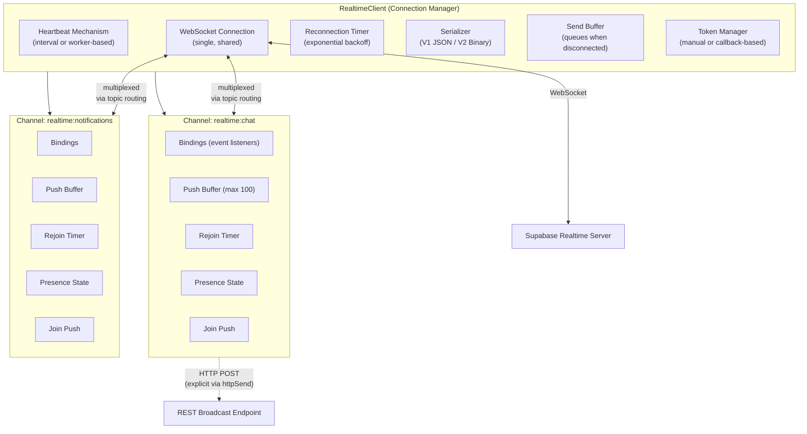
```mermaid
graph TB
    subgraph RealtimeClient["RealtimeClient (Connection Manager)"]
        WS["WebSocket Connection<br/>(single, shared)"]
        HB["Heartbeat Mechanism<br/>(interval or worker-based)"]
        RT["Reconnection Timer<br/>(exponential backoff)"]
        SER["Serializer<br/>(V1 JSON / V2 Binary)"]
        SB["Send Buffer<br/>(queues when disconnected)"]
        TM["Token Manager<br/>(manual or callback-based)"]
    end

    subgraph Channel1["Channel: realtime:chat"]
        B1["Bindings (event listeners)"]
        PB1["Push Buffer (max 100)"]
        RJ1["Rejoin Timer"]
        PR1["Presence State"]
        JP1["Join Push"]
    end

    subgraph Channel2["Channel: realtime:notifications"]
        B2["Bindings"]
        PB2["Push Buffer"]
        RJ2["Rejoin Timer"]
        PR2["Presence State"]
        JP2["Join Push"]
    end

    RealtimeClient --> Channel1
    RealtimeClient --> Channel2
    WS <-->|"multiplexed<br/>via topic routing"| Channel1
    WS <-->|"multiplexed<br/>via topic routing"| Channel2

    Server["Supabase Realtime Server"]
    WS <-->|"WebSocket"| Server
    REST["REST Broadcast Endpoint"]
    Channel1 -.->|"HTTP POST<br/>(explicit via httpSend)"| REST
```

### Key Architectural Decisions

- **Single WebSocket**: All channels MUST share one WebSocket connection. The client manages channel multiplexing via topic-based routing.
- **Topic prefixing**: Channel topics MUST be prefixed with `realtime:` (e.g., topic `"chat"` becomes `"realtime:chat"`). The prefix MUST be stripped when communicating with the REST broadcast API.
- **State machines**: Both the client connection and each channel MUST maintain independent state machines (see Sections 6 and 7).
- **Push/Reply correlation**: Every push MUST have a unique `ref` string. The server replies with a `phx_reply` event carrying the same `ref`, enabling request/response correlation.
- **Join reference**: Each channel subscription MUST have a `join_ref` that changes on each rejoin. This prevents stale messages from previous subscriptions from being processed.

---

## 3. Configuration

### RealtimeClient Options

| Option | Type | Default | Description |
|--------|------|---------|-------------|
| `transport` | WebSocket constructor | auto-detected | Custom WebSocket implementation. |
| `timeout` | integer (ms) | `10000` | Default timeout for push operations. |
| `heartbeatIntervalMs` | integer (ms) | `25000` | Interval between heartbeat messages. |
| `heartbeatCallback` | callback | no-op | Callback invoked on heartbeat status changes. Receives `(status, latency?)`. |
| `vsn` | string | `"2.0.0"` | Protocol version. MUST be `"1.0.0"` or `"2.0.0"`. |
| `logger` | callback | no-op | Custom logger: `(kind, msg, data)`. |
| `encode` | callback | protocol-dependent | Custom message encoder. |
| `decode` | callback | protocol-dependent | Custom message decoder. |
| `reconnectAfterMs` | callback | stepped backoff | Custom reconnect delay calculator: `(tries) -> ms`. |
| `params` | map | `{}` | Connection parameters. MUST include `apikey`. Sent as URL query parameters. |
| `logLevel` | string | none | Log level: `"info"`, `"warn"`, or `"error"`. Sent as `log_level` URL parameter. |
| `fetch` | callback | platform fetch | Custom HTTP fetch implementation for REST broadcast. |
| `worker` | boolean | `false` | Use background worker for heartbeat (prevents timer throttling in browsers). |
| `workerUrl` | string | built-in script | URL to a custom worker script. |
| `accessToken` | async callback | null | Async callback returning a JWT string or null. |

**Constructor Requirements:**
- The `params.apikey` field is REQUIRED. Construction MUST fail with error `"API key is required to connect to Realtime"` if it is not provided.
- The endpoint URL MUST be transformed: `/socket/websocket` is appended for WebSocket connections.
- The HTTP broadcast endpoint MUST be derived by converting the WebSocket URL scheme (`ws://` to `http://`, `wss://` to `https://`), stripping `/socket/websocket`, `/socket`, or `/websocket` suffixes, and appending `/api/broadcast`.

### RealtimeChannel Options

```
RealtimeChannelOptions {
  config {
    broadcast {
      self     : Boolean    = false   -- Receive own broadcast messages
      ack      : Boolean    = false   -- Require server acknowledgement
      replay {                        -- Replay previous broadcasts (private channels ONLY)
        since  : Integer              -- Message ID to replay from
        limit  : Integer?             -- Maximum number of messages to replay
      }?
    }?
    presence {
      key      : String     = ""      -- Presence key for this client
      enabled  : Boolean    = false   -- Explicitly enable presence
    }?
    private    : Boolean    = false   -- Enable RLS policy enforcement
  }
}
```

**Validation Rules:**
- If `replay` is configured on a non-private channel, construction MUST fail with an error.
- Presence MUST be automatically enabled if presence event listeners are registered, even if `enabled` is not explicitly set to `true`.

---

## 4. Data Models

### RealtimeMessage

The fundamental message structure exchanged over the WebSocket:

```
RealtimeMessage {
  topic    : String        -- Channel topic (e.g., "realtime:chat")
  event    : String        -- Event type (e.g., "phx_join", "broadcast", "heartbeat")
  payload  : Any           -- Event-specific data
  ref      : String        -- Unique message reference for reply correlation
  join_ref : String?       -- Reference to the channel's current join
}
```

### Presence State

```
Presence<T> {
  presence_ref : String    -- Unique session reference (derived from server's phx_ref)
  ...T                     -- Custom user-defined metadata fields
}

PresenceState<T> = Map<String, List<Presence<T>>>
  -- Key   = presence key (e.g., user ID)
  -- Value = list of presences for that key (multiple sessions per key)
```

### Presence Event Payloads

```
PresenceJoinPayload<T> {
  event              : "join"
  key                : String              -- The presence key that joined
  currentPresences   : List<Presence<T>>   -- All presences for this key after join
  newPresences       : List<Presence<T>>   -- Only the newly joined presences
}

PresenceLeavePayload<T> {
  event              : "leave"
  key                : String              -- The presence key that left
  currentPresences   : List<Presence<T>>   -- Remaining presences for this key
  leftPresences      : List<Presence<T>>   -- The presences that left
}
```

### PostgreSQL Change Payloads

```
PostgresInsertPayload<T> {
  schema             : String              -- Database schema (e.g., "public")
  table              : String              -- Table name
  commit_timestamp   : String              -- ISO-8601 timestamp
  errors             : List<String>        -- Any errors
  eventType          : "INSERT"
  new                : T                   -- The inserted record
  old                : EmptyMap            -- Empty for inserts
}

PostgresUpdatePayload<T> {
  schema             : String
  table              : String
  commit_timestamp   : String
  errors             : List<String>
  eventType          : "UPDATE"
  new                : T                   -- Full updated record
  old                : Partial<T>          -- Old record (may be partial based on replica identity)
}

PostgresDeletePayload<T> {
  schema             : String
  table              : String
  commit_timestamp   : String
  errors             : List<String>
  eventType          : "DELETE"
  new                : EmptyMap            -- Empty for deletes
  old                : Partial<T>          -- Deleted record (may be partial)
}
```

### PostgreSQL Changes Filter

```
PostgresChangesFilter {
  event  : String          -- "INSERT" | "UPDATE" | "DELETE" | "*"
  schema : String          -- Required: database schema
  table  : String?         -- Optional: specific table
  filter : String?         -- Optional: RLS filter expression (e.g., "id=eq.5")
}
```

### Broadcast via Changes Payloads

When receiving database changes via broadcast channel:

```
BroadcastInsertPayload<T> {
  schema     : String
  table      : String
  id         : String
  operation  : "INSERT"
  record     : T
  old_record : Null
}

BroadcastUpdatePayload<T> {
  schema     : String
  table      : String
  id         : String
  operation  : "UPDATE"
  record     : T
  old_record : T
}

BroadcastDeletePayload<T> {
  schema     : String
  table      : String
  id         : String
  operation  : "DELETE"
  record     : Null
  old_record : T
}
```

### Channel Bindings

Internal structure for event listener registration:

```
Binding {
  type     : String                -- Lowercased listener type
  filter   : Map<String, Any>      -- Event filter (e.g., { event: "INSERT" })
  callback : Callback              -- User callback
  id       : String?               -- Server-assigned ID (for postgres_changes)
}

Bindings = Map<String, List<Binding>>  -- Keyed by listener type
```

---

## 5. Enumerations and Constants

### Channel States

```
ChannelState = "closed" | "joining" | "joined" | "errored" | "leaving"
```

### Connection State

```
ConnectionState = "connecting" | "open" | "closing" | "closed"
```

### Client Internal State

```
ClientState = "connecting" | "connected" | "disconnecting" | "disconnected"
```

### Channel Events (Phoenix Protocol)

| Constant | Wire Value | Direction |
|----------|-----------|-----------|
| `CLOSE` | `"phx_close"` | Server to Client |
| `ERROR` | `"phx_error"` | Server to Client |
| `JOIN` | `"phx_join"` | Client to Server |
| `REPLY` | `"phx_reply"` | Server to Client |
| `LEAVE` | `"phx_leave"` | Client to Server |
| `ACCESS_TOKEN` | `"access_token"` | Client to Server |

### Listen Types

```
ListenType = "broadcast" | "presence" | "postgres_changes" | "system"
```

### PostgreSQL Changes Listen Events

```
PostgresChangesEvent = "*" | "INSERT" | "UPDATE" | "DELETE"
```

### Subscribe States

Callback status values delivered to the `subscribe()` callback:

```
SubscribeState = "SUBSCRIBED" | "TIMED_OUT" | "CLOSED" | "CHANNEL_ERROR"
```

### Presence Listen Events

```
PresenceEvent = "sync" | "join" | "leave"
```

### Heartbeat Status

```
HeartbeatStatus = "sent" | "ok" | "error" | "timeout" | "disconnected"
```

### Response Types

```
ChannelSendResponse       = "ok" | "timed out" | "error"
RemoveChannelResponse     = "ok" | "timed out" | "error"
```

---

## 6. Client State Machine

The client MUST maintain a connection state machine with the following states and transitions:

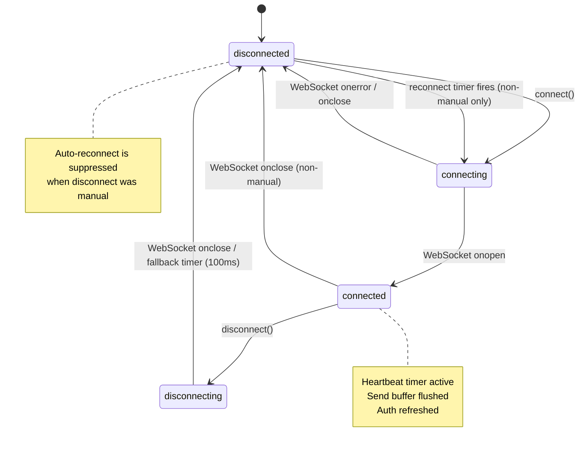
```mermaid
stateDiagram-v2
    [*] --> disconnected

    disconnected --> connecting : connect()
    connecting --> connected : WebSocket onopen
    connecting --> disconnected : WebSocket onerror / onclose
    connected --> disconnecting : disconnect()
    connected --> disconnected : WebSocket onclose (non-manual)
    disconnecting --> disconnected : WebSocket onclose / fallback timer (100ms)
    disconnected --> connecting : reconnect timer fires (non-manual only)

    note right of disconnected
        Auto-reconnect is suppressed
        when disconnect was manual
    end note

    note right of connected
        Heartbeat timer active
        Send buffer flushed
        Auth refreshed
    end note
```

### State Descriptions

| State | Description |
|-------|-------------|
| `disconnected` | No WebSocket connection. Initial state. |
| `connecting` | WebSocket creation in progress. |
| `connected` | WebSocket is open. Heartbeat is active. Channels may join. |
| `disconnecting` | Manual disconnect requested. Waiting for WebSocket close. |

### Transition Rules

- **connect()** while `connecting`, `connected`, or `disconnecting`: MUST be a no-op.
- **disconnect()** while `disconnecting`: MUST be a no-op.
- **On connected**: MUST start heartbeat, refresh auth, flush send buffer.
- **On disconnected (non-manual)**: MUST schedule reconnect timer.
- **On disconnected (manual)**: MUST NOT schedule reconnect timer.

---

## 7. Channel State Machine

Each channel MUST maintain an independent state machine:

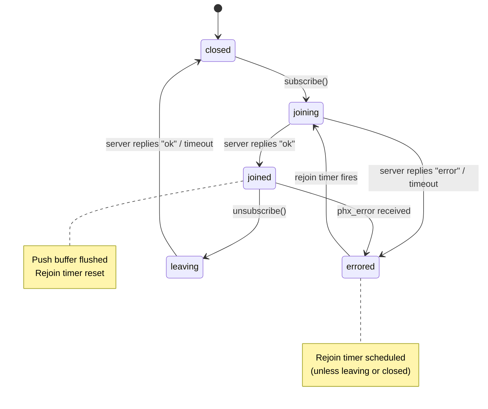
```mermaid
stateDiagram-v2
    [*] --> closed

    closed --> joining : subscribe()
    joining --> joined : server replies "ok"
    joining --> errored : server replies "error" / timeout
    joined --> leaving : unsubscribe()
    joined --> errored : phx_error received
    leaving --> closed : server replies "ok" / timeout
    errored --> joining : rejoin timer fires

    note right of joined
        Push buffer flushed
        Rejoin timer reset
    end note

    note right of errored
        Rejoin timer scheduled
        (unless leaving or closed)
    end note
```

### State Descriptions

| State | Description |
|-------|-------------|
| `closed` | Not subscribed. No communication. |
| `joining` | `phx_join` sent, awaiting server response. |
| `joined` | Successfully subscribed. Messages flow. Push buffer flushed. |
| `errored` | Error occurred. Rejoin will be attempted automatically. |
| `leaving` | `phx_leave` sent, awaiting server response. |

### Transition Rules

- **subscribe()** while not `closed`: MUST be a no-op (return immediately).
- **On joined**: MUST reset rejoin timer AND flush push buffer.
- **On errored**: MUST schedule rejoin timer, UNLESS channel is `leaving` or `closed`.
- **On leaving -> closed**: MUST remove channel from client if triggered by close event.

---

## 8. RealtimeClient API

### Constructor

```
RealtimeClient(endPoint: String, options?: RealtimeClientOptions) -> RealtimeClient
```

**Behavior:**
1. Validate that `options.params.apikey` is provided. MUST fail with error if missing.
2. Store `apiKey` from params.
3. Construct WebSocket endpoint: `endPoint + "/websocket"`.
4. Construct HTTP endpoint (see Section 3 for URL transformation rules).
5. Initialize all options with defaults (see Configuration).
6. Setup reconnection timer with exponential backoff.
7. Resolve platform fetch implementation.
8. If `worker` is enabled but background worker capability is not available, MUST fail with error.
9. Based on `vsn`:
   - `"1.0.0"`: Use pure JSON encode/decode.
   - `"2.0.0"`: Use Serializer (binary for broadcasts, JSON for others).
   - Other: MUST fail with error `"Unsupported serializer version: {vsn}"`.

### connect()

```
connect() -> Void
```

**Behavior:**
1. If already `connecting`, `disconnecting`, or `connected`, return immediately (idempotent).
2. Set connection state to `"connecting"`.
3. If an `accessToken` callback exists and no auth operation is in progress, trigger `setAuth()` asynchronously.
4. Create WebSocket connection using the configured transport or platform auto-detection.
5. Set binary mode on the WebSocket if supported (for receiving binary broadcast frames).
6. Attach `onopen`, `onerror`, `onmessage`, `onclose` handlers.
7. If WebSocket is already in `OPEN` state (immediate connection), call `_onConnOpen()` immediately.

### disconnect(code?, reason?)

```
disconnect(code?: Integer, reason?: String) -> Void
```

**Behavior:**
1. If already `disconnecting`, return immediately.
2. Set connection state to `"disconnecting"` with `manual = true` (prevents auto-reconnect).
3. Set up a fallback timer (100ms) to force state to `"disconnected"` if WebSocket close callback does not fire.
4. Close the WebSocket connection.
5. Teardown: clear all handlers, stop heartbeat, terminate worker, teardown all channels.

### channel(topic, params?)

```
channel(topic: String, params?: RealtimeChannelOptions) -> RealtimeChannel
```

**Behavior:**
1. Prefix topic with `"realtime:"` (e.g., `"chat"` becomes `"realtime:chat"`).
2. If a channel with the same prefixed topic already exists, MUST return the existing channel (deduplication).
3. Otherwise, create a new `RealtimeChannel` instance, add it to the channels list, and return it.

### getChannels()

```
getChannels() -> List<RealtimeChannel>
```

Returns the list of all created channels.

### removeChannel(channel)

```
removeChannel(channel: RealtimeChannel) -> Async<RemoveChannelResponse>
```

**Behavior:**
1. Call `channel.unsubscribe()`.
2. If unsubscribe returns `"ok"`, remove the channel from the internal list.
3. If no channels remain, disconnect the client.
4. Return the unsubscribe status.

### removeAllChannels()

```
removeAllChannels() -> Async<List<RemoveChannelResponse>>
```

**Behavior:**
1. Call `unsubscribe()` on all channels concurrently.
2. Clear the channels list.
3. Disconnect the client.
4. Return the list of statuses.

### setAuth(token?)

```
setAuth(token?: String | Null) -> Async<Void>
```

**Behavior:**
1. If `token` is provided (non-null), use it as the access token and mark as "manually set" (the `accessToken` callback MUST NOT be called until `setAuth()` is called without arguments).
2. If `token` is null/absent and an `accessToken` callback exists, call the callback to get a fresh token. On callback failure, fall back to the cached token value.
3. If the token value has changed:
   a. Update the cached token.
   b. For each channel, update the join payload with the new token.
   c. For channels that are currently `joined`, push an `access_token` event with the new token.

### push(data)

```
push(data: RealtimeMessage) -> Void
```

**Behavior:**
1. Encode the message using the configured encoder.
2. If connected, send immediately via WebSocket.
3. If not connected, add the send operation to the send buffer (flushed on next connection).

### connectionState()

```
connectionState() -> ConnectionState
```

Maps the WebSocket ready state to `ConnectionState`:
- `0` (connecting) -> `"connecting"`
- `1` (open) -> `"open"`
- `2` (closing) -> `"closing"`
- Default (null/3) -> `"closed"`

### isConnected()

```
isConnected() -> Boolean
```

Returns `true` if `connectionState()` is `"open"`.

### sendHeartbeat()

```
sendHeartbeat() -> Async<Void>
```

See [Section 15: Heartbeat Mechanism](#15-heartbeat-mechanism).

### flushSendBuffer()

```
flushSendBuffer() -> Void
```

If connected, sends all queued messages and clears the buffer.

---

## 9. RealtimeChannel API

### Constructor

```
RealtimeChannel(topic: String, params?: RealtimeChannelOptions, socket: RealtimeClient)
```

**Behavior:**
1. Store the topic and compute `subTopic` by stripping the `"realtime:"` prefix.
2. Merge config defaults: `broadcast: { ack: false, self: false }`, `presence: { key: "", enabled: false }`, `private: false`.
3. Create the join push (`phx_join` event) and rejoin timer.
4. Register internal handlers:
   - On join `"ok"`: set state to `joined`, reset rejoin timer, flush push buffer.
   - On close: reset rejoin timer, set state to `closed`, remove from client.
   - On error: set state to `errored`, schedule rejoin (unless `leaving` or `closed`).
   - On join `"timeout"`: set state to `errored`, schedule rejoin.
   - On join `"error"`: set state to `errored`, schedule rejoin.
   - On `phx_reply`: trigger the reply event for push correlation.
5. Create a `RealtimePresence` instance.
6. Compute the broadcast endpoint URL from the socket's endpoint.
7. Validate that `replay` is not used on non-private channels.

### subscribe(callback?, timeout?)

```
subscribe(
  callback?: (status: SubscribeState, err?: Error) -> Void,
  timeout?: Integer
) -> RealtimeChannel
```

**Behavior:**

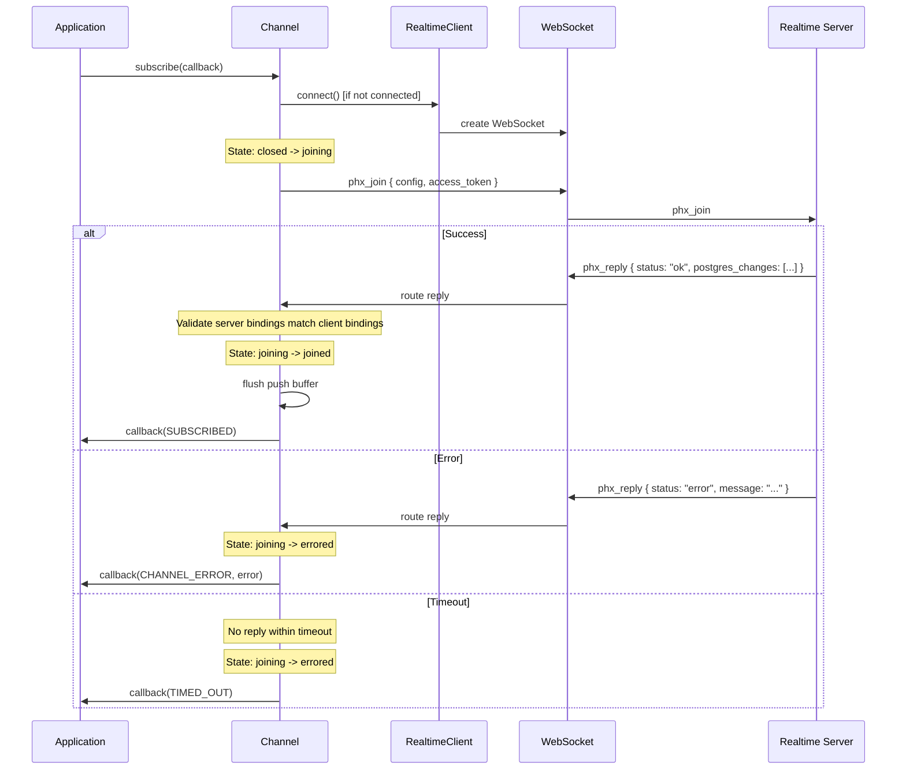
```mermaid
sequenceDiagram
    participant App as Application
    participant Ch as Channel
    participant Client as RealtimeClient
    participant WS as WebSocket
    participant Server as Realtime Server

    App->>Ch: subscribe(callback)
    Ch->>Client: connect() [if not connected]
    Client->>WS: create WebSocket

    Note over Ch: State: closed -> joining

    Ch->>WS: phx_join { config, access_token }
    WS->>Server: phx_join

    alt Success
        Server->>WS: phx_reply { status: "ok", postgres_changes: [...] }
        WS->>Ch: route reply
        Note over Ch: Validate server bindings match client bindings
        Note over Ch: State: joining -> joined
        Ch->>Ch: flush push buffer
        Ch->>App: callback(SUBSCRIBED)
    else Error
        Server->>WS: phx_reply { status: "error", message: "..." }
        WS->>Ch: route reply
        Note over Ch: State: joining -> errored
        Ch->>App: callback(CHANNEL_ERROR, error)
    else Timeout
        Note over Ch: No reply within timeout
        Note over Ch: State: joining -> errored
        Ch->>App: callback(TIMED_OUT)
    end
```

1. If the socket is not connected, call `socket.connect()`.
2. If the channel is not in `closed` state, return immediately.
3. Build the join payload:
   - Extract `broadcast` and `presence` config.
   - Collect all registered `postgres_changes` filters from bindings.
   - Auto-enable presence if presence listeners are registered.
   - Include current access token if available.
4. Set `joinedOnce = true`.
5. Send the rejoin (`phx_join`).
6. Register response handlers:
   - **"ok"**: Refresh auth (if callback-based). Validate that server-returned `postgres_changes` IDs match client bindings (same event, schema, table, filter). If mismatch, unsubscribe and deliver `CHANNEL_ERROR`. Otherwise, assign server IDs to bindings and deliver `SUBSCRIBED`.
   - **"error"**: Set state to `errored`, deliver `CHANNEL_ERROR` with error message.
   - **"timeout"**: Deliver `TIMED_OUT`.
7. Return `this` for chaining.

### on(type, filter, callback)

```
on(type: String, filter: Map, callback: Callback) -> RealtimeChannel
```

**Listener Signatures:**

| Type | Filter | Callback Payload |
|------|--------|-----------------|
| `"presence"` | `{ event: "sync" }` | None |
| `"presence"` | `{ event: "join" }` | `PresenceJoinPayload<T>` |
| `"presence"` | `{ event: "leave" }` | `PresenceLeavePayload<T>` |
| `"postgres_changes"` | `{ event: "*", schema: "..." }` | Any change payload |
| `"postgres_changes"` | `{ event: "INSERT", schema: "..." }` | `PostgresInsertPayload<T>` |
| `"postgres_changes"` | `{ event: "UPDATE", schema: "..." }` | `PostgresUpdatePayload<T>` |
| `"postgres_changes"` | `{ event: "DELETE", schema: "..." }` | `PostgresDeletePayload<T>` |
| `"broadcast"` | `{ event: "<name>" }` | Broadcast payload |
| `"broadcast"` | `{ event: "*" }` | Any broadcast payload |
| `"system"` | `{}` | System payload |

**Special behavior:**
- If a presence listener is added while the channel is already `joined`, the channel MUST automatically unsubscribe and resubscribe to enable presence on the server.
- The type MUST be lowercased before storing.
- Returns `this` for chaining.

### send(args, opts?)

```
send(
  args: { type: String, event: String, payload?: Any },
  opts?: { timeout?: Integer }
) -> Async<ChannelSendResponse>
```

**Behavior:**
1. If the channel can push (connected AND joined) OR the type is not `"broadcast"`, send via WebSocket push.
2. If the channel cannot push AND type is `"broadcast"`, fall back to REST API:
   - SHOULD log a deprecation warning.
   - POST to the broadcast endpoint with the message.
   - Include `apikey` header and `Authorization: Bearer <token>` if available.
   - Return `"ok"` on HTTP 202.
3. Wait for server acknowledgement if `config.broadcast.ack` is true.

### httpSend(event, payload, opts?)

```
httpSend(
  event: String,
  payload: Any,
  opts?: { timeout?: Integer }
) -> Async<{ success: Boolean, status?: Integer, error?: String }>
```

**Behavior:**
1. MUST reject if `payload` is null or undefined.
2. POST to the broadcast endpoint URL.
3. Include headers: `apikey`, `Content-Type: application/json`, `Authorization: Bearer <token>`.
4. Body format: `{ messages: [{ topic: subTopic, event, payload, private }] }`.
5. Return `{ success: true }` on HTTP 202.
6. On other status codes, attempt to parse error from response body, then fail with error.
7. Use timeout enforcement (e.g., via abort signal).

### track(payload, opts?)

```
track(payload: Map, opts?: { timeout?: Integer }) -> Async<ChannelSendResponse>
```

Sends a presence `track` event: `send({ type: "presence", event: "track", payload }, opts)`.

### untrack(opts?)

```
untrack(opts?: Map) -> Async<ChannelSendResponse>
```

Sends a presence `untrack` event: `send({ type: "presence", event: "untrack" }, opts)`.

### presenceState()

```
presenceState<T>() -> PresenceState<T>
```

Returns the current presence state from the `RealtimePresence` instance.

### unsubscribe(timeout?)

```
unsubscribe(timeout?: Integer) -> Async<"ok" | "timed out" | "error">
```

**Behavior:**
1. Set state to `leaving`.
2. Destroy the join push timer/listeners.
3. Create a leave push (`phx_leave`).
4. Register handlers: `"ok"` -> resolve `"ok"`, `"timeout"` -> resolve `"timed out"`, `"error"` -> resolve `"error"`.
5. Send the leave push.
6. If the channel cannot push (not connected or not joined), immediately trigger `"ok"`.
7. Clean up the leave push on resolution.

### teardown()

```
teardown() -> Void
```

**Behavior:**
1. Destroy all pushes in the push buffer.
2. Clear the push buffer.
3. Reset the rejoin timer.
4. Destroy the join push.
5. Set state to `closed`.
6. Clear all bindings.

### updateJoinPayload(payload)

```
updateJoinPayload(payload: Map) -> Void
```

Updates the payload for the next channel join (used for token updates).

---

## 10. Presence

### Overview

Presence synchronizes shared state across all clients subscribed to a channel. It uses a CRDT-like approach with full-state snapshots and incremental diffs to handle network partitions and reconnections gracefully.

### Presence Synchronization Flow

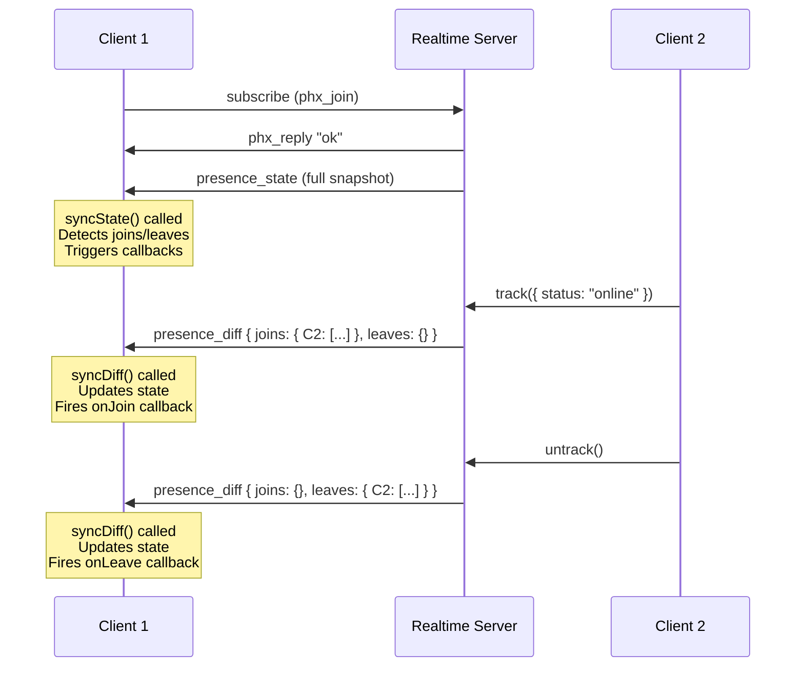
```mermaid
sequenceDiagram
    participant C1 as Client 1
    participant Server as Realtime Server
    participant C2 as Client 2

    C1->>Server: subscribe (phx_join)
    Server->>C1: phx_reply "ok"
    Server->>C1: presence_state (full snapshot)
    Note over C1: syncState() called<br/>Detects joins/leaves<br/>Triggers callbacks

    C2->>Server: track({ status: "online" })
    Server->>C1: presence_diff { joins: { C2: [...] }, leaves: {} }
    Note over C1: syncDiff() called<br/>Updates state<br/>Fires onJoin callback

    C2->>Server: untrack()
    Server->>C1: presence_diff { joins: {}, leaves: { C2: [...] } }
    Note over C1: syncDiff() called<br/>Updates state<br/>Fires onLeave callback
```

### Server Events

The server sends two types of presence events:

1. **`presence_state`**: Full state snapshot. Sent when a client first joins or reconnects.
2. **`presence_diff`**: Incremental update containing `joins` and `leaves` since the last event.

### Raw Server Format

The server sends presence data in "Phoenix format" with `metas`:

```
RawPresenceState = Map<String, { metas: List<{ phx_ref: String, phx_ref_prev?: String, ...metadata }> }>

RawPresenceDiff = {
  joins  : RawPresenceState
  leaves : RawPresenceState
}
```

### Client Transformation

The client MUST transform server format to client format:
1. Remove the `metas` wrapper.
2. Rename `phx_ref` to `presence_ref`.
3. Remove `phx_ref` and `phx_ref_prev` from the metadata.

**Example:**
```
Server: { "user1": { metas: [{ phx_ref: "abc", status: "online" }] } }
Client: { "user1": [{ presence_ref: "abc", status: "online" }] }
```

### Sync Algorithm

#### syncState (Full State)

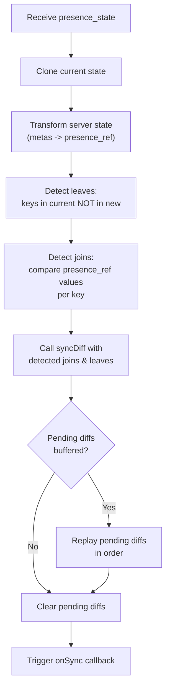
```mermaid
flowchart TD
    A["Receive presence_state"] --> B["Clone current state"]
    B --> C["Transform server state<br/>(metas -> presence_ref)"]
    C --> D["Detect leaves:<br/>keys in current NOT in new"]
    D --> E["Detect joins:<br/>compare presence_ref values<br/>per key"]
    E --> F["Call syncDiff with<br/>detected joins & leaves"]
    F --> G{"Pending diffs<br/>buffered?"}
    G -->|Yes| H["Replay pending diffs<br/>in order"]
    G -->|No| I["Clear pending diffs"]
    H --> I
    I --> J["Trigger onSync callback"]
```

Called when `presence_state` is received:

1. Clone the current state.
2. Transform the server state (metas -> presence_ref).
3. Detect leaves: keys in current state not in new state.
4. Detect joins: for each key in new state, compare `presence_ref` values with current state. New refs are joins, missing refs are leaves.
5. Call `syncDiff` with the detected joins and leaves.
6. Replay any pending diffs that arrived before this full state.
7. Clear pending diffs.
8. Trigger `onSync` callback.

#### syncDiff (Incremental)

Called when `presence_diff` is received:

1. Transform the joins and leaves from server format.
2. For each join:
   - Set the new presences for the key in state.
   - Preserve existing presences that still have valid refs.
   - Call `onJoin(key, currentPresences, newPresences)`.
3. For each leave:
   - Remove presences matching the left `presence_ref` values.
   - Call `onLeave(key, currentPresences, leftPresences)`.
   - If no presences remain for a key, delete the key from state.

### Pending Diffs Buffer

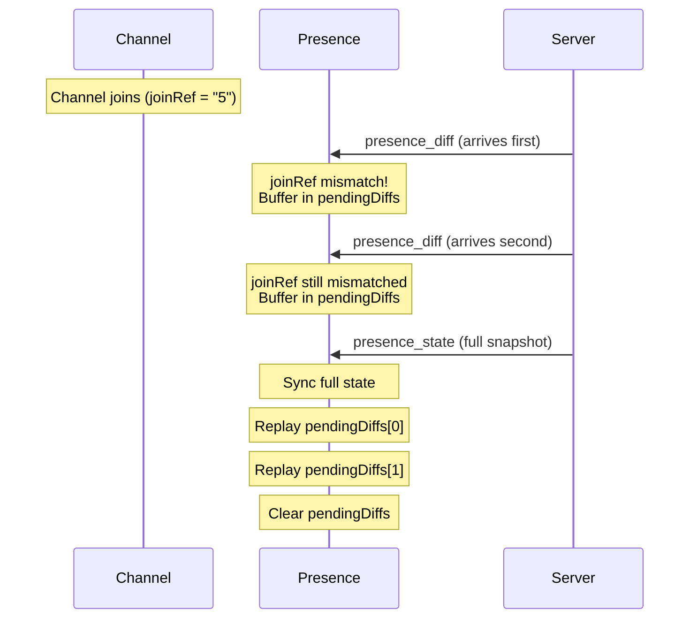
```mermaid
sequenceDiagram
    participant Ch as Channel
    participant Pr as Presence
    participant Server as Server

    Note over Ch: Channel joins (joinRef = "5")

    Server->>Pr: presence_diff (arrives first)
    Note over Pr: joinRef mismatch!<br/>Buffer in pendingDiffs

    Server->>Pr: presence_diff (arrives second)
    Note over Pr: joinRef still mismatched<br/>Buffer in pendingDiffs

    Server->>Pr: presence_state (full snapshot)
    Note over Pr: Sync full state
    Note over Pr: Replay pendingDiffs[0]
    Note over Pr: Replay pendingDiffs[1]
    Note over Pr: Clear pendingDiffs
```

During reconnection, `presence_diff` events MAY arrive before the `presence_state` snapshot:

1. The presence instance MUST track a `joinRef` that matches the channel's current join reference.
2. If a diff arrives and the `joinRef` does not match (or is null), the diff MUST be buffered in `pendingDiffs`.
3. When the full state arrives, all pending diffs MUST be replayed in order after syncing the state.

**This is critical for correctness**: Without pending diff buffering, state can become inconsistent during reconnections.

### Presence Events Triggered

After state synchronization, the following events MUST be triggered on the channel:

- `presence` with `{ event: "join", key, currentPresences, newPresences }` for each join.
- `presence` with `{ event: "leave", key, currentPresences, leftPresences }` for each leave.
- `presence` with `{ event: "sync" }` after all joins/leaves are processed.

### Deep Clone Requirement

The presence implementation MUST deep-clone state objects before mutation to prevent shared references between the internal state and user callbacks. A serialization round-trip (e.g., serialize then deserialize) is one approach, but any deep clone mechanism is acceptable.

---

## 11. Broadcast

### Broadcast Delivery Paths

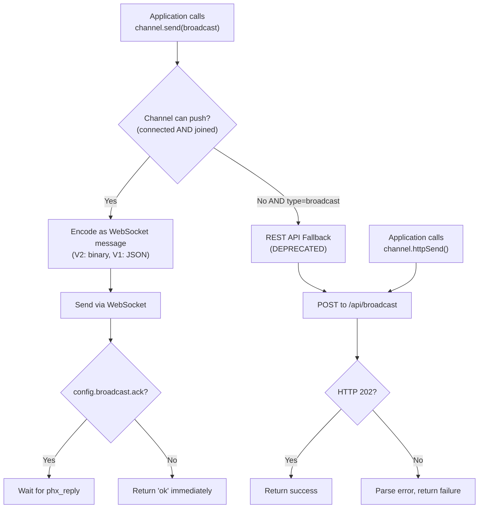
```mermaid
flowchart TD
    A["Application calls<br/>channel.send(broadcast)"] --> B{"Channel can push?<br/>(connected AND joined)"}

    B -->|Yes| C["Encode as WebSocket message<br/>(V2: binary, V1: JSON)"]
    C --> D["Send via WebSocket"]

    B -->|No AND type=broadcast| E["REST API Fallback<br/>(DEPRECATED)"]
    E --> F["POST to /api/broadcast"]

    G["Application calls<br/>channel.httpSend()"] --> F

    D --> H{"config.broadcast.ack?"}
    H -->|Yes| I["Wait for phx_reply"]
    H -->|No| J["Return 'ok' immediately"]

    F --> K{"HTTP 202?"}
    K -->|Yes| L["Return success"]
    K -->|No| M["Parse error, return failure"]
```

### Sending via WebSocket

When the channel is connected and joined, broadcasts MUST be sent as WebSocket messages:

```
{
  topic: "realtime:chat",
  event: "broadcast",
  payload: {
    type: "broadcast",
    event: "user_typing",
    payload: { userId: 123 }
  },
  ref: "5",
  join_ref: "1"
}
```

In V2 protocol, broadcast messages MUST be binary-encoded (see [Section 14](#14-message-serialization)).

### Sending via REST API (httpSend)

Broadcasts can be sent via the REST API explicitly using `httpSend()`:

**Endpoint**: `POST {httpEndpoint}/api/broadcast`

**Headers:**
```
apikey: <api-key>
Content-Type: application/json
Authorization: Bearer <access-token>     (if available)
```

**Body:**
```
{
  "messages": [
    {
      "topic": "<subTopic>",
      "event": "<event-name>",
      "payload": { ... },
      "private": <boolean>
    }
  ]
}
```

**Response:**
- HTTP 202: Success.
- Other: Error (attempt to parse error message from response body).

### Automatic REST Fallback (Deprecated)

When `send()` is called with `type: "broadcast"` and the channel cannot push (not connected or not joined), the SDK falls back to the REST API. This behavior is deprecated - implementations SHOULD log a warning directing users to use `httpSend()` explicitly.

### Self-Broadcast

When `config.broadcast.self` is `true`, the sending client MUST receive its own broadcast messages.

### Acknowledgement

When `config.broadcast.ack` is `true`, the server sends a `phx_reply` to confirm receipt.

### Replay

For private channels with `config.broadcast.replay` configured, previous broadcast messages MUST be replayed on join. Replayed messages include `meta.replayed: true` in the payload.

### Broadcast Event Filtering

- Listeners with a specific `event` name MUST receive only broadcasts matching that event.
- Listeners with `event: "*"` MUST receive all broadcast events (wildcard).
- Multiple listeners for the same event MUST all receive the payload.

---

## 12. PostgreSQL Changes (CDC)

### Subscription Setup

When `subscribe()` is called, all registered `postgres_changes` bindings MUST be sent as part of the join payload:

```
{
  "config": {
    "postgres_changes": [
      {
        "event": "INSERT",
        "schema": "public",
        "table": "messages",
        "filter": "room_id=eq.5"
      }
    ]
  }
}
```

### Server Binding Validation

On successful join, the server returns `postgres_changes` IDs. The client MUST validate that each server-returned filter matches the corresponding client filter:

1. Compare `event`, `schema`, `table`, and `filter` fields.
2. Treat `undefined`, `null`, and empty string as equivalent empty values.
3. On mismatch: unsubscribe, set state to `errored`, and deliver `CHANNEL_ERROR` to the subscribe callback.
4. On match: assign the server-provided `id` to each binding.

### Change Event Delivery

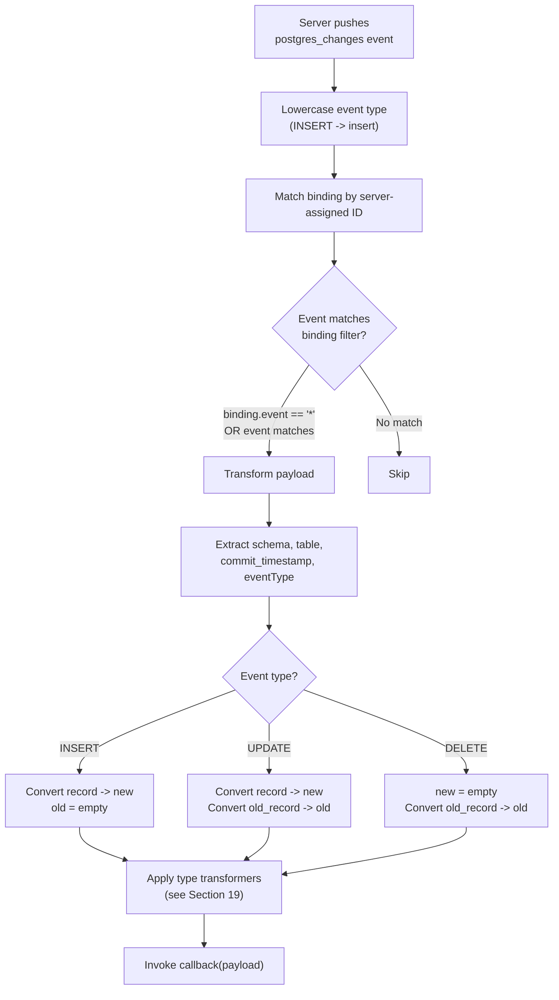
```mermaid
flowchart TD
    A["Server pushes<br/>postgres_changes event"] --> B["Lowercase event type<br/>(INSERT -> insert)"]
    B --> C["Match binding by server-assigned ID"]
    C --> D{"Event matches<br/>binding filter?"}
    D -->|"binding.event == '*'<br/>OR event matches"| E["Transform payload"]
    D -->|No match| F["Skip"]
    E --> G["Extract schema, table,<br/>commit_timestamp, eventType"]
    G --> H{"Event type?"}
    H -->|INSERT| I["Convert record -> new<br/>old = empty"]
    H -->|UPDATE| J["Convert record -> new<br/>Convert old_record -> old"]
    H -->|DELETE| K["new = empty<br/>Convert old_record -> old"]
    I --> L["Apply type transformers<br/>(see Section 19)"]
    J --> L
    K --> L
    L --> M["Invoke callback(payload)"]
```

When the server pushes a change event:

1. The event type MUST be lowercased (e.g., `"INSERT"` -> `"insert"`).
2. Match bindings by server-assigned ID.
3. For matching bindings, check if `event === "*"` or event matches the type.
4. Transform the payload:
   - Extract `schema`, `table`, `commit_timestamp`, `eventType`, `errors`.
   - For INSERT/UPDATE: Convert `record` using type transformers -> `new`.
   - For UPDATE/DELETE: Convert `old_record` using type transformers -> `old`.
5. Call all matching callbacks.

### Type Conversion

Change data arrives with string values from PostgreSQL. The SDK MUST convert these to native types using the transformers described in [Section 19](#19-postgresql-type-transformers).

---

## 13. WebSocket Protocol

### Protocol Versions

The SDK MUST support two protocol versions negotiated via the `vsn` URL parameter:

#### V1.0.0 (JSON Only)

All messages are JSON-encoded arrays:
```
[join_ref, ref, topic, event, payload]
```

#### V2.0.0 (Binary + JSON, Default)

- **Broadcast messages**: Binary-encoded for efficiency.
- **All other messages**: JSON-encoded arrays (same as V1).

### URL Structure

The WebSocket connection URL MUST be constructed as:

```
{endpoint}/websocket?vsn={version}&apikey={key}&log_level={level}
```

Parameters MUST be appended as URL query parameters.

### Phoenix Protocol Events

| Event | Direction | Purpose |
|-------|-----------|---------|
| `phx_join` | Client -> Server | Subscribe to a channel |
| `phx_reply` | Server -> Client | Response to a push (join, leave, heartbeat) |
| `phx_leave` | Client -> Server | Unsubscribe from a channel |
| `phx_close` | Server -> Client | Channel closed by server |
| `phx_error` | Server -> Client | Channel error |
| `heartbeat` | Client -> Server | Connection keepalive (topic: `"phoenix"`) |
| `access_token` | Client -> Server | Update auth token for a channel |
| `broadcast` | Both | Broadcast message |
| `presence_state` | Server -> Client | Full presence snapshot |
| `presence_diff` | Server -> Client | Incremental presence update |

### Message Routing

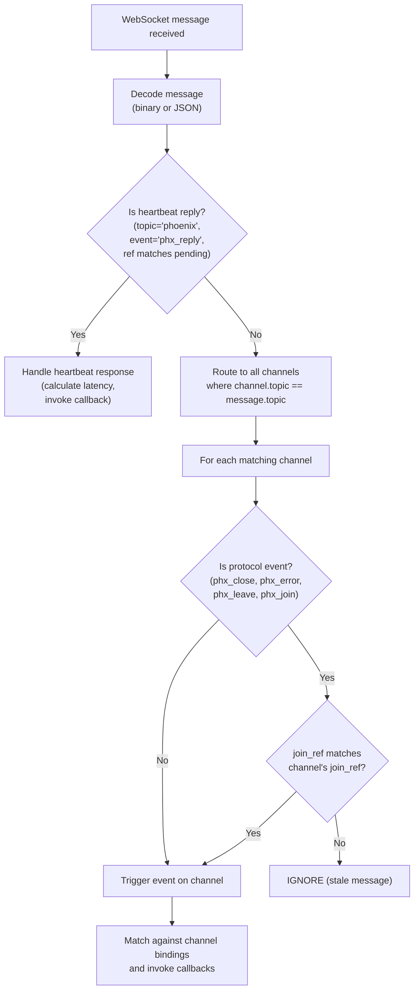
```mermaid
flowchart TD
    A["WebSocket message received"] --> B["Decode message<br/>(binary or JSON)"]
    B --> C{"Is heartbeat reply?<br/>(topic='phoenix',<br/>event='phx_reply',<br/>ref matches pending)"}
    C -->|Yes| D["Handle heartbeat response<br/>(calculate latency,<br/>invoke callback)"]
    C -->|No| E["Route to all channels<br/>where channel.topic == message.topic"]
    E --> F["For each matching channel"]
    F --> G{"Is protocol event?<br/>(phx_close, phx_error,<br/>phx_leave, phx_join)"}
    G -->|Yes| H{"join_ref matches<br/>channel's join_ref?"}
    H -->|Yes| I["Trigger event on channel"]
    H -->|No| J["IGNORE (stale message)"]
    G -->|No| I
    I --> K["Match against channel bindings<br/>and invoke callbacks"]
```

When a message arrives:

1. Decode it (binary or JSON).
2. If it is a heartbeat reply (topic `"phoenix"`, event `"phx_reply"`, matching ref), handle heartbeat response.
3. Route to all channels whose topic matches the message topic.
4. Each channel triggers the event through its binding system.

### Join Reference Verification

For protocol events (`phx_close`, `phx_error`, `phx_leave`, `phx_join`), the message's `ref` MUST be compared to the channel's current `join_ref`. If they do not match, the message is from a previous subscription and MUST be ignored.

---

## 14. Message Serialization

### JSON Encoding (V1 and V2 non-broadcast)

Messages MUST be encoded as a JSON array:

```
[join_ref, ref, topic, event, payload]
```

Decoding reverses this to a `RealtimeMessage` structure.

### Binary Encoding (V2 Broadcast Only)

Binary encoding MUST be used for broadcast messages in V2 protocol. Two kinds exist:

#### Push (Client -> Server): Kind = 3

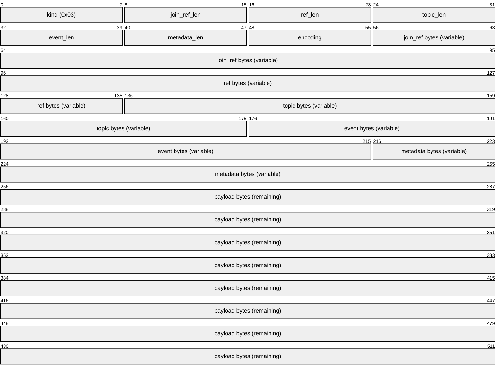
```mermaid
packet-beta
  0-7: "kind (0x03)"
  8-15: "join_ref_len"
  16-23: "ref_len"
  24-31: "topic_len"
  32-39: "event_len"
  40-47: "metadata_len"
  48-55: "encoding"
  56-95: "join_ref bytes (variable)"
  96-135: "ref bytes (variable)"
  136-175: "topic bytes (variable)"
  176-215: "event bytes (variable)"
  216-255: "metadata bytes (variable)"
  256-511: "payload bytes (remaining)"
```

| Field | Size | Description |
|-------|------|-------------|
| `kind` | 1 byte | `3` for user broadcast push |
| `join_ref_len` | 1 byte | Length of join_ref string (max 255) |
| `ref_len` | 1 byte | Length of ref string (max 255) |
| `topic_len` | 1 byte | Length of topic string (max 255) |
| `event_len` | 1 byte | Length of user event string (max 255) |
| `metadata_len` | 1 byte | Length of JSON metadata string (max 255) |
| `encoding` | 1 byte | `0` = binary payload, `1` = JSON payload (UTF-8 encoded) |
| String fields | variable | UTF-8 encoded bytes, concatenated in order |
| Payload | remaining | Raw binary or UTF-8 JSON bytes |

**Validation**: All string field lengths MUST NOT exceed 255 bytes. Implementations MUST fail with an error if this limit is exceeded.

**Metadata filtering**: Only explicitly allowed metadata keys MUST be included (configured via `allowedMetadataKeys` on the Serializer).

#### Incoming (Server -> Client): Kind = 4

| Field | Size | Description |
|-------|------|-------------|
| `kind` | 1 byte | `4` for user broadcast incoming |
| `topic_size` | 1 byte | Length of topic |
| `event_size` | 1 byte | Length of user event |
| `metadata_size` | 1 byte | Length of metadata JSON |
| `encoding` | 1 byte | `0` = binary, `1` = JSON |
| topic | variable | UTF-8 topic bytes |
| event | variable | UTF-8 event bytes |
| metadata | variable | UTF-8 JSON metadata bytes |
| payload | remaining | Raw binary or UTF-8 JSON bytes |

**Decoded structure:**
```
{
  join_ref: null,
  ref: null,
  topic: "<topic>",
  event: "broadcast",
  payload: {
    type: "broadcast",
    event: "<user-event>",
    payload: <decoded-payload>,
    meta: <parsed-metadata>     -- Only if metadata_size > 0
  }
}
```

### Encoding Selection Logic

The serializer MUST automatically select encoding:

1. If the message event is `"broadcast"` AND the payload has an `event` string field AND the payload is not a raw byte buffer:
   - If `payload.payload` is a raw byte buffer: Use binary encoding with `encoding = 0`.
   - Otherwise: JSON-encode the payload and use `encoding = 1`.
2. All other messages: JSON array encoding.

### Raw Byte Buffer Detection

A raw byte buffer (e.g., ArrayBuffer, ByteArray, byte[], etc.) MUST be detected in a cross-context safe manner. Implementations SHOULD check both type identity and constructor name for cross-realm compatibility.

---

## 15. Heartbeat Mechanism

### Purpose

Heartbeats detect stale WebSocket connections. Many network intermediaries (load balancers, proxies) silently drop idle connections. The heartbeat ensures both the client and server know the connection is alive.

### Heartbeat Flow

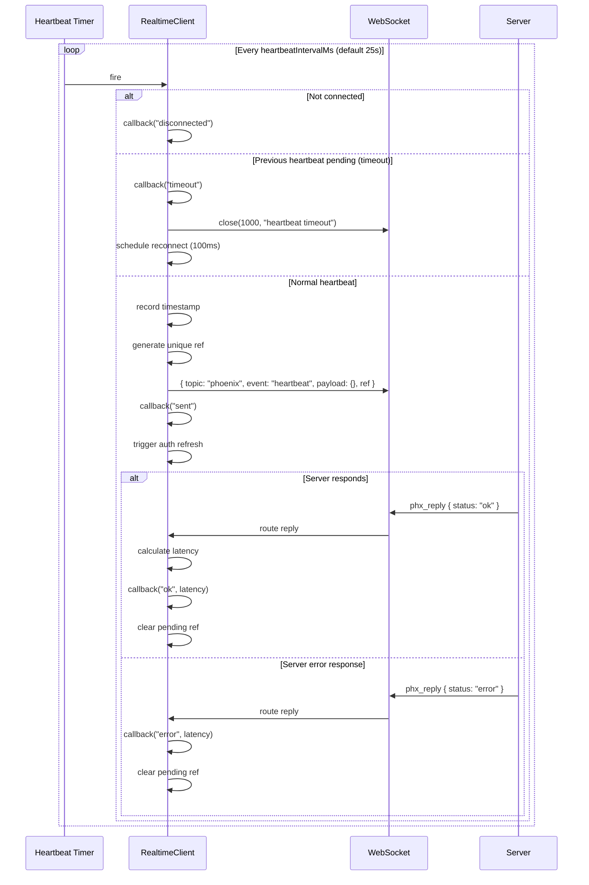
```mermaid
sequenceDiagram
    participant Timer as Heartbeat Timer
    participant Client as RealtimeClient
    participant WS as WebSocket
    participant Server as Server

    loop Every heartbeatIntervalMs (default 25s)
        Timer->>Client: fire
        alt Not connected
            Client->>Client: callback("disconnected")
        else Previous heartbeat pending (timeout)
            Client->>Client: callback("timeout")
            Client->>WS: close(1000, "heartbeat timeout")
            Client->>Client: schedule reconnect (100ms)
        else Normal heartbeat
            Client->>Client: record timestamp
            Client->>Client: generate unique ref
            Client->>WS: { topic: "phoenix", event: "heartbeat", payload: {}, ref }
            Client->>Client: callback("sent")
            Client->>Client: trigger auth refresh

            alt Server responds
                Server->>WS: phx_reply { status: "ok" }
                WS->>Client: route reply
                Client->>Client: calculate latency
                Client->>Client: callback("ok", latency)
                Client->>Client: clear pending ref
            else Server error response
                Server->>WS: phx_reply { status: "error" }
                WS->>Client: route reply
                Client->>Client: callback("error", latency)
                Client->>Client: clear pending ref
            end
        end
    end
```

### Heartbeat Algorithm

1. Timer fires every `heartbeatIntervalMs` (default: 25000ms).
2. Client calls `sendHeartbeat()`.
3. If not connected:
   - Invoke callback with status `"disconnected"`.
   - Return.
4. If `pendingHeartbeatRef` is set (previous heartbeat unanswered):
   - This is a TIMEOUT condition.
   - Clear pending ref.
   - Invoke callback with status `"timeout"`.
   - Close WebSocket with code 1000, reason `"heartbeat timeout"`.
   - Schedule reconnect after fallback delay (100ms).
   - Return.
5. Record timestamp.
6. Generate unique ref (`pendingHeartbeatRef`).
7. Push message: `{ topic: "phoenix", event: "heartbeat", payload: {}, ref }`.
8. Invoke callback with status `"sent"`.
9. Trigger auth refresh (if using callback-based tokens).

### Heartbeat Response Handling

When a message arrives with `topic == "phoenix"` AND `event == "phx_reply"` AND `ref == pendingHeartbeatRef`:

1. Calculate latency: `currentTime - sentTimestamp`.
2. Invoke callback with status `"ok"` (or `"error"` if payload status is not `"ok"`) and latency.
3. Clear `sentTimestamp` and `pendingHeartbeatRef`.

### Heartbeat Message Format

```
{
  topic: "phoenix",
  event: "heartbeat",
  payload: {},
  ref: "<unique-ref>"
}
```

### Background Worker Heartbeat

When `worker: true`, heartbeats SHOULD be driven by a background worker to prevent timer throttling in inactive browser tabs:

1. Create a background worker (from `workerUrl` or inline script).
2. Send `{ event: "start", interval: heartbeatIntervalMs }` to the worker.
3. Worker sends `{ event: "keepAlive" }` at the configured interval.
4. On receiving `"keepAlive"`, client calls `sendHeartbeat()`.
5. Worker MUST be terminated on disconnect.

**Default Worker Script (reference):**
```
on_message(event):
  if event.data.event == "start":
    start_interval(event.data.interval):
      post_message({ event: "keepAlive" })
```

---

## 16. Reconnection Strategy

### Exponential Backoff

The default reconnection intervals MUST be:

| Attempt | Delay |
|---------|-------|
| 1 | 1000ms |
| 2 | 2000ms |
| 3 | 5000ms |
| 4+ | 10000ms |

Custom reconnection logic MAY be provided via the `reconnectAfterMs` option.

### Reconnection Flow

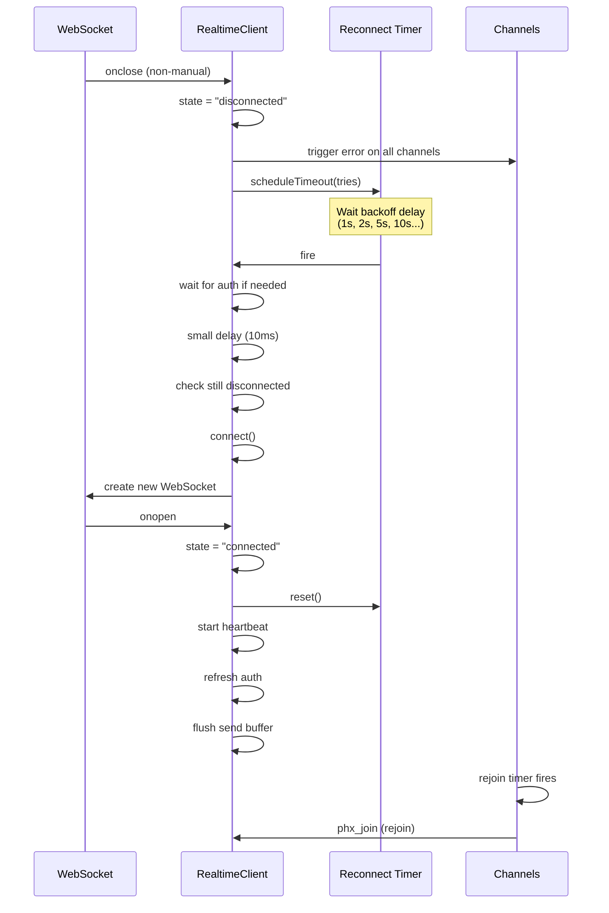
```mermaid
sequenceDiagram
    participant WS as WebSocket
    participant Client as RealtimeClient
    participant Timer as Reconnect Timer
    participant Ch as Channels

    WS->>Client: onclose (non-manual)
    Client->>Client: state = "disconnected"
    Client->>Ch: trigger error on all channels
    Client->>Timer: scheduleTimeout(tries)

    Note over Timer: Wait backoff delay<br/>(1s, 2s, 5s, 10s...)

    Timer->>Client: fire
    Client->>Client: wait for auth if needed
    Client->>Client: small delay (10ms)
    Client->>Client: check still disconnected
    Client->>Client: connect()
    Client->>WS: create new WebSocket

    WS->>Client: onopen
    Client->>Client: state = "connected"
    Client->>Timer: reset()
    Client->>Client: start heartbeat
    Client->>Client: refresh auth
    Client->>Client: flush send buffer

    Ch->>Ch: rejoin timer fires
    Ch->>Client: phx_join (rejoin)
```

### Timer Implementation

The reconnection MUST use a timer that:
- Tracks the number of tries.
- Calls `delayCalculator(tries + 1)` to get the delay before the next attempt.
- Increments tries after each callback execution.
- Can be `reset()` to start over from attempt 1.
- Each `scheduleTimeout()` cancels any previous pending timeout.

### Reconnection Triggers

1. **WebSocket close** (not manual): `_onConnClose()` MUST schedule reconnect.
2. **Heartbeat timeout**: Forces WebSocket close with code 1000, then schedules reconnect after 100ms fallback.
3. **Connection error**: MUST NOT directly schedule reconnect (reconnect is triggered by the subsequent close event).

### Manual Disconnect

When `disconnect()` is called:
1. `manualDisconnect` flag is set to `true`.
2. On the subsequent `onclose` event, the reconnection timer MUST NOT be scheduled.

### Channel Rejoin

Each channel MUST have its own rejoin timer (also using exponential backoff):

1. On channel error or join timeout, `rejoinTimer.scheduleTimeout()` is called.
2. When the timer fires:
   - Schedule the next attempt.
   - If the socket is connected, call `rejoin()`.
3. `rejoin()` leaves any existing subscription for the same topic, sets state to `joining`, and resends the join push.

---

## 17. Authentication and Token Management

### Token Management Flow

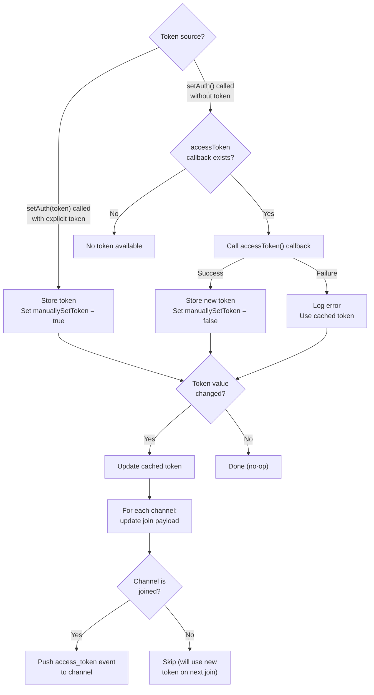
```mermaid
flowchart TD
    A{"Token source?"}

    A -->|"setAuth(token) called<br/>with explicit token"| B["Store token<br/>Set manuallySetToken = true"]
    A -->|"setAuth() called<br/>without token"| C{"accessToken<br/>callback exists?"}
    C -->|Yes| D["Call accessToken() callback"]
    C -->|No| E["No token available"]
    D -->|Success| F["Store new token<br/>Set manuallySetToken = false"]
    D -->|Failure| G["Log error<br/>Use cached token"]

    B --> H{"Token value<br/>changed?"}
    F --> H
    G --> H

    H -->|Yes| I["Update cached token"]
    H -->|No| J["Done (no-op)"]

    I --> K["For each channel:<br/>update join payload"]
    K --> L{"Channel is<br/>joined?"}
    L -->|Yes| M["Push access_token event<br/>to channel"]
    L -->|No| N["Skip (will use new<br/>token on next join)"]
```

### Token Sources

The SDK MUST support two token management modes:

#### 1. Manual Token (via `setAuth(token)`)

- Token is explicitly provided.
- Preserved across channel operations (removeChannel, resubscribe).
- The `accessToken` callback MUST NOT be called.
- The `manuallySetToken` flag MUST be set to `true`.

#### 2. Callback-Based Token (via `accessToken` option)

- Token is fetched by calling the async `accessToken()` callback.
- Refreshed on: connection open, channel join success, heartbeat.
- On callback failure, MUST fall back to the cached token value.
- The `manuallySetToken` flag MUST be set to `false`.

### Token Propagation

When the token value changes:

1. Update the cached token on the client.
2. For each channel:
   a. Update the join payload: `{ access_token: token }`.
   b. If the channel is `joined` and has joined at least once, push an `access_token` event.

### Token in Join Payload

The access token MUST be included in the channel join payload:

```
{
  "config": { ... },
  "access_token": "<jwt-token>"
}
```

### Token Refresh Points

Token MUST be refreshed (if using callback-based tokens) at:
1. **On `connect()`**: If `accessToken` callback exists and no auth is in progress.
2. **On connection open**: Wait for auth before flushing send buffer.
3. **After channel join "ok"**: Refresh via `setAuth()`.
4. **On heartbeat**: Refresh via safe auth method (non-blocking).

### Error Handling

- If the `accessToken` callback fails, the error MUST be logged and the cached token MUST be used.
- Auth errors MUST NOT block connection or message sending - operations MUST proceed with the best available token.

---

## 18. Push Buffer and Send Mechanism

### Push/Reply Correlation

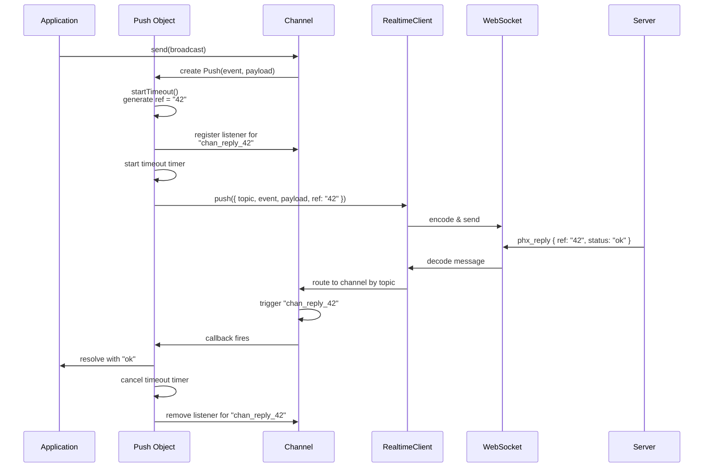
```mermaid
sequenceDiagram
    participant App as Application
    participant Push as Push Object
    participant Ch as Channel
    participant Client as RealtimeClient
    participant WS as WebSocket
    participant Server as Server

    App->>Ch: send(broadcast)
    Ch->>Push: create Push(event, payload)
    Push->>Push: startTimeout()<br/>generate ref = "42"
    Push->>Ch: register listener for<br/>"chan_reply_42"
    Push->>Push: start timeout timer

    Push->>Client: push({ topic, event, payload, ref: "42" })
    Client->>WS: encode & send

    Server->>WS: phx_reply { ref: "42", status: "ok" }
    WS->>Client: decode message
    Client->>Ch: route to channel by topic
    Ch->>Ch: trigger "chan_reply_42"
    Ch->>Push: callback fires
    Push->>App: resolve with "ok"
    Push->>Push: cancel timeout timer
    Push->>Ch: remove listener for "chan_reply_42"
```

### Client-Level Send Buffer

The client MUST maintain a send buffer of pending send operations:

1. When `push()` is called and the client is NOT connected, the send operation MUST be added to the buffer.
2. When the connection opens, `flushSendBuffer()` MUST be called after auth completes.
3. Flushing executes all callbacks and clears the buffer.
4. The client-level buffer has no size limit.

### Channel-Level Push Buffer

Each channel MUST maintain a push buffer:

1. When a push is attempted and the channel cannot push (not connected OR not joined), the push MUST be buffered.
2. Maximum buffer size: `100` (`MAX_PUSH_BUFFER_SIZE`).
3. When buffer exceeds limit, the oldest push MUST be removed and destroyed with a log warning.
4. Buffered pushes MUST start their timeout timer immediately (they can time out while buffered).
5. When the channel joins successfully ("ok" reply), all buffered pushes MUST be sent and the buffer MUST be cleared.

### Push Class

The `Push` class handles individual request/response pairs:

**Properties:**
- `channel`: The owning channel.
- `event`: The event name (e.g., `"phx_join"`, `"broadcast"`).
- `payload`: The message payload.
- `timeout`: Timeout in milliseconds (default: 10000).
- `sent`: Whether the push has been sent.
- `ref`: Unique reference assigned when starting timeout.
- `receivedResp`: The received response (if any).
- `recHooks`: List of status callbacks registered via `receive()`.
- `refEvent`: The reply event name (`chan_reply_{ref}`).

**Lifecycle:**
1. `startTimeout()`: Generate a unique ref, register a listener for `chan_reply_{ref}`, start the timeout timer.
2. `send()`: If not already timed out, start timeout and push the message via the socket.
3. `receive(status, callback)`: Register a callback for a specific status (`"ok"`, `"error"`, `"timeout"`). If the response has already been received with that status, call immediately.
4. `trigger(status, response)`: Trigger the reply event on the channel, causing the registered callback to fire.
5. `destroy()`: Cancel the ref event listener and the timeout timer.
6. `resend(timeout)`: Reset all state and re-send (used for rejoin).

### Reference Overflow Protection

The `_makeRef()` method MUST increment a counter and convert it to a string. If the counter would overflow (same value after increment), it MUST reset to 0.

---

## 19. PostgreSQL Type Transformers

### Supported Types

| PostgreSQL Type | Conversion Rule | Target Type |
|----------------|----------------|-------------|
| `bool` | `"t"` -> `true`, `"f"` -> `false` | Boolean |
| `int2`, `int4`, `int8` | Parse as floating-point number | Number |
| `float4`, `float8` | Parse as floating-point number | Number |
| `numeric` | Parse as floating-point number | Number |
| `oid` | Parse as floating-point number | Number |
| `json`, `jsonb` | Parse as JSON | Object/Map |
| `timestamp` | Replace first space with `"T"` | String (ISO-8601) |
| `_<type>` (arrays) | Parse `{...}` syntax, convert elements | List |
| All others | No conversion (pass through) | String |

### Conversion Functions

#### convertChangeData(columns, record, options?)

Takes a list of column definitions and a record (map of string values), converts each value based on its column type.

- `columns`: List of `{ name, type, flags?, type_modifier? }`.
- `record`: Map of column name to string value. Can be null (returns empty map).
- `options.skipTypes`: List of type names to skip conversion for.

#### convertCell(type, value)

Converts a single cell value:
1. If type starts with `_`, it is an array type: parse the PostgreSQL array syntax and convert each element.
2. If value is null, return null.
3. Otherwise, apply the type-specific converter.

#### toBoolean(value)

- `"t"` -> `true`
- `"f"` -> `false`
- Other -> pass through

#### toNumber(value)

- Parse as floating-point number.
- If result is NaN, return original value.

#### toJson(value)

- If string, attempt JSON parse.
- On parse failure, return original string.

#### toArray(value, type)

- If not a string, return as-is.
- Check for PostgreSQL array syntax: starts with `{`, ends with `}`.
- Try parsing `"[" + inner + "]"` as JSON first.
- On failure, split on comma.
- Convert each element using `convertCell(type, element)`.

#### toTimestampString(value)

- Replace the first space with `"T"` to convert PostgreSQL timestamp format to ISO-8601.
- Example: `"2019-09-10 00:00:00"` -> `"2019-09-10T00:00:00"`

### HTTP Endpoint URL Conversion

```
httpEndpointURL(socketUrl: String) -> String
```

Converts a WebSocket URL to the corresponding HTTP broadcast endpoint:

1. Replace `ws://` with `http://` (or `wss://` with `https://`).
2. Remove trailing slashes.
3. Remove `/socket/websocket`, `/socket`, or `/websocket` suffixes (in that order of precedence).
4. Append `/api/broadcast`.

---

## 20. Integration with Parent SDK

### Integration Architecture

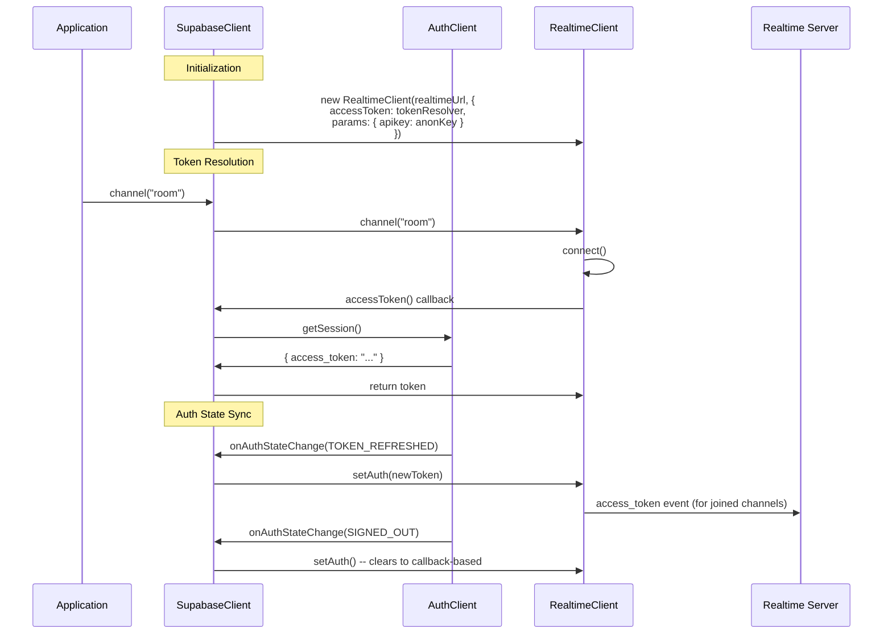
```mermaid
sequenceDiagram
    participant App as Application
    participant SDK as SupabaseClient
    participant Auth as AuthClient
    participant RT as RealtimeClient
    participant Server as Realtime Server

    Note over SDK: Initialization
    SDK->>RT: new RealtimeClient(realtimeUrl, {<br/>  accessToken: tokenResolver,<br/>  params: { apikey: anonKey }<br/>})

    Note over SDK: Token Resolution
    App->>SDK: channel("room")
    SDK->>RT: channel("room")
    RT->>RT: connect()
    RT->>SDK: accessToken() callback
    SDK->>Auth: getSession()
    Auth->>SDK: { access_token: "..." }
    SDK->>RT: return token

    Note over SDK: Auth State Sync
    Auth->>SDK: onAuthStateChange(TOKEN_REFRESHED)
    SDK->>RT: setAuth(newToken)
    RT->>Server: access_token event (for joined channels)

    Auth->>SDK: onAuthStateChange(SIGNED_OUT)
    SDK->>RT: setAuth() -- clears to callback-based
```

### Initialization

The parent SDK (e.g., `SupabaseClient`) MUST initialize the Realtime client:

1. Construct the Realtime URL from the base URL: derive `realtime/v1` path, then replace `http` protocol with `ws`.
2. Create `RealtimeClient` with:
   - `accessToken` callback bound to the parent's token resolution method.
   - `params.apikey` set to the Supabase anonymous key.
   - Any user-provided `realtime` options merged in.
3. If using third-party auth (custom `accessToken` on SupabaseClient), immediately call `realtime.setAuth(token)`.

### Token Resolution

The parent SDK MUST provide a token resolution function:

1. If a custom `accessToken` function is configured on the parent SDK, use it.
2. Otherwise, get the session from the auth module and return `session.access_token`.
3. If no session exists, fall back to the Supabase anonymous key.

### Auth Event Synchronization

The parent SDK MUST listen for auth state changes:

- `TOKEN_REFRESHED` or `SIGNED_IN`: Call `realtime.setAuth(newToken)` (if token has actually changed).
- `SIGNED_OUT`: Call `realtime.setAuth()` (clears to callback-based resolution).

### Convenience Methods

The parent SDK MUST expose:

```
channel(name, opts?)       -> RealtimeChannel   -- delegates to realtime.channel()
getChannels()              -> List<RealtimeChannel>  -- delegates to realtime.getChannels()
removeChannel(channel)     -> Async<Response>    -- delegates to realtime.removeChannel()
removeAllChannels()        -> Async<List<Response>>  -- delegates to realtime.removeAllChannels()
```

---

## 21. Required Test Scenarios

### 21.1 Client Lifecycle

| ID | Scenario | Expected Behavior |
|----|----------|-------------------|
| CL-01 | Construct client with valid API key | Client initializes without errors |
| CL-02 | Construct client without API key | Fails with "API key is required" error |
| CL-03 | Call connect() | WebSocket connection is established |
| CL-04 | Call connect() when already connected | No-op, returns without creating duplicate connection |
| CL-05 | Call connect() when connecting | No-op |
| CL-06 | Call disconnect() | WebSocket is closed, state becomes "disconnected" |
| CL-07 | Call disconnect() when already disconnecting | No-op |
| CL-08 | Disconnect sets manual flag | Auto-reconnect does NOT trigger after manual disconnect |
| CL-09 | Connection established triggers onopen callbacks | All registered open callbacks fire |
| CL-10 | Connection closed triggers onclose callbacks | All registered close callbacks fire |
| CL-11 | Connection error triggers onerror callbacks | All registered error callbacks fire |
| CL-12 | Received messages trigger onmessage callbacks | All registered message callbacks fire |
| CL-13 | Disconnect with close code and reason | WebSocket close is called with provided code and reason |
| CL-14 | Disconnect fallback timer | If onclose does not fire within 100ms, state is forced to "disconnected" |
| CL-15 | Teardown cleans up all resources | Handlers cleared, timers stopped, worker terminated, channels torn down |

### 21.2 Client Configuration

| ID | Scenario | Expected Behavior |
|----|----------|-------------------|
| CC-01 | Endpoint URL includes /websocket suffix | `endpointURL()` returns `{endpoint}/websocket?vsn=2.0.0&apikey=...` |
| CC-02 | HTTP endpoint strips socket paths | `/socket/websocket`, `/socket`, `/websocket` all stripped, `/api/broadcast` appended |
| CC-03 | V1 protocol uses JSON encoding | All messages encoded as JSON arrays |
| CC-04 | V2 protocol uses binary for broadcasts | Broadcast messages binary-encoded, others JSON |
| CC-05 | Custom logger receives log calls | Logger called with `(kind, msg, data)` |
| CC-06 | Custom transport is used | Provided WebSocket implementation used instead of native |
| CC-07 | Custom reconnectAfterMs | Custom function called with try count |
| CC-08 | logLevel sent as URL parameter | `log_level` included in connection URL params |
| CC-09 | Unsupported VSN fails | Construction fails for unknown protocol versions |

### 21.3 Authentication

| ID | Scenario | Expected Behavior |
|----|----------|-------------------|
| AU-01 | setAuth(token) stores manual token | Token stored, `manuallySetToken` set to true |
| AU-02 | setAuth() uses callback | `accessToken()` callback invoked, result stored |
| AU-03 | setAuth() callback failure | Error logged, cached token used |
| AU-04 | Token change propagates to channels | All channels receive updated join payload |
| AU-05 | Token change pushes access_token to joined channels | `access_token` event pushed to channels in "joined" state |
| AU-06 | Manual token preserved across removeChannel | After removeChannel + new channel, same token used |
| AU-07 | Token refreshed on heartbeat | Auth refreshed during heartbeat (callback-based only) |
| AU-08 | Token refreshed on channel join success | `setAuth()` called after "ok" reply (callback-based only) |
| AU-09 | Auth waits before flushing on connect | Send buffer not flushed until auth completes |
| AU-10 | Auth error does not block connection | Connection proceeds even if auth callback fails |

### 21.4 Heartbeat

| ID | Scenario | Expected Behavior |
|----|----------|-------------------|
| HB-01 | Heartbeat sent at configured interval | Heartbeat message sent every `heartbeatIntervalMs` |
| HB-02 | Heartbeat message format | `{ topic: "phoenix", event: "heartbeat", payload: {}, ref: "<ref>" }` |
| HB-03 | Successful heartbeat response | Callback invoked with status "ok" and latency |
| HB-04 | Heartbeat timeout (no response before next) | Callback with "timeout", WebSocket closed, reconnect scheduled |
| HB-05 | Heartbeat when disconnected | Callback with "disconnected", no message sent |
| HB-06 | Heartbeat callback error handling | Errors in callback caught and logged, do not crash the client |
| HB-07 | Heartbeat error response | Callback with "error" when server replies with error status |
| HB-08 | Pending heartbeat cleared on response | `pendingHeartbeatRef` set to null after reply received |
| HB-09 | Latency calculation | `currentTime - sentTimestamp` reported as latency |

### 21.5 Reconnection

| ID | Scenario | Expected Behavior |
|----|----------|-------------------|
| RC-01 | Auto-reconnect after connection loss | Reconnect timer schedules after non-manual close |
| RC-02 | Exponential backoff intervals | Delays: 1s, 2s, 5s, 10s, 10s, 10s... |
| RC-03 | No reconnect after manual disconnect | `manualDisconnect` prevents reconnect timer |
| RC-04 | Reconnect timer reset on successful connect | Timer reset when connection opens |
| RC-05 | Channel rejoin after reconnect | Channels attempt rejoin when socket reconnects |
| RC-06 | Channel rejoin exponential backoff | Channel rejoin uses its own backoff timer |
| RC-07 | Heartbeat timeout triggers reconnect | After heartbeat timeout, reconnect is scheduled |
| RC-08 | Auth waited before reconnect | Auth checked before connect attempt |
| RC-09 | Custom reconnectAfterMs | Custom delay function used for reconnect timing |
| RC-10 | Timer reset resets try count | `timer.reset()` sets tries to 0 |

### 21.6 Channel Lifecycle

| ID | Scenario | Expected Behavior |
|----|----------|-------------------|
| CH-01 | Create channel adds to channels list | `getChannels()` returns the new channel |
| CH-02 | Duplicate topic returns existing channel | Same topic returns existing channel, no duplicate |
| CH-03 | Topic auto-prefixed with "realtime:" | Topic "chat" becomes "realtime:chat" |
| CH-04 | subscribe() sends phx_join | Join push sent with config payload |
| CH-05 | subscribe() connects if not connected | `socket.connect()` called when socket is disconnected |
| CH-06 | Subscribe success transitions to "joined" | State changes from "joining" to "joined" |
| CH-07 | Subscribe callback receives SUBSCRIBED | Callback called with `SUBSCRIBED` status |
| CH-08 | Subscribe timeout | Callback called with `TIMED_OUT`, state set to "errored" |
| CH-09 | Subscribe error | Callback called with `CHANNEL_ERROR`, state set to "errored" |
| CH-10 | unsubscribe() sends phx_leave | Leave push sent, state set to "leaving" |
| CH-11 | Unsubscribe resolves with status | Returns "ok", "timed out", or "error" |
| CH-12 | removeChannel removes from list | Channel no longer in `getChannels()` |
| CH-13 | removeAllChannels disconnects client | All channels removed, client disconnected |
| CH-14 | Channel teardown clears all state | Bindings empty, timers reset, push buffer cleared |
| CH-15 | Push buffer flushed on join success | All buffered pushes sent when state becomes "joined" |
| CH-16 | Push buffer overflow | Oldest push removed when buffer exceeds 100 |
| CH-17 | Push before subscribe fails | Error if push attempted before join |

### 21.7 Channel Messaging

| ID | Scenario | Expected Behavior |
|----|----------|-------------------|
| CM-01 | send() via WebSocket when connected | Message pushed through socket |
| CM-02 | send() broadcast falls back to REST | When not connected, REST API used with deprecation warning |
| CM-03 | httpSend() always uses REST | POST to broadcast endpoint regardless of connection state |
| CM-04 | httpSend() requires payload | Fails with error if payload is null/undefined |
| CM-05 | httpSend() returns success on 202 | `{ success: true }` returned |
| CM-06 | httpSend() error handling | Error message parsed from response body |
| CM-07 | httpSend() timeout enforcement | Timeout mechanism used for request cancellation |
| CM-08 | Broadcast self-receive | Own messages received when `self: true` |
| CM-09 | Broadcast acknowledgement | Server sends phx_reply when `ack: true` |
| CM-10 | Replay on private channel | Previous messages replayed with `meta.replayed: true` |
| CM-11 | Replay on public channel fails | Error during construction |

### 21.8 Event Filtering

| ID | Scenario | Expected Behavior |
|----|----------|-------------------|
| EF-01 | Broadcast exact event match | Only listeners with matching event name fire |
| EF-02 | Broadcast wildcard event | Listener with event `"*"` receives all broadcasts |
| EF-03 | Multiple listeners same event | All registered listeners fire |
| EF-04 | System event handling | System listeners receive system events |
| EF-05 | Event unbinding | Specific listener removed by reference |
| EF-06 | Unbind non-existent event | No error, operation is a no-op |
| EF-07 | Presence sync event | Sync listener fires after state synchronization |
| EF-08 | Presence join event | Join listener fires with key and presences |
| EF-09 | Presence leave event | Leave listener fires with key and presences |

### 21.9 Presence

| ID | Scenario | Expected Behavior |
|----|----------|-------------------|
| PR-01 | track() sends presence event | Presence track message sent via channel |
| PR-02 | untrack() sends untrack event | Presence untrack message sent |
| PR-03 | presenceState() returns current state | Current synced state returned |
| PR-04 | Full state sync (presence_state) | State replaced, joins/leaves detected, callbacks fired |
| PR-05 | Incremental sync (presence_diff) | State updated incrementally, callbacks fired |
| PR-06 | Pending diffs buffered before state | Diffs buffered when joinRef does not match |
| PR-07 | Pending diffs replayed after state | All buffered diffs applied in order after state sync |
| PR-08 | Join callback parameters | `onJoin(key, currentPresences, newPresences)` |
| PR-09 | Leave callback parameters | `onLeave(key, currentPresences, leftPresences)` |
| PR-10 | Leave removes key when empty | Key deleted from state when no presences remain |
| PR-11 | Server format transformed | `phx_ref` renamed to `presence_ref`, metas unwrapped |
| PR-12 | Presence auto-enabled | Presence enabled when listeners registered (even without `enabled: true`) |
| PR-13 | Presence listener on joined channel | Adding presence listener triggers resubscribe |
| PR-14 | Deep clone prevents shared state | State modifications in callbacks do not affect internal state |

### 21.10 PostgreSQL Changes

| ID | Scenario | Expected Behavior |
|----|----------|-------------------|
| PG-01 | Subscribe with postgres_changes filter | Filters sent in join payload |
| PG-02 | Server binding validation (match) | Server IDs assigned to bindings |
| PG-03 | Server binding mismatch | Unsubscribe triggered, CHANNEL_ERROR delivered |
| PG-04 | INSERT event delivery | New record in `new`, empty `old` |
| PG-05 | UPDATE event delivery | Full record in `new`, partial in `old` |
| PG-06 | DELETE event delivery | Empty `new`, partial record in `old` |
| PG-07 | Wildcard event filter | Listener with event `"*"` receives all change types |
| PG-08 | Type conversion applied | String values converted to native types (bool, number, JSON, etc.) |
| PG-09 | Array type conversion | PostgreSQL arrays parsed and elements converted |
| PG-10 | Timestamp conversion | Space replaced with "T" for ISO-8601 |
| PG-11 | Schema and table filtering | Only matching schema/table changes delivered |
| PG-12 | RLS filter applied | Server-side filter restricts delivered changes |

### 21.11 Serialization

| ID | Scenario | Expected Behavior |
|----|----------|-------------------|
| SR-01 | V1 JSON encoding | Message encoded as `[join_ref, ref, topic, event, payload]` |
| SR-02 | V1 JSON decoding | Array parsed back to message structure |
| SR-03 | V2 broadcast binary encoding | Binary format with header and payload |
| SR-04 | V2 broadcast binary decoding | Binary buffer decoded to message structure |
| SR-05 | V2 non-broadcast uses JSON | Non-broadcast messages still use JSON in V2 |
| SR-06 | Binary payload encoding (encoding=0) | Raw byte buffer preserved in payload |
| SR-07 | JSON payload encoding (encoding=1) | JSON payload UTF-8 encoded in binary container |
| SR-08 | String length validation | Error if any field exceeds 255 bytes |
| SR-09 | Metadata filtering | Only allowed metadata keys included in binary |
| SR-10 | Byte buffer detection cross-context | Detects byte buffers by constructor name fallback |

### 21.12 Transformers

| ID | Scenario | Expected Behavior |
|----|----------|-------------------|
| TR-01 | Boolean conversion | `"t"` -> true, `"f"` -> false |
| TR-02 | Integer conversion | `"42"` -> 42 |
| TR-03 | Float conversion | `"3.14"` -> 3.14 |
| TR-04 | JSON/JSONB conversion | `'{"key":"value"}'` -> `{ key: "value" }` |
| TR-05 | Invalid JSON passthrough | Malformed JSON returns original string |
| TR-06 | Timestamp conversion | `"2019-09-10 00:00:00"` -> `"2019-09-10T00:00:00"` |
| TR-07 | Array conversion | `"{1,2,3}"` -> `[1, 2, 3]` (with element type conversion) |
| TR-08 | Empty array | `"{}"` -> `[]` |
| TR-09 | Null value passthrough | `null` values preserved |
| TR-10 | Skip types | Specified types not converted |
| TR-11 | Unknown type passthrough | Unrecognized types return value as-is |
| TR-12 | HTTP endpoint URL conversion | `ws://host/realtime/v1` -> `http://host/realtime/v1/api/broadcast` |
| TR-13 | NaN number passthrough | Non-numeric strings return original value |

### 21.13 Memory Management

| ID | Scenario | Expected Behavior |
|----|----------|-------------------|
| MM-01 | Channel teardown clears bindings | All event bindings removed |
| MM-02 | Channel teardown clears timers | Rejoin timer reset |
| MM-03 | Push buffer bounded | Buffer never exceeds MAX_PUSH_BUFFER_SIZE |
| MM-04 | Push buffer overflow cleanup | Removed pushes have destroy() called |
| MM-05 | Worker terminated on disconnect | No orphaned workers |
| MM-06 | Connection handlers cleared | All onopen/onclose/onerror/onmessage set to null |
| MM-07 | Leave push destroyed after resolution | Leave push cleaned up after completion |

### 21.14 Error Handling

| ID | Scenario | Expected Behavior |
|----|----------|-------------------|
| ER-01 | Connection error triggers channel errors | All channels receive error trigger |
| ER-02 | Channel error sets errored state | State changed, rejoin scheduled |
| ER-03 | Channel error during leaving | Ignored (no state change) |
| ER-04 | Channel error during closed | Ignored (no state change) |
| ER-05 | Callback errors caught | Errors in user callbacks caught and logged |
| ER-06 | Push before subscribe fails | Helpful error message about calling subscribe first |
| ER-07 | Malformed message handling | Graceful handling of unexpected message formats |

### 21.15 Integration

| ID | Scenario | Expected Behavior |
|----|----------|-------------------|
| IN-01 | Parent SDK creates realtime client | Client created with correct URL and API key |
| IN-02 | Auth state change updates token | TOKEN_REFRESHED/SIGNED_IN triggers setAuth on realtime |
| IN-03 | Sign out clears token | SIGNED_OUT triggers setAuth() without token |
| IN-04 | channel() convenience method | Delegates to realtime.channel() |
| IN-05 | getChannels() convenience method | Delegates to realtime.getChannels() |
| IN-06 | removeChannel() convenience method | Delegates to realtime.removeChannel() |
| IN-07 | removeAllChannels() convenience method | Delegates to realtime.removeAllChannels() |
| IN-08 | Third-party auth token set immediately | Custom accessToken set on realtime during construction |

---

## 22. Constants and Defaults Reference

### Timeouts and Intervals

| Constant | Value | Description |
|----------|-------|-------------|
| `DEFAULT_TIMEOUT` | `10000` (10s) | Default push timeout |
| `HEARTBEAT_INTERVAL` | `25000` (25s) | Default heartbeat interval |
| `RECONNECT_DELAY` | `10` (10ms) | Small delay before reconnect attempt |
| `HEARTBEAT_TIMEOUT_FALLBACK` | `100` (100ms) | Delay before scheduling reconnect after heartbeat timeout |
| `WS_CLOSE_NORMAL` | `1000` | WebSocket normal close code |
| `MAX_PUSH_BUFFER_SIZE` | `100` | Maximum channel push buffer size |

### Reconnection Intervals

| Attempt | Delay |
|---------|-------|
| 1 | 1000ms |
| 2 | 2000ms |
| 3 | 5000ms |
| 4+ | 10000ms |

### Protocol Versions

| Version | Value | Description |
|---------|-------|-------------|
| `VSN_1_0_0` | `"1.0.0"` | JSON-only protocol |
| `VSN_2_0_0` | `"2.0.0"` | Binary + JSON protocol (default) |

### Default Channel Config

```
broadcast : { ack: false, self: false }
presence  : { key: "", enabled: false }
private   : false
```

### Binary Protocol Constants

| Constant | Value | Description |
|----------|-------|-------------|
| `HEADER_LENGTH` | `1` | Size of the kind byte |
| `USER_BROADCAST_PUSH_META_LENGTH` | `6` | Size of push header fields after kind |
| `KINDS.userBroadcastPush` | `3` | Kind for client -> server broadcast |
| `KINDS.userBroadcast` | `4` | Kind for server -> client broadcast |
| `BINARY_ENCODING` | `0` | Raw binary payload |
| `JSON_ENCODING` | `1` | JSON-encoded payload |

---

## Appendix A: Implementation Checklist

### Core Components

- [ ] RealtimeClient with WebSocket connection management
- [ ] RealtimeChannel with event binding and state machine
- [ ] RealtimePresence with state synchronization
- [ ] Push class with request/response correlation
- [ ] Timer class with exponential backoff
- [ ] Serializer with V1 JSON and V2 binary encoding
- [ ] WebSocket abstraction for cross-runtime detection
- [ ] PostgreSQL type transformers
- [ ] HTTP broadcast endpoint integration

### Connection Management

- [ ] WebSocket connect/disconnect lifecycle
- [ ] Heartbeat mechanism (interval-based and worker-based)
- [ ] Automatic reconnection with exponential backoff
- [ ] Manual disconnect prevention of auto-reconnect
- [ ] Connection state machine (connecting/connected/disconnecting/disconnected)
- [ ] Send buffer for offline message queuing
- [ ] Connection state change callbacks

### Channel Management

- [ ] Channel creation with topic deduplication
- [ ] Channel state machine (closed/joining/joined/errored/leaving)
- [ ] Subscribe/unsubscribe lifecycle
- [ ] Push buffer with size limit (100)
- [ ] Rejoin timer with exponential backoff
- [ ] Join reference verification for stale message filtering

### Authentication

- [ ] Manual token via setAuth(token)
- [ ] Callback-based token via accessToken option
- [ ] Token propagation to all channels
- [ ] Token refresh on connect, join success, and heartbeat
- [ ] Fallback to cached token on callback failure

### Broadcast

- [ ] WebSocket broadcast send
- [ ] REST API broadcast (httpSend)
- [ ] Automatic REST fallback (deprecated)
- [ ] Self-broadcast option
- [ ] Acknowledgement option
- [ ] Replay option (private channels only)
- [ ] Wildcard event filtering

### Presence

- [ ] Full state synchronization (presence_state)
- [ ] Incremental diff synchronization (presence_diff)
- [ ] Pending diffs buffer for out-of-order delivery
- [ ] Server format transformation (phx_ref -> presence_ref)
- [ ] Join/leave/sync event triggers
- [ ] Deep clone to prevent shared state mutation
- [ ] Auto-enable on listener registration
- [ ] track() and untrack() methods

### PostgreSQL Changes

- [ ] Filter configuration (event, schema, table, filter)
- [ ] Server binding validation on join
- [ ] Change event routing (INSERT, UPDATE, DELETE, *)
- [ ] Type conversion using transformers
- [ ] Payload enrichment (new/old records)

### Serialization

- [ ] V1 JSON encode/decode
- [ ] V2 binary encode for broadcast push (kind=3)
- [ ] V2 binary decode for broadcast incoming (kind=4)
- [ ] V2 JSON fallback for non-broadcast messages
- [ ] String length validation (max 255 bytes)
- [ ] Metadata filtering
- [ ] Byte buffer detection (cross-context safe)

### Error Handling

- [ ] Connection errors trigger channel errors
- [ ] Channel errors schedule rejoin (unless leaving/closed)
- [ ] User callback errors caught and logged
- [ ] Push timeout handling
- [ ] Auth callback failure graceful degradation
- [ ] Join reference mismatch filtering

---

## Appendix B: Wire Protocol Examples

### Channel Join

**Client sends:**
```json
["1", "1", "realtime:chat", "phx_join", {
  "config": {
    "broadcast": { "ack": false, "self": false },
    "presence": { "key": "", "enabled": true },
    "postgres_changes": [],
    "private": false
  },
  "access_token": "eyJhbG..."
}]
```

**Server replies:**
```json
[null, "1", "realtime:chat", "phx_reply", {
  "status": "ok",
  "response": {}
}]
```

### Broadcast (V2 Binary)

**Client sends:** Binary buffer with kind=3, containing topic, event, and JSON-encoded payload.

**Server delivers:** Binary buffer with kind=4, containing topic, event, optional metadata, and payload.

### Heartbeat

**Client sends:**
```json
[null, "5", "phoenix", "heartbeat", {}]
```

**Server replies:**
```json
[null, "5", "phoenix", "phx_reply", { "status": "ok", "response": {} }]
```

### PostgreSQL Change Event

**Server pushes:**
```json
[null, null, "realtime:chat", "postgres_changes", {
  "ids": ["abc123"],
  "data": {
    "schema": "public",
    "table": "messages",
    "type": "INSERT",
    "columns": [
      { "name": "id", "type": "int4" },
      { "name": "content", "type": "text" },
      { "name": "created_at", "type": "timestamp" }
    ],
    "record": { "id": "1", "content": "Hello", "created_at": "2024-01-01 12:00:00" },
    "old_record": null,
    "commit_timestamp": "2024-01-01T12:00:00Z",
    "errors": []
  }
}]
```

### Presence State

**Server sends (full state):**
```json
[null, null, "realtime:chat", "presence_state", {
  "user1": {
    "metas": [
      { "phx_ref": "abc", "status": "online", "cursor": { "x": 10, "y": 20 } }
    ]
  },
  "user2": {
    "metas": [
      { "phx_ref": "def", "status": "away" }
    ]
  }
}]
```

### Presence Diff

**Server sends (incremental):**
```json
[null, null, "realtime:chat", "presence_diff", {
  "joins": {
    "user3": {
      "metas": [{ "phx_ref": "ghi", "status": "online" }]
    }
  },
  "leaves": {
    "user2": {
      "metas": [{ "phx_ref": "def", "status": "away" }]
    }
  }
}]
```

### Channel Leave

**Client sends:**
```json
["1", "6", "realtime:chat", "phx_leave", {}]
```

**Server replies:**
```json
[null, "6", "realtime:chat", "phx_reply", { "status": "ok", "response": {} }]
```

### Access Token Update

**Client sends:**
```json
["1", "7", "realtime:chat", "access_token", {
  "access_token": "eyJhbG...new-token"
}]
```
