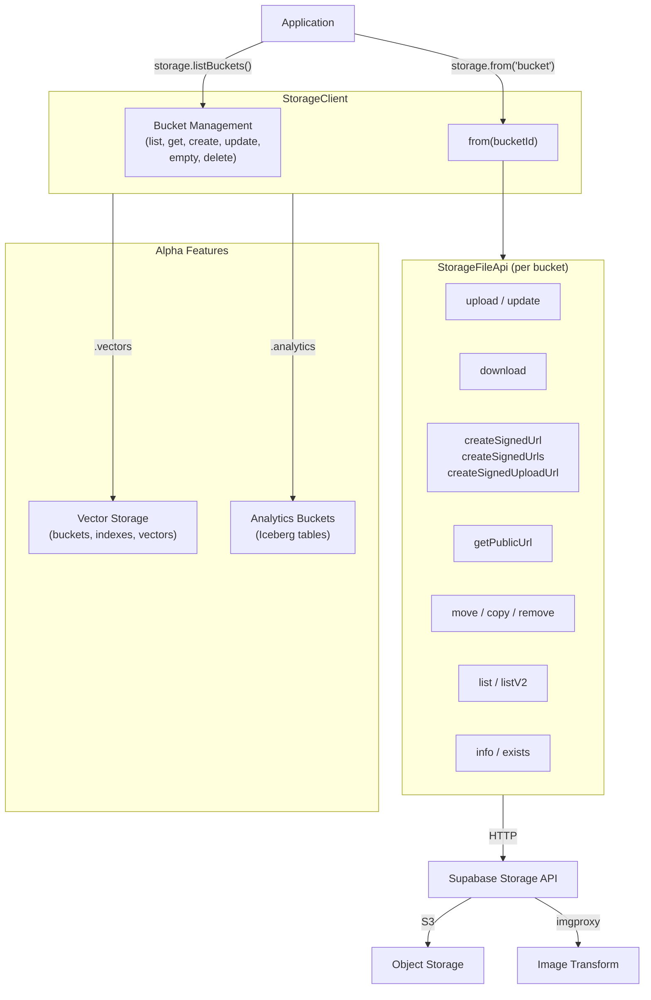
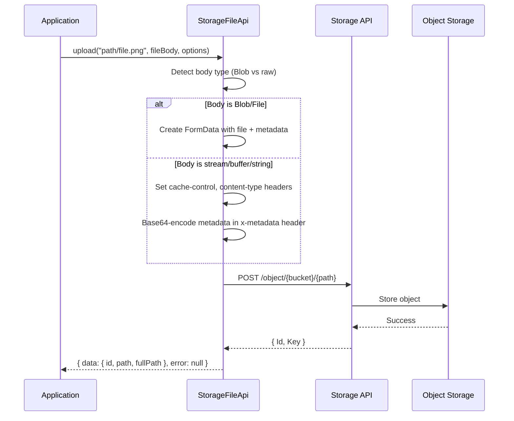
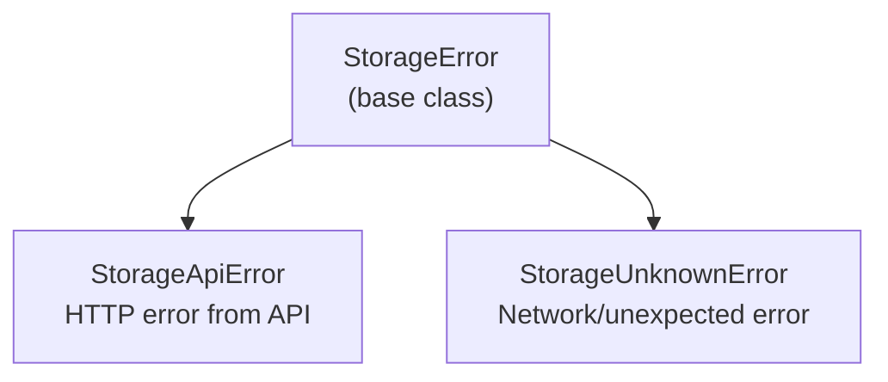
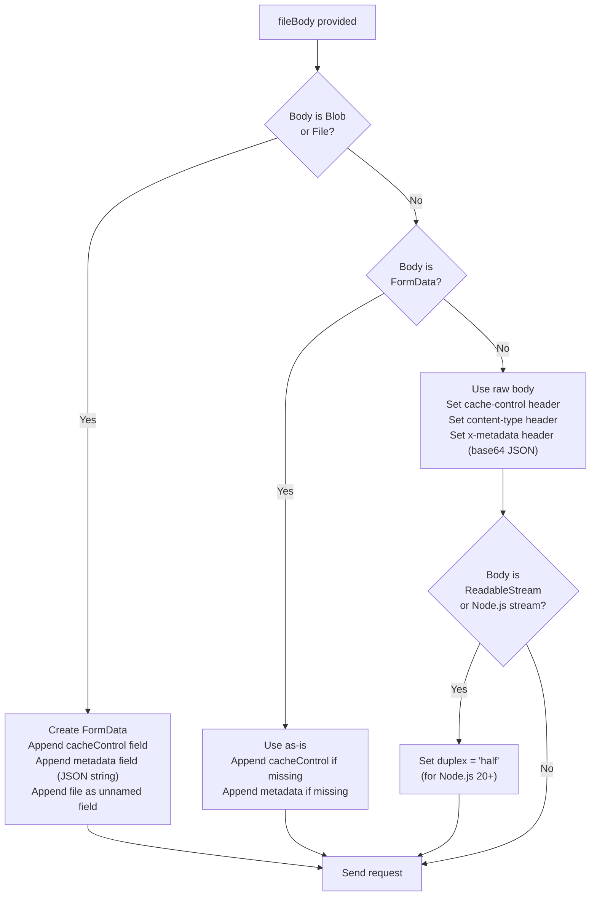
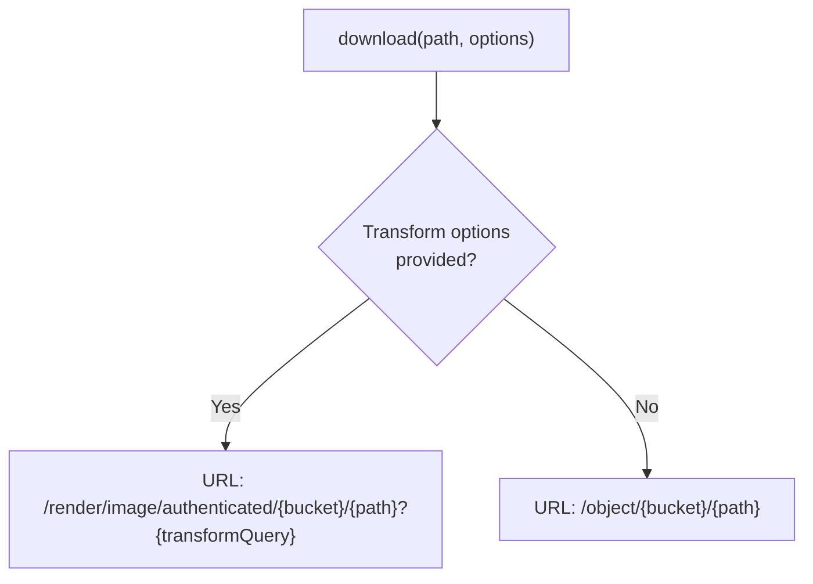
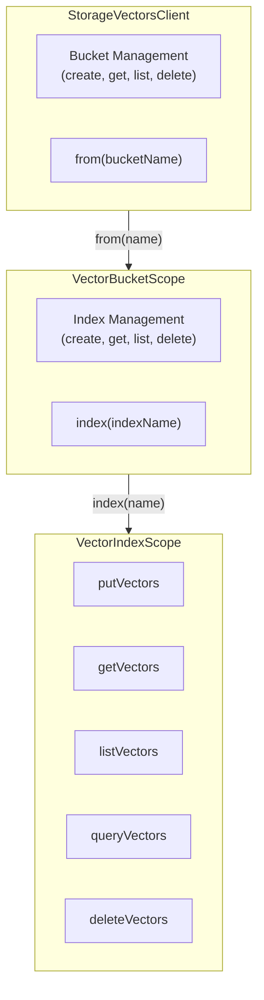

# Supabase Storage SDK Specification

**Version**: 2.0.0
**Status**: Draft
**Last Updated**: 2026-02-09
**Reference Implementation**: `@supabase/storage-js`

> This specification defines the canonical behavior for all Supabase Storage SDK implementations.
> It is **stack-agnostic** and uses RFC 2119 keywords: **MUST**, **MUST NOT**, **SHOULD**,
> **SHOULD NOT**, and **MAY** to indicate requirement levels.
> All code examples use pseudocode notation unless otherwise noted.

---

## Table of Contents

1. [Overview](#1-overview)
2. [Architecture](#2-architecture)
3. [Configuration](#3-configuration)
4. [Data Models](#4-data-models)
5. [Error Model](#5-error-model)
6. [Bucket Management API](#6-bucket-management-api)
7. [File Operations API](#7-file-operations-api)
8. [Upload Mechanism](#8-upload-mechanism)
9. [Download Mechanism](#9-download-mechanism)
10. [Signed URLs](#10-signed-urls)
11. [Public URLs](#11-public-urls)
12. [Image Transformations](#12-image-transformations)
13. [File Listing](#13-file-listing)
14. [Vector Storage API (Alpha)](#14-vector-storage-api-alpha)
15. [HTTP Layer](#15-http-layer)
16. [Integration with Parent SDK](#16-integration-with-parent-sdk)
17. [Required Test Scenarios](#17-required-test-scenarios)
18. [Constants and Defaults](#18-constants-and-defaults)

---

## 1. Overview

The Supabase Storage SDK is a client library for managing files in Supabase Storage. The storage service provides S3-compatible object storage with built-in CDN, image transformations, and fine-grained access control via Row Level Security. The SDK handles:

- Bucket management (create, list, update, empty, delete)
- File operations (upload, update, download, move, copy, remove)
- Signed URL generation for temporary access
- Public URL construction for public buckets
- Image transformations (resize, crop, quality)
- File listing with search and pagination
- Vector storage for embedding search (alpha)
- Analytics buckets with Iceberg tables (alpha)

### Design Principles

1. **Never throw by default**: All public methods MUST return `{ data, error }` result objects. Errors are returned as values, not thrown, unless `.throwOnError()` is explicitly enabled.
2. **Bucket-scoped operations**: File operations MUST be scoped to a bucket via the `from(bucketId)` method.
3. **Auto-detect upload encoding**: The SDK MUST automatically choose between FormData (for Blob/File) and raw body upload (for streams/buffers) based on the body type.
4. **Platform agnostic**: The SDK MUST work across runtimes. Platform-specific concerns (Blob, FormData, Buffer, ReadableStream availability) MUST be handled with runtime guards.
5. **Lazy downloads**: Download operations SHOULD return a builder that executes on await, supporting both blob and stream consumption.

### Terminology

| Term | Definition |
|------|-----------|
| **Bucket** | A top-level container for files, similar to an S3 bucket |
| **Object** | A file stored in a bucket, identified by its path |
| **Path** | The relative path within a bucket (e.g., `folder/image.png`) |
| **Full Path** | The complete path including bucket ID (e.g., `avatars/folder/image.png`) |
| **Signed URL** | A time-limited URL that grants access to a private file |
| **Transform** | Server-side image manipulation (resize, crop, quality adjustment) |
| **RLS** | Row Level Security - PostgreSQL policies controlling file access |

---

## 2. Architecture

### Component Diagram



### Upload Flow



---

## 3. Configuration

### Constructor Options

| Parameter | Type | Default | Description |
|-----------|------|---------|-------------|
| `url` | String | **(required)** | Base URL of the Storage API (e.g., `https://<project>.supabase.co/storage/v1`) |
| `headers` | Map<String, String> | `{}` | Default headers (merged with `X-Client-Info` default) |
| `fetch` | FetchFunction | platform fetch | Custom fetch implementation |
| `useNewHostname` | Boolean | `false` | When true, rewrites hostname for large file upload support |

### Hostname Rewriting

When `useNewHostname` is true and the URL matches a Supabase host pattern:
- `project-ref.supabase.co` becomes `project-ref.storage.supabase.co`
- This disables request buffering, enabling uploads larger than 50GB
- Only applies to hosts matching `supabase.(co|in|red)`

---

## 4. Data Models

### Bucket

```
Bucket {
  id: String                      -- Unique bucket identifier
  name: String                    -- Bucket display name
  type: BucketType?               -- "STANDARD" or "ANALYTICS"
  owner: String                   -- Bucket owner identifier
  public: Boolean                 -- Whether objects are publicly accessible
  file_size_limit: Integer?       -- Max file size in bytes (null = no limit)
  allowed_mime_types: List<String>? -- Allowed MIME types (null = all allowed)
  created_at: String              -- ISO 8601 creation timestamp
  updated_at: String              -- ISO 8601 last update timestamp
}
```

### FileObject (V1)

```
FileObject {
  id: String                      -- UUID of the file
  name: String                    -- File name
  bucket_id: String               -- Parent bucket ID
  owner: String                   -- File owner
  created_at: String              -- ISO 8601 creation timestamp
  updated_at: String              -- ISO 8601 last update timestamp
  last_accessed_at: String        -- (deprecated) Last access timestamp
  metadata: Map<String, Any>      -- File metadata (eTag, size, mimetype, etc.)
}
```

### FileObject (V2)

```
FileObjectV2 {
  id: String                      -- UUID of the file
  version: String                 -- File version
  name: String                    -- File name
  bucket_id: String               -- Parent bucket ID
  created_at: String              -- ISO 8601 creation timestamp
  updated_at: String              -- ISO 8601 last update timestamp
  last_accessed_at: String        -- (deprecated) Last access timestamp
  size: Integer?                  -- File size in bytes
  cache_control: String?          -- Cache-Control header value
  content_type: String?           -- MIME type
  etag: String?                   -- Entity tag for caching
  last_modified: String?          -- Last modification timestamp
  metadata: Map<String, Any>?     -- User-provided metadata
}
```

### FileOptions

```
FileOptions {
  cacheControl: String?           -- Cache duration in seconds (default: "3600")
  contentType: String?            -- MIME type (default: "text/plain;charset=UTF-8")
  upsert: Boolean?                -- Overwrite if exists (default: false)
  duplex: String?                 -- Stream duplex mode ("half" for Node.js streams)
  metadata: Map<String, Any>?     -- Custom metadata key-value pairs
  headers: Map<String, String>?   -- Additional HTTP headers
}
```

### TransformOptions

```
TransformOptions {
  width: Integer?                 -- Width in pixels
  height: Integer?                -- Height in pixels
  resize: ResizeMode?             -- "cover" (default), "contain", or "fill"
  quality: Integer?               -- 20-100 (default: 80)
  format: "origin"?               -- Force original format (skip WebP conversion)
}
```

### SearchOptions (V1)

```
SearchOptions {
  limit: Integer?                 -- Max results (default: 100)
  offset: Integer?                -- Starting position (default: 0)
  sortBy: SortBy?                 -- Sort column and order
  search: String?                 -- Filter by file name
}
```

### SearchV2Options

```
SearchV2Options {
  limit: Integer?                 -- Max results (default: 1000)
  prefix: String?                 -- Filter by path prefix
  cursor: String?                 -- Pagination cursor from previous response
  with_delimiter: Boolean?        -- Emulate folder hierarchy (default: false)
  sortBy: SortByV2?               -- Sort by "name", "updated_at", or "created_at"
}
```

### FetchParameters

```
FetchParameters {
  signal: AbortSignal?            -- Request cancellation signal
  cache: CacheMode?               -- HTTP cache mode ("default", "no-store", etc.)
}
```

---

## 5. Error Model

### Error Hierarchy



### StorageError (Base)

```
StorageError {
  message: String         -- Human-readable error description
  name: String            -- "StorageError" or "StorageVectorsError"
  namespace: String       -- "storage" or "vectors"
  status: Integer?        -- HTTP status code
  statusCode: String?     -- API-specific error code
}
```

### StorageApiError

Created when the Storage API returns a non-2xx response with a parseable error body.

### StorageUnknownError

Created when the error is unexpected (network failure, invalid response format).

```
StorageUnknownError {
  originalError: Any      -- The original error object
}
```

### Error Handling Pattern

All public methods MUST wrap operations in an error handler that:
1. Catches any `StorageError` subclass and returns `{ data: null, error }`
2. Catches unknown errors and wraps them in `StorageUnknownError`
3. When `throwOnError` is enabled, throws instead of returning errors

---

## 6. Bucket Management API

All bucket methods are available directly on the `StorageClient`.

### `listBuckets(options?)`

```
listBuckets(options?: ListBucketOptions): Async<{ data: List<Bucket>, error } | { data: null, error }>
```

**HTTP**: `GET /bucket[?limit=&offset=&sortColumn=&sortOrder=&search=]`

### `getBucket(id)`

```
getBucket(id: String): Async<{ data: Bucket, error } | { data: null, error }>
```

**HTTP**: `GET /bucket/{id}`

### `createBucket(id, options?)`

```
createBucket(id: String, options?: {
  public: Boolean,
  fileSizeLimit?: Integer,
  allowedMimeTypes?: List<String>,
  type?: BucketType
}): Async<{ data: { name: String }, error } | { data: null, error }>
```

**HTTP**: `POST /bucket` with body `{ id, name, public, file_size_limit, allowed_mime_types, type }`

**Requirements:**
- `id` and `name` MUST both be set to the provided `id` value
- `public` defaults to `false`

### `updateBucket(id, options)`

```
updateBucket(id: String, options: {
  public: Boolean,
  fileSizeLimit?: Integer,
  allowedMimeTypes?: List<String>
}): Async<{ data: { message: String }, error } | { data: null, error }>
```

**HTTP**: `PUT /bucket/{id}`

### `emptyBucket(id)`

```
emptyBucket(id: String): Async<{ data: { message: String }, error } | { data: null, error }>
```

**HTTP**: `POST /bucket/{id}/empty`

### `deleteBucket(id)`

```
deleteBucket(id: String): Async<{ data: { message: String }, error } | { data: null, error }>
```

**HTTP**: `DELETE /bucket/{id}`

**Note**: A bucket MUST be empty before it can be deleted.

---

## 7. File Operations API

All file operations are scoped to a bucket via `storage.from(bucketId)`.

### `from(bucketId)`

Creates a file operations client scoped to the specified bucket.

```
from(bucketId: String): StorageFileApi
```

### `move(fromPath, toPath, options?)`

```
move(fromPath: String, toPath: String, options?: { destinationBucket?: String }): Async<{ data: { message }, error }>
```

**HTTP**: `POST /object/move` with body `{ bucketId, sourceKey, destinationKey, destinationBucket? }`

### `copy(fromPath, toPath, options?)`

```
copy(fromPath: String, toPath: String, options?: { destinationBucket?: String }): Async<{ data: { path }, error }>
```

**HTTP**: `POST /object/copy` with body `{ bucketId, sourceKey, destinationKey, destinationBucket? }`

### `remove(paths)`

```
remove(paths: List<String>): Async<{ data: List<FileObject>, error }>
```

**HTTP**: `DELETE /object/{bucketId}` with body `{ prefixes: paths }`

### `info(path)`

```
info(path: String): Async<{ data: FileObjectV2 (camelCase), error }>
```

**HTTP**: `GET /object/info/{bucketId}/{path}`

**Requirements:**
- Response MUST be converted from snake_case to camelCase before returning

### `exists(path)`

```
exists(path: String): Async<{ data: Boolean, error }>
```

**HTTP**: `HEAD /object/{bucketId}/{path}`

**Requirements:**
- Returns `{ data: true }` on success (2xx)
- Returns `{ data: false }` on 400 or 404

---

## 8. Upload Mechanism

### `upload(path, fileBody, options?)`

```
upload(path: String, fileBody: FileBody, options?: FileOptions):
  Async<{ data: { id, path, fullPath }, error }>
```

**HTTP**: `POST /object/{bucketId}/{path}`

### `update(path, fileBody, options?)`

```
update(path: String, fileBody: FileBody, options?: FileOptions):
  Async<{ data: { id, path, fullPath }, error }>
```

**HTTP**: `PUT /object/{bucketId}/{path}`

### Body Type Detection



### Supported Body Types

| Type | Category |
|------|----------|
| Blob | FormData upload |
| File | FormData upload (File extends Blob) |
| FormData | FormData upload (pass through) |
| ArrayBuffer | Raw body upload |
| ArrayBufferView | Raw body upload |
| Buffer | Raw body upload |
| String | Raw body upload |
| ReadableStream | Raw body upload (with duplex) |
| Node.js ReadableStream | Raw body upload (with duplex) |

### Metadata Encoding

- **FormData uploads**: Metadata is JSON-stringified and appended as a `metadata` form field
- **Raw body uploads**: Metadata is JSON-stringified, then base64-encoded, and set as `x-metadata` header
- The SDK MUST provide a `toBase64()` utility that uses `Buffer.from().toString('base64')` when available, falling back to `btoa()`

### Upsert Header

For `upload()` (POST), the `x-upsert` header MUST be set to the string value of `options.upsert` (default: `"false"`).

### Path Normalization

Before constructing the request URL:
1. Remove leading and trailing slashes
2. Collapse multiple consecutive slashes into a single slash
3. Prepend bucket ID: `{bucketId}/{normalizedPath}`

---

## 9. Download Mechanism

### `download(path, options?, parameters?)`

```
download(path: String, options?: { transform?: TransformOptions }, parameters?: FetchParameters):
  BlobDownloadBuilder
```

**Requirements:**
- MUST return a `BlobDownloadBuilder` that implements the `PromiseLike` interface
- The HTTP request MUST NOT be sent until the builder is awaited
- The builder MUST support `.asStream()` to convert to a `StreamDownloadBuilder`

### Download URL Construction



### BlobDownloadBuilder

- Implements `PromiseLike<{ data: Blob, error } | { data: null, error }>`
- On resolution: fetches the URL, reads response as blob, returns `{ data: blob, error: null }`
- On error: returns `{ data: null, error: StorageError }`

### StreamDownloadBuilder

- Created by calling `.asStream()` on a `BlobDownloadBuilder`
- Implements `PromiseLike<{ data: ReadableStream, error } | { data: null, error }>`
- On resolution: fetches the URL, returns `response.body` as a ReadableStream

---

## 10. Signed URLs

### `createSignedUrl(path, expiresIn, options?)`

```
createSignedUrl(path: String, expiresIn: Integer, options?: {
  download?: String | Boolean,
  transform?: TransformOptions
}): Async<{ data: { signedUrl: String }, error }>
```

**HTTP**: `POST /object/sign/{bucketId}/{path}` with body `{ expiresIn, transform? }`

**Requirements:**
- The returned `signedUrl` MUST be the full URL: `{baseUrl}{signedURL}{downloadParam}`
- The URL MUST be URI-encoded
- When `download` is true: append `&download=`
- When `download` is a string: append `&download={filename}`

### `createSignedUrls(paths, expiresIn, options?)`

```
createSignedUrls(paths: List<String>, expiresIn: Integer, options?: {
  download?: String | Boolean
}): Async<{ data: List<{ error, path, signedUrl }>, error }>
```

**HTTP**: `POST /object/sign/{bucketId}` with body `{ expiresIn, paths }`

**Requirements:**
- MUST map over response array and construct full signed URLs for each path
- Each entry MAY contain a per-file error

### `createSignedUploadUrl(path, options?)`

```
createSignedUploadUrl(path: String, options?: { upsert: Boolean }):
  Async<{ data: { signedUrl, token, path }, error }>
```

**HTTP**: `POST /object/upload/sign/{bucketId}/{path}` (with `x-upsert: true` header if upsert)

**Requirements:**
- MUST extract the `token` query parameter from the returned URL
- MUST fail with error if no token is present in the response
- Signed upload URLs are valid for 2 hours

### `uploadToSignedUrl(path, token, fileBody, options?)`

```
uploadToSignedUrl(path: String, token: String, fileBody: FileBody, options?: FileOptions):
  Async<{ data: { path, fullPath }, error }>
```

**HTTP**: `PUT /object/upload/sign/{bucketId}/{path}?token={token}`

---

## 11. Public URLs

### `getPublicUrl(path, options?)`

```
getPublicUrl(path: String, options?: {
  download?: String | Boolean,
  transform?: TransformOptions
}): { data: { publicUrl: String } }
```

**Requirements:**
- This is a **synchronous** method - it MUST NOT make an HTTP request
- It MUST NOT verify whether the bucket is actually public
- URL construction:
  - Without transform: `{baseUrl}/object/public/{bucketId}/{path}`
  - With transform: `{baseUrl}/render/image/public/{bucketId}/{path}`
- Download and transform query parameters appended as needed
- The URL MUST be URI-encoded

---

## 12. Image Transformations

Transformations are applied server-side when downloading or generating URLs for images.

### Transform Parameters

| Parameter | Query Param | Description |
|-----------|------------|-------------|
| `width` | `width` | Target width in pixels |
| `height` | `height` | Target height in pixels |
| `resize` | `resize` | Resize mode: `cover` (default), `contain`, `fill` |
| `quality` | `quality` | JPEG/WebP quality: 20-100 (default: 80) |
| `format` | `format` | `origin` to preserve original format |

### Transform URL Paths

- **Authenticated download**: `/render/image/authenticated/{bucket}/{path}?{transformParams}`
- **Public URL**: `/render/image/public/{bucket}/{path}?{transformParams}`
- **Signed URL**: Transform options passed in the sign request body

---

## 13. File Listing

### `list(path?, options?, parameters?)` (V1)

```
list(path?: String, options?: SearchOptions, parameters?: FetchParameters):
  Async<{ data: List<FileObject>, error }>
```

**HTTP**: `POST /object/list/{bucketId}` with body `{ prefix, limit, offset, sortBy, search }`

**Default options:**
- `limit`: 100
- `offset`: 0
- `sortBy`: `{ column: "name", order: "asc" }`

### `listV2(options?, parameters?)` (V2 - Experimental)

```
listV2(options?: SearchV2Options, parameters?: FetchParameters):
  Async<{ data: SearchV2Result, error }>
```

**HTTP**: `POST /object/list-v2/{bucketId}` with body `{ limit?, prefix?, cursor?, with_delimiter?, sortBy? }`

**Response:**
```
SearchV2Result {
  hasNext: Boolean                -- Whether more results exist
  folders: List<SearchV2Folder>   -- Folders (when with_delimiter=true)
  objects: List<SearchV2Object>   -- File objects
  nextCursor: String?             -- Cursor for next page
}
```

---

## 14. Vector Storage API (Alpha)

### Architecture



### Vector Bucket Operations

| Method | HTTP | Description |
|--------|------|-------------|
| `createBucket(name)` | `POST /vector/bucket` | Create a vector bucket |
| `getBucket(name)` | `GET /vector/bucket/{name}` | Get bucket details |
| `listBuckets(options?)` | `GET /vector/bucket` | List vector buckets |
| `deleteBucket(name)` | `DELETE /vector/bucket/{name}` | Delete a vector bucket |

### Vector Index Operations (scoped to bucket)

| Method | HTTP | Description |
|--------|------|-------------|
| `createIndex(options)` | `POST /vector/bucket/{bucket}/index` | Create index with dimension and metric |
| `getIndex(name)` | `GET /vector/bucket/{bucket}/index/{name}` | Get index details |
| `listIndexes(options?)` | `GET /vector/bucket/{bucket}/index` | List indexes |
| `deleteIndex(name)` | `DELETE /vector/bucket/{bucket}/index/{name}` | Delete index |

### Vector Data Operations (scoped to index)

| Method | HTTP | Description |
|--------|------|-------------|
| `putVectors({ vectors })` | `POST /vector/bucket/{b}/index/{i}/point/put` | Insert/update 1-500 vectors |
| `getVectors({ keys })` | `POST /vector/bucket/{b}/index/{i}/point/get` | Retrieve vectors by key |
| `listVectors(options?)` | `POST /vector/bucket/{b}/index/{i}/point/list` | Scan/list vectors |
| `queryVectors({ queryVector, topK })` | `POST /vector/bucket/{b}/index/{i}/point/query` | ANN similarity search |
| `deleteVectors({ keys })` | `POST /vector/bucket/{b}/index/{i}/point/delete` | Delete 1-500 vectors by key |

### Vector Types

```
VectorData { float32: List<Float> }

VectorObject {
  key: String
  data: VectorData
  metadata: Map<String, Any>?
}

VectorMatch {
  key: String
  data: VectorData?
  metadata: Map<String, Any>?
  distance: Float?
}

DistanceMetric = "cosine" | "euclidean" | "dotproduct"
```

### Constraints

| Constraint | Value |
|-----------|-------|
| Vectors per put/delete request | 1-500 |
| List max results | 1000 |
| Parallel scan segments | 1-16 |
| Response size limit | 1MB |

---

## 15. HTTP Layer

### Request Construction

All requests MUST include:
- Default header: `X-Client-Info: storage-js/{version}`
- Client-provided headers (including `Authorization`, `apikey`)
- Method-specific headers (e.g., `x-upsert`, `cache-control`, `x-metadata`)

### Response Handling

1. Check if response is ok (2xx)
2. If ok: parse JSON body (or return raw response for downloads)
3. If not ok: parse error body, create `StorageApiError`
4. Catch network errors: wrap in `StorageUnknownError`

### Snake-to-Camel Conversion

The `info()` method MUST recursively convert response keys from snake_case to camelCase using a helper function.

---

## 16. Integration with Parent SDK

### Initialization

The parent SDK MUST create a `StorageClient` with:
- `url`: `{supabaseUrl}/storage/v1`
- `headers`: Global headers from parent (including `Authorization`, `apikey`)
- `fetch`: Auth-wrapped fetch that injects current access token

### Access Pattern

```
supabase.storage                     -- StorageClient instance
supabase.storage.listBuckets()       -- Bucket management
supabase.storage.from('avatars')     -- File operations in bucket
supabase.storage.vectors             -- Vector storage (alpha)
supabase.storage.analytics           -- Analytics buckets (alpha)
```

---

## 17. Required Test Scenarios

### Bucket Management Tests

| ID | Scenario | Given | When | Then |
|----|----------|-------|------|------|
| BM-01 | Create bucket | Valid bucket config | `createBucket()` called | Returns `{ name }` |
| BM-02 | Create public bucket | `public: true` | Bucket created | Files accessible without auth |
| BM-03 | List buckets | Buckets exist | `listBuckets()` called | Returns array of buckets |
| BM-04 | List with options | Limit, offset, search | `listBuckets(options)` called | Filtered/paginated results |
| BM-05 | Get bucket | Bucket exists | `getBucket(id)` called | Returns bucket details |
| BM-06 | Update bucket | Bucket exists | `updateBucket(id, opts)` called | Bucket updated |
| BM-07 | Empty bucket | Bucket has files | `emptyBucket(id)` called | All files removed |
| BM-08 | Delete bucket | Bucket is empty | `deleteBucket(id)` called | Bucket deleted |
| BM-09 | Delete non-empty bucket | Bucket has files | `deleteBucket(id)` called | Error returned |

### Upload Tests

| ID | Scenario | Given | When | Then |
|----|----------|-------|------|------|
| UL-01 | Upload Blob | Blob body | `upload()` called | FormData sent, returns { id, path, fullPath } |
| UL-02 | Upload ArrayBuffer | ArrayBuffer body | `upload()` called | Raw body with headers, returns { id, path, fullPath } |
| UL-03 | Upload string | String body | `upload()` called | Raw body with text content type |
| UL-04 | Upload with upsert | `upsert: true` | `upload()` called | `x-upsert: true` header set |
| UL-05 | Upload without upsert | `upsert: false` (default) | `upload()` called | `x-upsert: false` header set |
| UL-06 | Upload with metadata | Metadata provided | `upload()` called | Metadata encoded in FormData or x-metadata header |
| UL-07 | Upload stream | ReadableStream body | `upload()` called | `duplex: 'half'` set |
| UL-08 | Upload with custom headers | Custom headers in options | `upload()` called | Headers merged |
| UL-09 | Update file | Existing file | `update()` called | PUT method used, file replaced |
| UL-10 | Upload to signed URL | Token from createSignedUploadUrl | `uploadToSignedUrl()` called | PUT with token query param |
| UL-11 | Path normalization | Path with extra slashes | Upload called | Slashes normalized |

### Download Tests

| ID | Scenario | Given | When | Then |
|----|----------|-------|------|------|
| DL-01 | Download as blob | File exists | `download()` awaited | Returns blob data |
| DL-02 | Download as stream | File exists | `download().asStream()` awaited | Returns ReadableStream |
| DL-03 | Download with transform | Transform options | `download({ transform })` called | Uses render/image/authenticated path |
| DL-04 | Download with abort | AbortSignal provided | Signal aborted | Request cancelled |
| DL-05 | Download with cache control | Cache option set | `download({}, { cache: 'no-store' })` | Cache header applied |
| DL-06 | Lazy execution | Download builder created | Not awaited | No HTTP request made |

### Signed URL Tests

| ID | Scenario | Given | When | Then |
|----|----------|-------|------|------|
| SU-01 | Create signed URL | File exists | `createSignedUrl(path, 60)` | Returns full signed URL |
| SU-02 | Signed URL with download | Download option | `createSignedUrl(path, 60, { download: true })` | URL includes `&download=` |
| SU-03 | Signed URL with filename | Download filename | `createSignedUrl(path, 60, { download: "file.png" })` | URL includes `&download=file.png` |
| SU-04 | Signed URL with transform | Transform options | `createSignedUrl(path, 60, { transform })` | Transform sent in request body |
| SU-05 | Batch signed URLs | Multiple paths | `createSignedUrls(paths, 60)` | Returns array with signed URLs |
| SU-06 | Signed upload URL | Path specified | `createSignedUploadUrl(path)` | Returns signedUrl, token, path |
| SU-07 | Signed upload URL upsert | `upsert: true` | `createSignedUploadUrl(path, { upsert: true })` | `x-upsert: true` header set |

### Public URL Tests

| ID | Scenario | Given | When | Then |
|----|----------|-------|------|------|
| PU-01 | Basic public URL | Path provided | `getPublicUrl(path)` | Returns `{baseUrl}/object/public/{bucket}/{path}` |
| PU-02 | Public URL with download | Download option | `getPublicUrl(path, { download: true })` | URL includes `?download=` |
| PU-03 | Public URL with transform | Transform options | `getPublicUrl(path, { transform })` | URL uses `render/image/public` path |
| PU-04 | Synchronous return | Any input | `getPublicUrl(path)` | Returns immediately (no HTTP request) |

### File Operation Tests

| ID | Scenario | Given | When | Then |
|----|----------|-------|------|------|
| FO-01 | Move file | File exists | `move(from, to)` called | File moved |
| FO-02 | Move cross-bucket | Destination bucket specified | `move(from, to, { destinationBucket })` | File moved to other bucket |
| FO-03 | Copy file | File exists | `copy(from, to)` called | File copied, path returned |
| FO-04 | Remove files | Files exist | `remove([path1, path2])` called | Files deleted |
| FO-05 | File info | File exists | `info(path)` called | Returns camelCase metadata |
| FO-06 | File exists (true) | File exists | `exists(path)` called | Returns `{ data: true }` |
| FO-07 | File exists (false) | File not found | `exists(path)` called | Returns `{ data: false }` |

### File Listing Tests

| ID | Scenario | Given | When | Then |
|----|----------|-------|------|------|
| FL-01 | List files | Files in bucket | `list()` called | Returns file objects |
| FL-02 | List with search | Search term provided | `list(path, { search })` | Filtered results |
| FL-03 | List with pagination | Limit and offset | `list(path, { limit, offset })` | Paginated results |
| FL-04 | List V2 | Files in bucket | `listV2()` called | Returns V2 result with hasNext, folders, objects |
| FL-05 | List V2 with cursor | Previous cursor | `listV2({ cursor })` | Next page of results |
| FL-06 | List V2 with delimiter | `with_delimiter: true` | `listV2({ with_delimiter: true })` | Hierarchical folder listing |

### Error Handling Tests

| ID | Scenario | Given | When | Then |
|----|----------|-------|------|------|
| EH-01 | API error | Server returns 400 | Any operation | Returns `{ data: null, error: StorageApiError }` |
| EH-02 | Network error | Network unavailable | Any operation | Returns `{ data: null, error: StorageUnknownError }` |
| EH-03 | Never throws | Any error | Any operation (default mode) | Error returned in tuple, not thrown |
| EH-04 | throwOnError | Error occurs | `.throwOnError()` enabled | Error thrown |

---

## 18. Constants and Defaults

| Constant | Value | Description |
|----------|-------|-------------|
| Default Cache Control | `"3600"` | 1 hour cache (in seconds) |
| Default Content Type | `"text/plain;charset=UTF-8"` | Default MIME type for uploads |
| Default Upsert | `false` | Do not overwrite existing files |
| Default Search Limit (V1) | `100` | Max files per list request |
| Default Search Offset (V1) | `0` | Starting position |
| Default Sort Column (V1) | `"name"` | Sort by file name |
| Default Sort Order (V1) | `"asc"` | Ascending order |
| Default Search Limit (V2) | `1000` | Max files per listV2 request |
| Signed Upload URL TTL | 2 hours | Validity period for upload tokens |
| Default X-Client-Info | `"storage-js/{version}"` | Client identification header |

---

## Appendix: Implementation Checklist

### Core Infrastructure

- [ ] StorageClient constructor with URL, headers, fetch, hostname rewriting
- [ ] `from(bucketId)` returns bucket-scoped file API
- [ ] `.vectors` property returns vector storage client
- [ ] `.analytics` property returns analytics client
- [ ] Error wrapping with `handleOperation()` pattern
- [ ] `throwOnError()` support

### Bucket Management

- [ ] `listBuckets(options?)` with query params
- [ ] `getBucket(id)`
- [ ] `createBucket(id, options)` with all options
- [ ] `updateBucket(id, options)`
- [ ] `emptyBucket(id)`
- [ ] `deleteBucket(id)`

### File Upload

- [ ] `upload(path, body, options)` - POST
- [ ] `update(path, body, options)` - PUT
- [ ] Body type detection (Blob vs FormData vs raw)
- [ ] Metadata encoding (FormData field vs base64 header)
- [ ] Stream detection and duplex option
- [ ] Path normalization (leading/trailing slashes, duplicates)
- [ ] Upsert header (`x-upsert`)
- [ ] Custom headers merge
- [ ] `uploadToSignedUrl(path, token, body, options)`
- [ ] `createSignedUploadUrl(path, options)` with token extraction

### File Download

- [ ] `download(path, options, parameters)` returns BlobDownloadBuilder
- [ ] BlobDownloadBuilder with lazy execution
- [ ] StreamDownloadBuilder via `.asStream()`
- [ ] Transform URL path switching (`render/image/authenticated`)
- [ ] AbortSignal and cache support via FetchParameters

### URLs

- [ ] `createSignedUrl(path, expiresIn, options)` with download/transform
- [ ] `createSignedUrls(paths, expiresIn, options)` batch
- [ ] `getPublicUrl(path, options)` synchronous construction
- [ ] URI encoding for all generated URLs

### File Operations

- [ ] `move(from, to, options)` with cross-bucket support
- [ ] `copy(from, to, options)` with cross-bucket support
- [ ] `remove(paths)` batch delete
- [ ] `info(path)` with snake_case to camelCase conversion
- [ ] `exists(path)` with HEAD request and boolean return

### File Listing

- [ ] `list(path, options, parameters)` V1 with defaults
- [ ] `listV2(options, parameters)` V2 with cursor pagination

### Image Transformations

- [ ] Transform options to query string conversion
- [ ] Width, height, resize, quality, format parameters
- [ ] Path switching for transform URLs (render/image vs object)

### Vector Storage (Alpha)

- [ ] Vector bucket CRUD
- [ ] Vector index CRUD with dimension and distance metric
- [ ] putVectors (1-500 per request)
- [ ] getVectors by keys
- [ ] listVectors with pagination and parallel scanning
- [ ] queryVectors (ANN search) with filter and topK
- [ ] deleteVectors by keys (1-500 per request)
- [ ] Scoped client pattern (from -> index)
