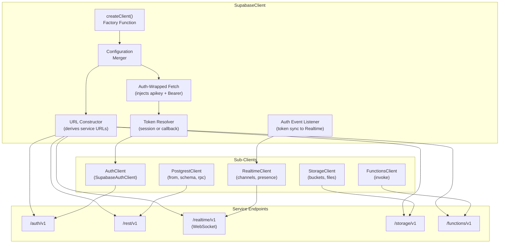
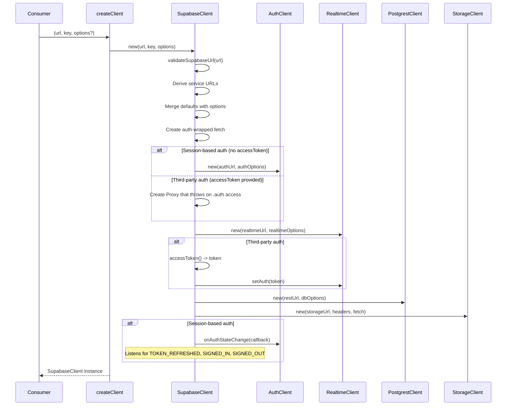
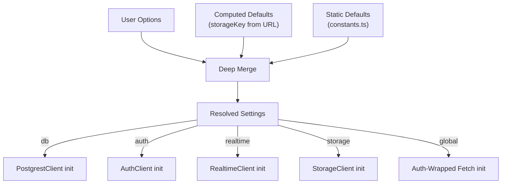
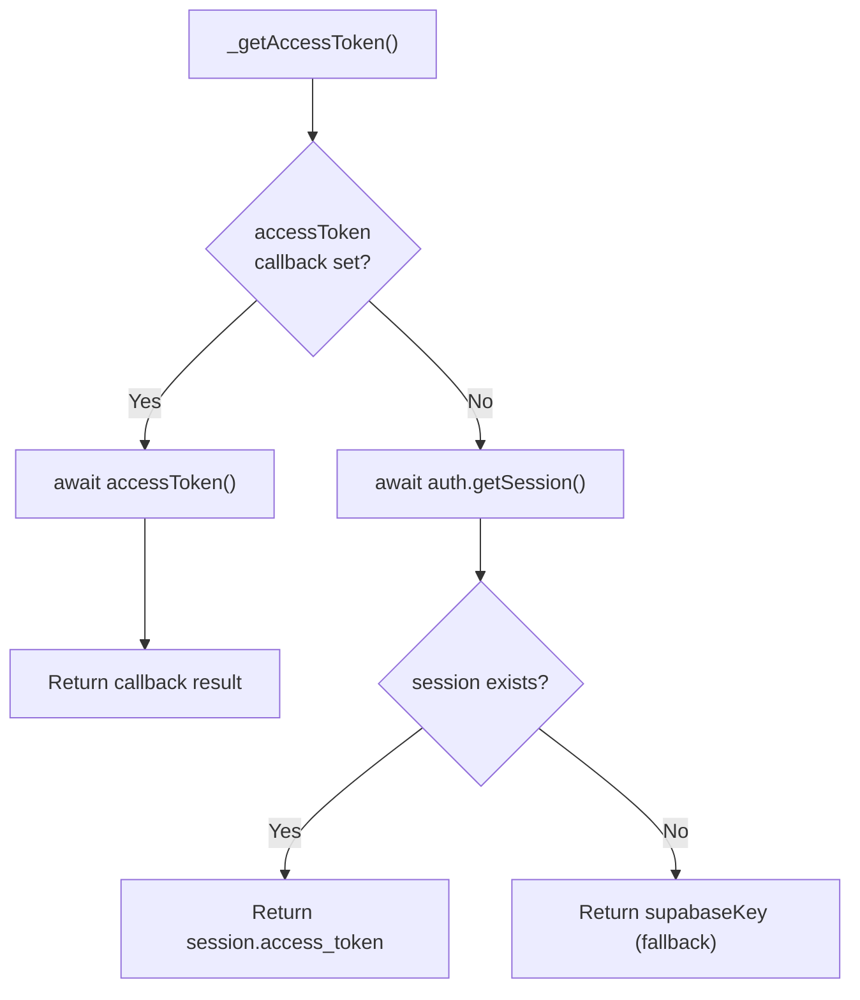
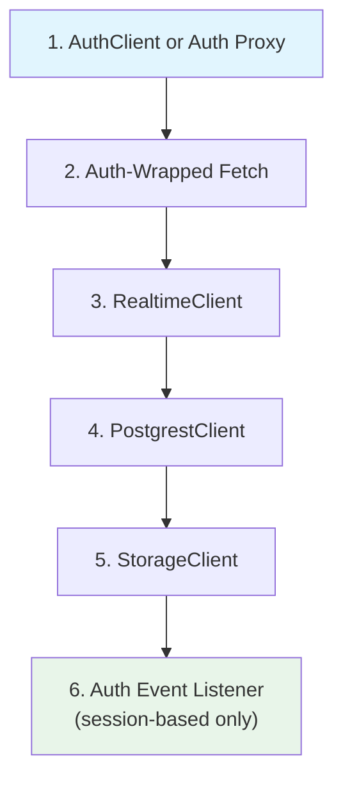
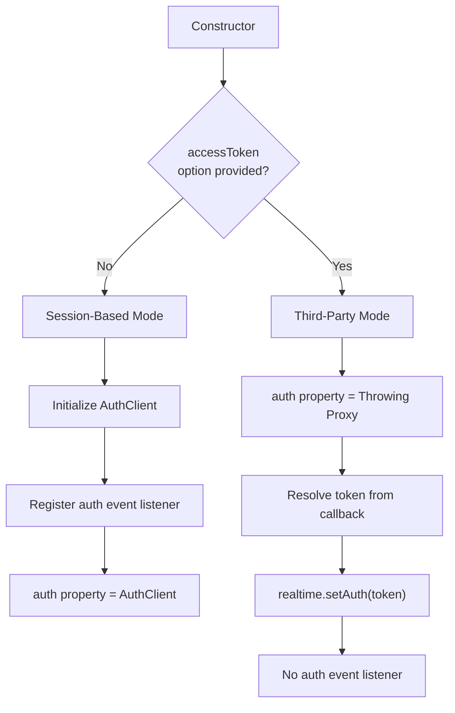
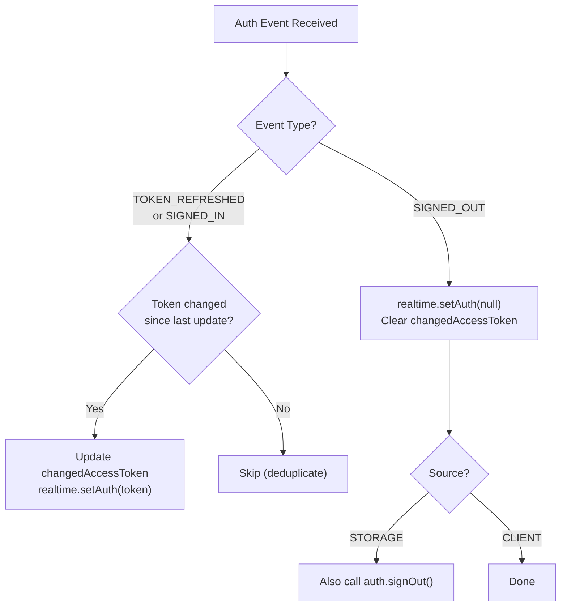

# Supabase Client SDK Specification

**Version**: 2.0.0
**Status**: Draft
**Last Updated**: 2026-02-09
**Reference Implementation**: `@supabase/supabase-js`

> This specification defines the canonical behavior for all Supabase Client SDK implementations.
> It is **stack-agnostic** and uses RFC 2119 keywords: **MUST**, **MUST NOT**, **SHOULD**,
> **SHOULD NOT**, and **MAY** to indicate requirement levels.
> All code examples use pseudocode notation unless otherwise noted.

---

## Table of Contents

1. [Overview](#1-overview)
2. [Architecture](#2-architecture)
3. [Configuration](#3-configuration)
4. [URL Construction](#4-url-construction)
5. [Environment Detection](#5-environment-detection)
6. [Auth-Wrapped Fetch](#6-auth-wrapped-fetch)
7. [Token Resolution](#7-token-resolution)
8. [Sub-Client Initialization](#8-sub-client-initialization)
9. [Auth Mode Selection](#9-auth-mode-selection)
10. [Auth Event Propagation](#10-auth-event-propagation)
11. [Public Client API](#11-public-client-api)
12. [CORS Module](#12-cors-module)
13. [Factory Function](#13-factory-function)
14. [Re-Exports](#14-re-exports)
15. [Node.js Version Deprecation](#15-nodejs-version-deprecation)
16. [Integration Test Scenarios](#16-integration-test-scenarios)
17. [Constants and Defaults](#17-constants-and-defaults)

---

## 1. Overview

The Supabase Client SDK is the top-level orchestrator that composes all individual Supabase service clients into a single, unified interface. It manages:

- Initialization and configuration of all sub-clients (Auth, PostgREST, Realtime, Storage, Functions)
- URL derivation for each service endpoint from a single base URL
- Token propagation from the authentication layer to all service clients
- Two authentication modes: built-in Supabase Auth and third-party access token providers
- Auth event forwarding to keep Realtime connections synchronized with the current session
- Cross-platform environment detection for client identification headers
- A CORS header module for Edge Function preflight responses

### Design Principles

1. **Single entry point**: Consumers MUST be able to initialize the entire Supabase SDK through a single factory function (`createClient`) and a single base URL.
2. **Transparent token injection**: All HTTP requests to Supabase services MUST automatically include valid authentication headers without consumer intervention.
3. **Composable sub-clients**: Each service module (Auth, PostgREST, Realtime, Storage, Functions) MUST be independently usable while sharing authentication state when accessed through the parent client.
4. **Zero-config defaults**: The client MUST work with only a URL and API key. All other settings MUST have sensible defaults.
5. **Third-party auth support**: The client MUST support replacing Supabase Auth with an external authentication provider via a callback function.
6. **Platform agnostic**: The client MUST detect its runtime environment and set appropriate client identification headers.

### Terminology

| Term | Definition |
|------|-----------|
| **Base URL** | The Supabase project URL (e.g., `https://xyzcompany.supabase.co`) |
| **API Key** | The `anon` or `service_role` key for the Supabase project |
| **Sub-Client** | An individual service client (Auth, PostgREST, Realtime, Storage, Functions) |
| **Auth-Wrapped Fetch** | A fetch implementation that automatically injects `apikey` and `Authorization` headers |
| **Access Token Callback** | A user-provided async function that returns a JWT from a third-party auth system |
| **Storage Key** | The key used to persist auth sessions in local storage |

---

## 2. Architecture

### Component Diagram



### Initialization Sequence



---

## 3. Configuration

### SupabaseClientOptions

The client MUST accept the following configuration structure:

```
SupabaseClientOptions {
  db?: {
    schema?: string           // Default: "public"
    timeout?: number          // Milliseconds; optional PostgREST timeout
    urlLengthLimit?: number   // Max URL length; default 8000
  }

  auth?: {
    autoRefreshToken?: boolean     // Default: true
    persistSession?: boolean       // Default: true
    detectSessionInUrl?: boolean | function  // Default: true
    storageKey?: string            // Default: derived from URL
    storage?: StorageAdapter       // Default: platform localStorage
    userStorage?: StorageAdapter   // Experimental: separate user profile storage
    flowType?: "implicit" | "pkce" // Default: "implicit"
    lock?: LockFunction            // Experimental: custom locking
    debug?: boolean | function     // Debug logging
    throwOnError?: boolean         // Error throwing mode
  }

  realtime?: RealtimeClientOptions  // Passed directly to RealtimeClient

  storage?: StorageClientOptions    // Passed directly to StorageClient

  global?: {
    fetch?: FetchImplementation     // Custom fetch; default: platform fetch
    headers?: Record<string, string>  // Merged with default headers
  }

  accessToken?: () => Promise<string | null>  // Third-party auth callback
}
```

### Configuration Merge Rules

The client MUST apply settings using the following precedence (highest to lowest):

1. **User-provided options** (passed to `createClient`)
2. **Computed defaults** (e.g., `storageKey` derived from URL)
3. **Static defaults** (defined in constants)

The merge algorithm MUST:

- Deep-merge each top-level section (`db`, `auth`, `realtime`, `global`) independently
- For `global.headers`: merge default headers with user headers, where user headers take precedence
- NOT merge `accessToken` with defaults; it MUST be set only if explicitly provided



---

## 4. URL Construction

### Service URL Derivation

Given a base URL, the client MUST derive all service URLs as follows:

| Service | Path | Protocol | Example |
|---------|------|----------|---------|
| Auth | `/auth/v1` | HTTPS | `https://xyzcompany.supabase.co/auth/v1` |
| REST (PostgREST) | `/rest/v1` | HTTPS | `https://xyzcompany.supabase.co/rest/v1` |
| Realtime | `/realtime/v1` | WSS | `wss://xyzcompany.supabase.co/realtime/v1` |
| Storage | `/storage/v1` | HTTPS | `https://xyzcompany.supabase.co/storage/v1` |
| Functions | `/functions/v1` | HTTPS | `https://xyzcompany.supabase.co/functions/v1` |

### URL Construction Rules

1. The implementation MUST normalize the base URL to include a trailing slash before appending paths.
2. The Realtime URL MUST replace the `http` protocol prefix with `ws` (i.e., `https://` becomes `wss://`, `http://` becomes `ws://`).
3. Service URLs MUST be constructed at initialization time and stored for reuse.
4. The base URL MUST be a valid HTTP or HTTPS URL. The constructor MUST throw a synchronous error if the URL is invalid.

### URL Validation

```
function validateSupabaseUrl(url: string) -> URL:
    trimmedUrl = url.trim()

    if trimmedUrl is empty:
        throw Error("supabaseUrl is required.")

    if trimmedUrl does not match /^https?:\/\//i:
        throw Error("Invalid supabaseUrl: Must be a valid HTTP or HTTPS URL.")

    try:
        return new URL(ensureTrailingSlash(trimmedUrl))
    catch:
        throw Error("Invalid supabaseUrl: Provided URL is malformed.")
```

The constructor MUST also throw a synchronous error if `supabaseKey` is empty or not provided.

---

## 5. Environment Detection

### Runtime Identification

The client MUST detect the runtime environment and include it in the `X-Client-Info` header. Detection MUST follow this priority order:

| Priority | Condition | Environment ID |
|----------|-----------|----------------|
| 1 | `typeof Deno !== "undefined"` | `deno` |
| 2 | `typeof document !== "undefined"` | `web` |
| 3 | `typeof navigator !== "undefined" && navigator.product === "ReactNative"` | `react-native` |
| 4 | (fallback) | `node` |

### X-Client-Info Header

The client MUST set a default header:

```
X-Client-Info: supabase-js-{environment}/{version}
```

Where `{environment}` is the detected runtime ID and `{version}` is the SDK version string.

This header MUST be included in `DEFAULT_HEADERS` and merged into all requests via the global headers configuration.

---

## 6. Auth-Wrapped Fetch

### Purpose

The auth-wrapped fetch is a higher-order function that wraps the platform's `fetch` (or a user-provided custom fetch) to automatically inject authentication headers into every request made by sub-clients.

### Construction

```
function fetchWithAuth(supabaseKey, getAccessToken, customFetch?) -> FetchFunction:
    baseFetch = customFetch ?? globalFetch

    return async function(input, init):
        accessToken = (await getAccessToken()) ?? supabaseKey
        headers = new Headers(init?.headers)

        if not headers.has("apikey"):
            headers.set("apikey", supabaseKey)

        if not headers.has("Authorization"):
            headers.set("Authorization", "Bearer " + accessToken)

        return baseFetch(input, { ...init, headers })
```

### Header Injection Rules

| Header | Value | Condition |
|--------|-------|-----------|
| `apikey` | The Supabase API key | Only if not already present in the request |
| `Authorization` | `Bearer {accessToken}` | Only if not already present in the request |

The access token MUST be resolved at request time (not at initialization) to ensure the latest token is always used.

If `getAccessToken()` returns `null`, the API key MUST be used as the Bearer token fallback.

### Sub-Client Fetch Assignment

| Sub-Client | Receives Auth-Wrapped Fetch | Notes |
|------------|----------------------------|-------|
| AuthClient | NO | Auth client uses its own headers (`Authorization: Bearer {apikey}`) |
| PostgrestClient | YES | Via `fetch` option |
| RealtimeClient | NO | Uses `accessToken` callback instead |
| StorageClient | YES | Via constructor parameter |
| FunctionsClient | YES | Via `customFetch` option |

---

## 7. Token Resolution

### _getAccessToken Algorithm

The client MUST implement a private method to resolve the current access token:

```
async function _getAccessToken() -> string:
    if this.accessToken is set:
        // Third-party auth mode
        return await this.accessToken()

    // Session-based auth mode
    { data } = await this.auth.getSession()
    return data.session?.access_token ?? this.supabaseKey
```

### Token Resolution Flow



### Key Behaviors

1. When `accessToken` callback is set, the implementation MUST NOT call `auth.getSession()`.
2. When no session exists and no callback is provided, the implementation MUST fall back to using the API key as the access token.
3. The `_getAccessToken` method MUST be bound to the client instance before passing to `fetchWithAuth` and `RealtimeClient`.

---

## 8. Sub-Client Initialization

### Initialization Order

Sub-clients MUST be initialized in the following order, as some depend on earlier initializations:



Note: FunctionsClient is NOT initialized during construction. See [Lazy Initialization](#functions-client-lazy-getter).

### AuthClient Initialization

When `accessToken` is NOT provided:

```
authHeaders = {
    "Authorization": "Bearer " + supabaseKey,
    "apikey": supabaseKey
}

this.auth = new SupabaseAuthClient({
    url: authUrl,
    headers: { ...authHeaders, ...globalHeaders },
    storageKey: settings.auth.storageKey,
    autoRefreshToken: settings.auth.autoRefreshToken,
    persistSession: settings.auth.persistSession,
    detectSessionInUrl: settings.auth.detectSessionInUrl,
    storage: settings.auth.storage,
    userStorage: settings.auth.userStorage,
    flowType: settings.auth.flowType,
    lock: settings.auth.lock,
    debug: settings.auth.debug,
    throwOnError: settings.auth.throwOnError,
    fetch: settings.global.fetch,
    hasCustomAuthorizationHeader: globalHeaders has "authorization" key (case-insensitive)
})
```

The `hasCustomAuthorizationHeader` flag MUST be set to `true` if any key in the global headers matches `"authorization"` (case-insensitive comparison). This tells the AuthClient whether a custom authorization header is in use.

### RealtimeClient Initialization

```
this.realtime = new RealtimeClient(realtimeUrl, {
    ...settings.realtime,
    headers: globalHeaders,
    accessToken: this._getAccessToken.bind(this),
    params: {
        apikey: supabaseKey,
        ...settings.realtime?.params
    }
})
```

The `apikey` MUST be included in the WebSocket connection `params` (sent as query parameters during the WebSocket handshake).

When `accessToken` callback is provided, the implementation MUST immediately resolve the token and call `realtime.setAuth(token)` to avoid race conditions with early channel subscriptions:

```
if this.accessToken:
    token = await this.accessToken()
    this.realtime.setAuth(token)
```

This initial token resolution MUST NOT block construction. It SHOULD be performed asynchronously (fire-and-forget) with error suppression via a catch handler that logs a warning.

### PostgrestClient Initialization

```
this.rest = new PostgrestClient(restUrl, {
    headers: globalHeaders,
    schema: settings.db.schema,
    fetch: authWrappedFetch,
    timeout: settings.db.timeout,
    urlLengthLimit: settings.db.urlLengthLimit
})
```

### StorageClient Initialization

```
this.storage = new StorageClient(
    storageUrl,
    globalHeaders,
    authWrappedFetch,
    settings.storage
)
```

### FunctionsClient (Lazy Getter)

The FunctionsClient MUST NOT be instantiated during construction. It MUST be created on demand via a computed property/getter:

```
get functions() -> FunctionsClient:
    return new FunctionsClient(functionsUrl, {
        headers: globalHeaders,
        customFetch: authWrappedFetch
    })
```

A new FunctionsClient instance MUST be created on each access. This ensures the latest headers are always used.

---

## 9. Auth Mode Selection

### Session-Based Auth (Default)

When `accessToken` is NOT provided in options:

1. A full `SupabaseAuthClient` MUST be initialized with session management.
2. Auth event listeners MUST be registered to propagate token changes to Realtime.
3. The `auth` property MUST expose the full Auth API.

### Third-Party Auth (accessToken Callback)

When `accessToken` IS provided in options:

1. The AuthClient MUST NOT be initialized.
2. The `auth` property MUST be set to a Proxy (or equivalent mechanism) that throws an error on any property access.
3. The error message MUST include the property name being accessed.
4. Auth event listeners MUST NOT be registered.
5. The Realtime client MUST receive its initial token immediately via `setAuth()`.



### Auth Proxy Error Format

When a consumer accesses any property on the auth proxy, the implementation MUST throw:

```
Error: "@supabase/supabase-js: Supabase Client is configured with the accessToken option, accessing supabase.auth.{propertyName} is not possible"
```

Where `{propertyName}` is the string representation of the accessed property.

---

## 10. Auth Event Propagation

### Event Listener Registration

When in session-based auth mode, the client MUST register a listener for auth state changes:

```
function _listenForAuthEvents():
    this.auth.onAuthStateChange((event, session) ->
        this._handleTokenChanged(event, "CLIENT", session?.access_token)
    )
```

### Token Change Handling

```
function _handleTokenChanged(event, source, token?):
    if (event == "TOKEN_REFRESHED" or event == "SIGNED_IN")
       and this.changedAccessToken != token:
        this.changedAccessToken = token
        this.realtime.setAuth(token)

    else if event == "SIGNED_OUT":
        this.realtime.setAuth(null)
        if source == "STORAGE":
            this.auth.signOut()
        this.changedAccessToken = undefined
```

### Event Handling Rules



| Rule | Description |
|------|-------------|
| **Deduplication** | The implementation MUST track the last propagated token (`changedAccessToken`) and MUST NOT call `realtime.setAuth()` if the token has not changed. |
| **TOKEN_REFRESHED** | MUST update the Realtime client with the new token. |
| **SIGNED_IN** | MUST update the Realtime client with the new token. |
| **SIGNED_OUT** | MUST clear the Realtime auth token by calling `setAuth()` with no argument or null. |
| **STORAGE source** | When sign-out is triggered from storage (cross-tab sync), the implementation MUST also call `auth.signOut()` to clean up the local session. |
| **CLIENT source** | When sign-out originates from the client itself, `auth.signOut()` MUST NOT be called again (it already happened). |

---

## 11. Public Client API

### Properties

| Property | Type | Access | Description |
|----------|------|--------|-------------|
| `auth` | AuthClient | public | Auth client instance (or throwing proxy in third-party mode) |
| `realtime` | RealtimeClient | public | Realtime client instance |
| `storage` | StorageClient | public | Storage client instance |
| `functions` | FunctionsClient | public (getter) | Lazily-created Functions client |

### Database Query Methods

#### from(relation)

Delegates to `PostgrestClient.from()`.

```
function from(relation: string) -> PostgrestQueryBuilder:
    return this.rest.from(relation)
```

MUST support querying both tables and views.

#### schema(schemaName)

Delegates to `PostgrestClient.schema()`.

```
function schema(schemaName: string) -> PostgrestClient:
    return this.rest.schema(schemaName)
```

Returns a new PostgrestClient scoped to the specified schema.

#### rpc(functionName, args?, options?)

Delegates to `PostgrestClient.rpc()`.

```
function rpc(fn: string, args?: object, options?: RpcOptions) -> PostgrestFilterBuilder:
    return this.rest.rpc(fn, args, options)
```

Options:

| Option | Type | Default | Description |
|--------|------|---------|-------------|
| `head` | boolean | `false` | When true, no data is returned (useful for count-only) |
| `get` | boolean | `false` | When true, uses read-only access mode |
| `count` | string | undefined | Count algorithm: `"exact"`, `"planned"`, or `"estimated"` |

### Realtime Channel Methods

#### channel(name, opts?)

Delegates to `RealtimeClient.channel()`.

```
function channel(name: string, opts?: ChannelOptions) -> RealtimeChannel:
    return this.realtime.channel(name, opts)
```

Default options: `{ config: {} }`.

#### getChannels()

```
function getChannels() -> RealtimeChannel[]:
    return this.realtime.getChannels()
```

Returns all active Realtime channels.

#### removeChannel(channel)

```
function removeChannel(channel: RealtimeChannel) -> Promise<"ok" | "timed out" | "error">:
    return this.realtime.removeChannel(channel)
```

Unsubscribes and removes a specific channel.

#### removeAllChannels()

```
function removeAllChannels() -> Promise<("ok" | "timed out" | "error")[]>:
    return this.realtime.removeAllChannels()
```

Unsubscribes and removes all channels.

---

## 12. CORS Module

### Purpose

The SDK MUST export a CORS headers module that Edge Functions can use for preflight responses. This ensures CORS headers stay synchronized with the headers the SDK actually sends.

### Export Path

The CORS module MUST be importable from a subpath:

```
import { corsHeaders } from "@supabase/supabase-js/cors"
```

### CORS Headers

```
corsHeaders = {
    "Access-Control-Allow-Origin": "*",
    "Access-Control-Allow-Headers": "authorization, x-client-info, apikey, content-type",
    "Access-Control-Allow-Methods": "GET, POST, PUT, PATCH, DELETE, OPTIONS"
}
```

### Allowed Headers

The `Access-Control-Allow-Headers` value MUST include all custom headers the SDK sends:

| Header | Purpose |
|--------|---------|
| `authorization` | Bearer token for authentication |
| `x-client-info` | Library version information |
| `apikey` | Project API key |
| `content-type` | Standard HTTP content type |

### Allowed Methods

The `Access-Control-Allow-Methods` value MUST include all HTTP methods used by the SDK:

| Method | Used By |
|--------|---------|
| `GET` | PostgREST reads, Storage downloads, Functions invocations |
| `POST` | PostgREST inserts, Auth operations, Functions invocations, Storage uploads |
| `PUT` | Storage file updates |
| `PATCH` | PostgREST updates |
| `DELETE` | PostgREST deletes, Storage file removals |
| `OPTIONS` | CORS preflight |

---

## 13. Factory Function

### createClient

The SDK MUST export a `createClient` factory function as the primary entry point:

```
function createClient(supabaseUrl: string, supabaseKey: string, options?: SupabaseClientOptions) -> SupabaseClient:
    return new SupabaseClient(supabaseUrl, supabaseKey, options)
```

### Validation at Construction

The factory/constructor MUST validate inputs and throw synchronous errors:

| Condition | Error Message |
|-----------|---------------|
| URL is empty or whitespace | `"supabaseUrl is required."` |
| URL does not start with `http://` or `https://` | `"Invalid supabaseUrl: Must be a valid HTTP or HTTPS URL."` |
| URL is malformed (fails URL parsing) | `"Invalid supabaseUrl: Provided URL is malformed."` |
| API key is empty or not provided | `"supabaseKey is required."` |

---

## 14. Re-Exports

### Type and Value Re-Exports

The main SDK entry point MUST re-export key types and values from sub-packages to allow consumers to import everything from a single package:

| Re-Export | Source Package | Kind |
|-----------|---------------|------|
| All auth exports (`*`) | `@supabase/auth-js` | Types + Values |
| `AuthUser`, `AuthSession` | `@supabase/auth-js` (as `User`, `Session`) | Type aliases |
| `PostgrestResponse`, `PostgrestSingleResponse`, `PostgrestMaybeSingleResponse` | `@supabase/postgrest-js` | Types |
| `PostgrestError` | `@supabase/postgrest-js` | Value |
| `FunctionInvokeOptions` | `@supabase/functions-js` | Type |
| `FunctionsHttpError`, `FunctionsFetchError`, `FunctionsRelayError`, `FunctionsError`, `FunctionRegion` | `@supabase/functions-js` | Values |
| All realtime exports (`*`) | `@supabase/realtime-js` | Types + Values |
| `SupabaseClient` | Local | Value (default export) |
| `SupabaseClientOptions`, `QueryResult`, `QueryData`, `QueryError`, `DatabaseWithoutInternals` | Local | Types |

### Type Helper Utilities

The SDK MUST provide these utility types for extracting query result types:

| Type | Definition | Purpose |
|------|------------|---------|
| `QueryResult<T>` | Extracts the resolved type from a PromiseLike | Get full result type from a query |
| `QueryData<T>` | Extracts the `data` field from a resolved PromiseLike, excluding null | Get just the data type |
| `QueryError` | Alias for `PostgrestError` | Consistent error type reference |
| `DatabaseWithoutInternals<DB>` | `Omit<DB, "__InternalSupabase">` | Strip internal metadata from generated Database types |

---

## 15. Node.js Version Deprecation

### Runtime Warning

When running in a Node.js environment with version 18 or below, the SDK SHOULD emit a console warning:

```
"Node.js 18 and below are deprecated and will no longer be supported in future versions of @supabase/supabase-js. Please upgrade to Node.js 20 or later."
```

### Detection Rules

1. The check MUST be skipped in browser environments (`typeof window !== "undefined"`).
2. The check MUST be skipped if `process` is not available (Edge Runtime).
3. The check MUST be skipped if `process.version` is not available.
4. The check MUST parse the major version from the `process.version` string (format: `vMAJOR.MINOR.PATCH`).
5. The warning MUST only be emitted when the major version is 18 or below.
6. The warning MUST be emitted at module load time (not at client creation time).

---

## 16. Integration Test Scenarios

### Constructor Validation

| ID | Scenario | Input | Expected |
|----|----------|-------|----------|
| CV-01 | Valid URL and key | `createClient("https://x.supabase.co", "key")` | Client created successfully |
| CV-02 | Empty URL | `createClient("", "key")` | Throws `"supabaseUrl is required."` |
| CV-03 | Whitespace-only URL | `createClient("   ", "key")` | Throws `"supabaseUrl is required."` |
| CV-04 | Invalid protocol | `createClient("ftp://x.co", "key")` | Throws `"Invalid supabaseUrl: Must be a valid HTTP or HTTPS URL."` |
| CV-05 | No protocol | `createClient("x.supabase.co", "key")` | Throws `"Invalid supabaseUrl: Must be a valid HTTP or HTTPS URL."` |
| CV-06 | Malformed URL | `createClient("https://", "key")` | Throws `"Invalid supabaseUrl: Provided URL is malformed."` |
| CV-07 | Empty key | `createClient("https://x.supabase.co", "")` | Throws `"supabaseKey is required."` |
| CV-08 | URL with trailing slash | `createClient("https://x.supabase.co/", "key")` | Client created; URLs derived correctly |
| CV-09 | URL without trailing slash | `createClient("https://x.supabase.co", "key")` | Client created; trailing slash added internally |
| CV-10 | HTTP URL | `createClient("http://localhost:54321", "key")` | Client created; Realtime uses `ws://` |

### URL Construction

| ID | Scenario | Base URL | Expected Service URLs |
|----|----------|----------|-----------------------|
| UC-01 | Standard project URL | `https://abc.supabase.co` | Auth: `/auth/v1`, REST: `/rest/v1`, RT: `wss://abc.supabase.co/realtime/v1`, Storage: `/storage/v1`, Functions: `/functions/v1` |
| UC-02 | Local development | `http://localhost:54321` | RT: `ws://localhost:54321/realtime/v1`; all others HTTP |
| UC-03 | Custom domain | `https://api.example.com` | All paths appended correctly to custom domain |

### Storage Key Derivation

| ID | Scenario | URL | Expected Storage Key |
|----|----------|-----|--------------------|
| SK-01 | Standard Supabase URL | `https://abcdef.supabase.co` | `sb-abcdef-auth-token` |
| SK-02 | Localhost | `http://localhost:54321` | `sb-localhost-auth-token` |
| SK-03 | Custom storage key | User provides `storageKey: "my-key"` | `my-key` |

### Auth Mode

| ID | Scenario | Config | Expected |
|----|----------|--------|----------|
| AM-01 | Default (session-based) | No `accessToken` option | `auth` property is full AuthClient; event listener registered |
| AM-02 | Third-party auth | `accessToken: () => Promise.resolve("jwt")` | `auth` property is throwing proxy |
| AM-03 | Access auth in third-party mode | `client.auth.getSession()` | Throws error with property name `"getSession"` |
| AM-04 | Access auth in third-party mode | `client.auth.signOut()` | Throws error with property name `"signOut"` |
| AM-05 | Initial Realtime auth (third-party) | `accessToken` provided | `realtime.setAuth(token)` called before first channel subscribe |

### Auth-Wrapped Fetch

| ID | Scenario | Request Headers | Expected Injected Headers |
|----|----------|-----------------|--------------------------|
| FW-01 | No existing auth headers | `{}` | `apikey: {key}`, `Authorization: Bearer {token}` |
| FW-02 | Existing apikey | `{ apikey: "custom" }` | `apikey: "custom"` (not overwritten), `Authorization: Bearer {token}` |
| FW-03 | Existing Authorization | `{ Authorization: "Bearer custom" }` | `apikey: {key}`, `Authorization: "Bearer custom"` (not overwritten) |
| FW-04 | Both existing | `{ apikey: "a", Authorization: "b" }` | Neither overwritten |
| FW-05 | No session, no callback | Auth returns no session | `Authorization: Bearer {apikey}` (fallback) |
| FW-06 | Callback returns null | `accessToken: () => null` | `Authorization: Bearer {apikey}` (fallback) |

### Token Propagation to Realtime

| ID | Scenario | Auth Event | Expected |
|----|----------|------------|----------|
| TP-01 | Token refreshed | `TOKEN_REFRESHED` with new token | `realtime.setAuth(newToken)` called |
| TP-02 | User signed in | `SIGNED_IN` with token | `realtime.setAuth(token)` called |
| TP-03 | Same token (dedup) | `TOKEN_REFRESHED` with same token as last | `realtime.setAuth()` NOT called |
| TP-04 | User signed out | `SIGNED_OUT` | `realtime.setAuth(null)` called; `changedAccessToken` cleared |
| TP-05 | Signed out from storage | `SIGNED_OUT` source=STORAGE | `realtime.setAuth(null)` called AND `auth.signOut()` called |
| TP-06 | Signed out from client | `SIGNED_OUT` source=CLIENT | `realtime.setAuth(null)` called; `auth.signOut()` NOT called again |

### Sub-Client Delegation

| ID | Scenario | Method Call | Expected Delegation |
|----|----------|-------------|---------------------|
| SD-01 | Query table | `client.from("users")` | `rest.from("users")` |
| SD-02 | Switch schema | `client.schema("private")` | `rest.schema("private")` |
| SD-03 | Call RPC | `client.rpc("my_fn", { id: 1 })` | `rest.rpc("my_fn", { id: 1 })` |
| SD-04 | Create channel | `client.channel("room1")` | `realtime.channel("room1")` |
| SD-05 | Get channels | `client.getChannels()` | `realtime.getChannels()` |
| SD-06 | Remove channel | `client.removeChannel(ch)` | `realtime.removeChannel(ch)` |
| SD-07 | Remove all channels | `client.removeAllChannels()` | `realtime.removeAllChannels()` |
| SD-08 | Access functions | `client.functions` | New `FunctionsClient` created each access |
| SD-09 | Access storage | `client.storage` | Same `StorageClient` instance |
| SD-10 | Access auth | `client.auth` | Same `AuthClient` instance (session mode) |

### Configuration Defaults

| ID | Scenario | Expected Default |
|----|----------|-----------------|
| CD-01 | DB schema | `"public"` |
| CD-02 | Auth autoRefreshToken | `true` |
| CD-03 | Auth persistSession | `true` |
| CD-04 | Auth detectSessionInUrl | `true` |
| CD-05 | Auth flowType | `"implicit"` |
| CD-06 | Storage key (no override) | `"sb-{hostname-first-part}-auth-token"` |
| CD-07 | Global headers | Contains `X-Client-Info` header |
| CD-08 | User headers merge | User headers override defaults; defaults preserved for non-conflicting keys |

### CORS Module

| ID | Scenario | Expected |
|----|----------|----------|
| CO-01 | Import corsHeaders | Object with 3 keys: `Access-Control-Allow-Origin`, `Access-Control-Allow-Headers`, `Access-Control-Allow-Methods` |
| CO-02 | Allow-Origin value | `"*"` |
| CO-03 | Allow-Headers value | Contains `authorization`, `x-client-info`, `apikey`, `content-type` |
| CO-04 | Allow-Methods value | Contains `GET`, `POST`, `PUT`, `PATCH`, `DELETE`, `OPTIONS` |

### Environment Detection

| ID | Scenario | Expected X-Client-Info |
|----|----------|----------------------|
| ED-01 | Deno runtime | `supabase-js-deno/{version}` |
| ED-02 | Browser (document exists) | `supabase-js-web/{version}` |
| ED-03 | React Native | `supabase-js-react-native/{version}` |
| ED-04 | Node.js (fallback) | `supabase-js-node/{version}` |

---

## 17. Constants and Defaults

### Default Values

| Constant | Value |
|----------|-------|
| `DEFAULT_DB_OPTIONS.schema` | `"public"` |
| `DEFAULT_AUTH_OPTIONS.autoRefreshToken` | `true` |
| `DEFAULT_AUTH_OPTIONS.persistSession` | `true` |
| `DEFAULT_AUTH_OPTIONS.detectSessionInUrl` | `true` |
| `DEFAULT_AUTH_OPTIONS.flowType` | `"implicit"` |
| `DEFAULT_REALTIME_OPTIONS` | `{}` (empty object) |
| `DEFAULT_GLOBAL_OPTIONS.headers` | `{ "X-Client-Info": "supabase-js-{env}/{version}" }` |

### Storage Key Format

```
"sb-{hostname_first_part}-auth-token"
```

Where `{hostname_first_part}` is the first segment of the base URL hostname split by `.`:

- `https://abcdef.supabase.co` -> `sb-abcdef-auth-token`
- `http://localhost:54321` -> `sb-localhost-auth-token`
- `https://my-project.supabase.co` -> `sb-my-project-auth-token`

### Service URL Paths

| Service | Path Suffix |
|---------|-------------|
| Auth | `auth/v1` |
| REST (PostgREST) | `rest/v1` |
| Realtime | `realtime/v1` |
| Storage | `storage/v1` |
| Functions | `functions/v1` |

### Node.js Deprecation Threshold

| Constant | Value |
|----------|-------|
| Minimum supported Node.js major version | 19 (18 and below are deprecated) |

---

## Implementation Checklist

- [ ] `createClient` factory function validates URL and key
- [ ] URL validation rejects non-HTTP(S) URLs and malformed URLs
- [ ] Trailing slash normalization on base URL
- [ ] Service URLs derived correctly (including WS protocol for Realtime)
- [ ] Environment detection sets correct `X-Client-Info` header
- [ ] Configuration defaults applied with correct merge precedence
- [ ] Storage key derived from URL hostname
- [ ] Auth-wrapped fetch injects `apikey` and `Authorization` conditionally
- [ ] Token resolution prefers callback over session
- [ ] Session-based mode initializes full AuthClient
- [ ] Third-party mode creates throwing proxy for `auth` property
- [ ] Third-party mode calls `realtime.setAuth()` at initialization (async, non-blocking)
- [ ] Auth event listener registered in session-based mode only
- [ ] Token deduplication prevents redundant `setAuth()` calls
- [ ] SIGNED_OUT clears Realtime token
- [ ] SIGNED_OUT from STORAGE triggers `auth.signOut()`
- [ ] `from()` delegates to PostgrestClient
- [ ] `schema()` delegates to PostgrestClient
- [ ] `rpc()` delegates to PostgrestClient
- [ ] `channel()` delegates to RealtimeClient
- [ ] `getChannels()` delegates to RealtimeClient
- [ ] `removeChannel()` delegates to RealtimeClient
- [ ] `removeAllChannels()` delegates to RealtimeClient
- [ ] `functions` getter creates new FunctionsClient on each access
- [ ] `storage` property returns shared StorageClient instance
- [ ] CORS module exports correct headers for Edge Functions
- [ ] All sub-package types and values re-exported from main entry point
- [ ] Node.js version deprecation warning emitted at module load time
- [ ] `hasCustomAuthorizationHeader` flag passed to AuthClient
